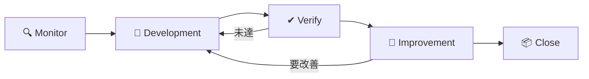
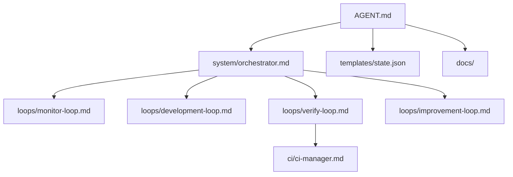

# ServiceHub Construction Platform New

建設業向け統合業務プラットフォームを、Copilot CLI で安全に自律開発するための案件テンプレートです。

このプロジェクトでは、`AGENT.md` を運用入口、`copilotcli-kernel/` を実行カーネル、`.github/copilot-instructions.md` をリポジトリ組み込み指示として扱います。

## 🚀 このプロジェクトの狙い

| 項目 | 内容 |
|---|---|
| 🧭 開発方式 | Copilot CLI による疑似ループ型の自律開発 |
| 🏗 対象領域 | 建設業務、申請、承認、監査、業務連携 |
| 🔒 重視点 | 監査性、保守性、安全性、再開容易性 |
| 📄 文書運用 | `README.md`、`docs/`、`templates/state.json` を常に同期 |
| ✅ 品質基準 | test / lint / build / CI / security を基準に STABLE 判定 |

## 📊 開発モード

```text
Monitor -> Development -> Verify -> Improvement -> Close
```

このループは時間ではなく、現在の主作業内容で判定します。

| ループ | 主作業 |
|---|---|
| 🔍 Monitor | 現状確認、依存確認、Issue / PR / CI / docs 把握 |
| 🔨 Development | 設計、実装、修復、設定変更、WorkTree 整理 |
| ✔ Verify | test、lint、build、security、CI 確認 |
| 🔧 Improvement | リファクタリング、命名改善、README / docs 整備 |
| 📦 Close | commit、push、PR、最終報告、再開メモ整理 |

## 🧠 最初に読むべきファイル

1. `AGENT.md`
2. `.github/copilot-instructions.md`
3. `copilotcli-kernel/system/orchestrator.md`
4. `copilotcli-kernel/system/loop-guard.md`
5. `copilotcli-kernel/loops/monitor-loop.md`
6. `copilotcli-kernel/loops/development-loop.md`
7. `copilotcli-kernel/loops/verify-loop.md`
8. `copilotcli-kernel/loops/improvement-loop.md`
9. `copilotcli-kernel/loops/close-loop.md`
10. `docs/OPERATIONS.md`

## 🏗 構成

| パス | 役割 |
|---|---|
| `AGENT.md` | ServiceHub 専用の自律開発ポリシー |
| `.github/copilot-instructions.md` | Copilot 実行時の短い必須指示 |
| `copilotcli-kernel/` | ループ、Loop Guard、CI、統制のカーネル |
| `docs/` | 要件、設計、運用、セキュリティ、API、DB 文書 |
| `templates/state.json` | 現在フェーズ、ループ回数、再開点の管理 |

## 🔄 開発フロー



## 🧩 カーネル連携

`AGENT.md` だけではなく、`copilotcli-kernel/` を常に参照して動作します。



## ✅ STABLE の考え方

| 条件 | 必須 |
|---|---|
| test success | 必須 |
| lint success | 必須 |
| build success | 必須 |
| CI success | 推奨、使える場合は必須 |
| security critical issue 0 | 必須 |

| 変更規模 | 連続成功回数 |
|---|---|
| 小規模 | N=2 |
| 通常 | N=3 |
| 重要 | N=5 |

## 📋 ドキュメント更新方針

- セッション開始時に前提条件を更新する
- 実装完了時に機能説明と影響範囲を更新する
- Verify 後に結果を反映する
- Improvement 後に名称、構造、運用説明を整える
- Close 時に最終状態と再開ポイントを残す

## 🛑 停止条件

- 同じ失敗を 3 回繰り返した
- CI 修復を 5 回以上試した
- 重大な security issue を検出した
- 外部依存で進行不能になった
- `state.json` に進展がなくループが停滞した

## 📌 使い始め

1. `AGENT.md` を読む
2. `.github/copilot-instructions.md` を読む
3. `copilotcli-kernel/` の system と loops を読む
4. `templates/state.json` を初期化または確認する
5. 現在のタスクを `Monitor` として開始する
