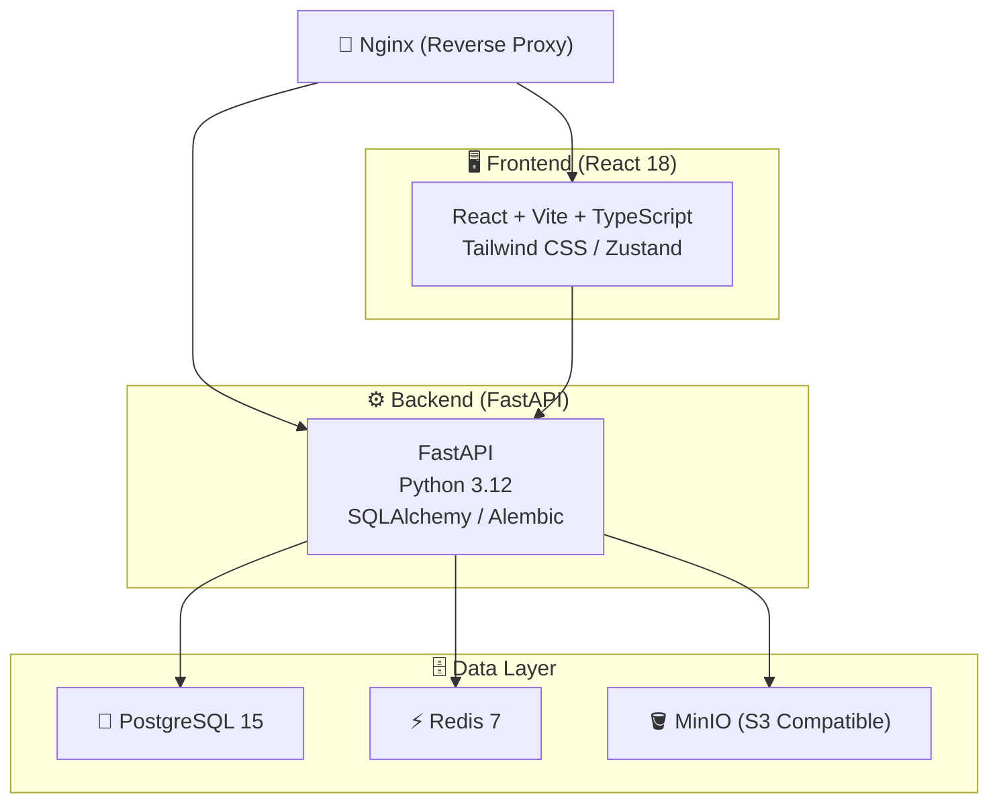
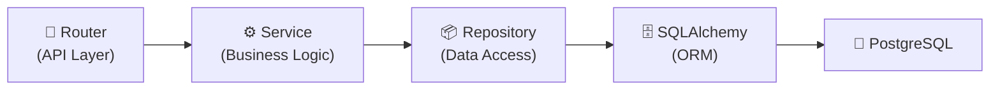
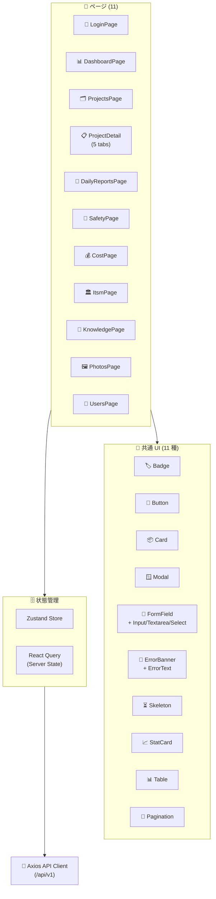
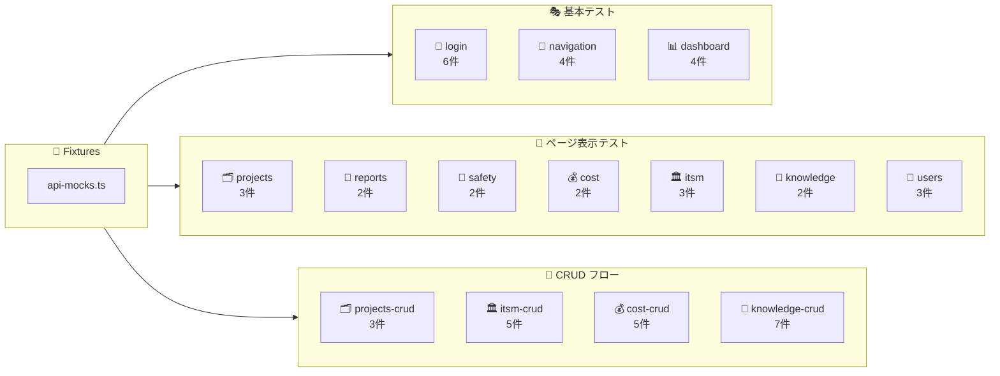
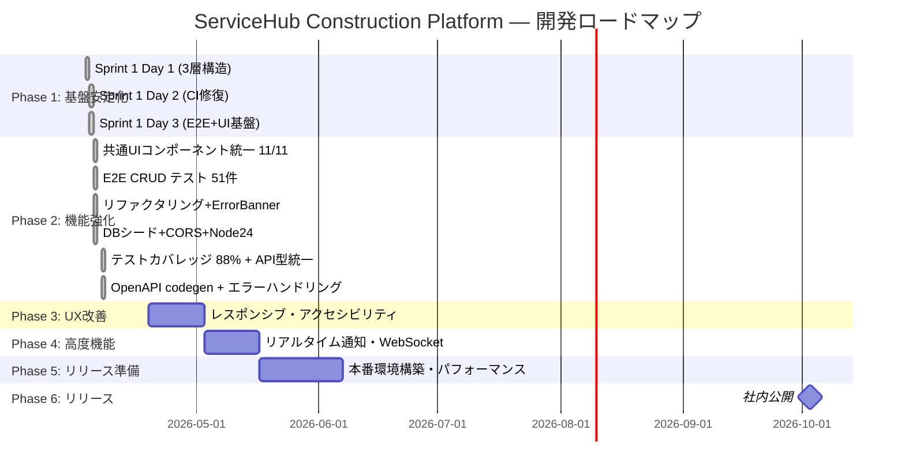
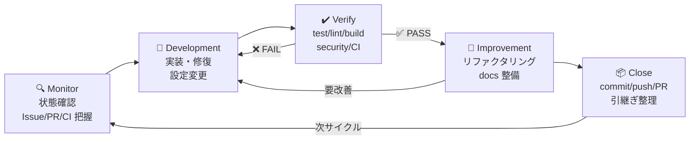
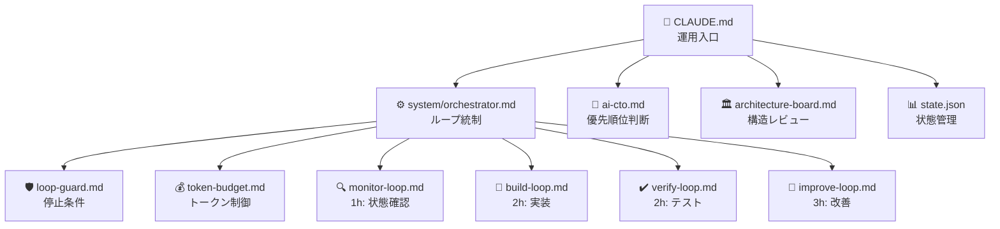

# 🏗️ ServiceHub Construction Platform

> 建設業向け統合業務プラットフォーム — FastAPI × React 18 × Docker で構築されたフルスタック SaaS

[](https://www.python.org/)
[](https://fastapi.tiangolo.com/)
[](https://react.dev/)
[](https://www.typescriptlang.org/)
[](https://docs.docker.com/compose/)
[](https://www.postgresql.org/)

[](https://github.com/Kensan196948G/ServiceHub-Construction-Platform/actions/workflows/backend-ci.yml)
[](https://github.com/Kensan196948G/ServiceHub-Construction-Platform/actions/workflows/security.yml)
[](https://github.com/Kensan196948G/ServiceHub-Construction-Platform/actions/workflows/frontend-ci.yml)
[](LICENSE)

---

## 📖 概要

**ServiceHub Construction Platform** は、建設業務のデジタル化を目的とした統合業務管理プラットフォームです。  
工事案件の進捗管理から日報・写真・安全品質・原価・ITSM・AI ナレッジまで、現場業務に必要な機能をワンストップで提供します。

### ✨ 特徴

- 🔐 **JWT / RBAC 認証** — ロールベースの細かいアクセス制御
- 🗂️ **工事案件管理** — CRUD・ステータス追跡・予算管理
- 📝 **日報管理** — 作成・提出・承認ワークフロー
- 🖼️ **写真・資料管理** — MinIO (S3) + プリサインド URL による安全な配信
- 🦺 **安全・品質管理** — 安全確認チェック・品質検査記録
- 💰 **原価・工数管理** — コスト記録・予実対比ダッシュボード
- 🏛️ **ITSM 運用管理** — インシデント管理・変更要求ワークフロー
- 🤖 **AI ナレッジ管理** — OpenAI 連携によるナレッジ AI 検索
- 🚀 **ClaudeOS v5 自律開発** — Monitor → Development → Verify → Improvement ループ

---

## 🏛️ アーキテクチャ図



---

## ✅ 実装済み機能一覧

| アイコン | モジュール         | 機能                         | API 数 | 状態        |
| :------: | :----------------- | :--------------------------- | :----: | :---------: |
| 🔐       | 認証・認可          | JWT ログイン / トークンリフレッシュ / ロール管理 | 4      | ✅ 完了     |
| 🗂️       | 工事案件管理        | CRUD / ステータス管理 / 予算追跡 | 5      | ✅ 完了     |
| 📝       | 日報管理            | 作成 / 提出 / 承認ワークフロー  | 5      | ✅ 完了     |
| 🖼️       | 写真・資料管理      | MinIO アップロード / プリサインド URL | 5  | ✅ 完了     |
| 🦺       | 安全・品質管理      | 安全確認チェック / 品質検査記録 | 4      | ✅ 完了     |
| 💰       | 原価・工数管理      | コスト記録 / 工数記録 / 予実対比 | 4     | ✅ 完了     |
| 🏛️       | ITSM 運用管理       | インシデント / 変更要求ワークフロー | 5   | ✅ 完了     |
| 🤖       | AI ナレッジ管理     | 記事 CRUD / AI 検索 (OpenAI)  | 5      | ✅ 完了     |
| 📡       | システム            | ヘルスチェック / ステータス確認 | 2     | ✅ 完了     |
| 📊       | Dashboard KPI API   | 集計 KPI 取得 / React Query hook | 1   | ✅ 完了     |

### 🧩 共通 UI コンポーネント（`src/components/ui/`）

| コンポーネント | 用途 | 特徴 |
| :--- | :--- | :--- |
| 🏷️ `Badge` | ステータス・重要度表示 | 5バリアント（default/success/warning/danger/info）/ cva ベース |
| 🔘 `Button` | 操作ボタン | loading 状態・aria-busy・sr-only 対応 |
| 📦 `Card` | コンテナ | padding バリアント (none/sm/md/lg) / `HTMLAttributes` 継承 |
| 📝 `FormField` | フォームフィールド | label + error + required 表示 / Input・Textarea・Select 付属 |
| 🪟 `Modal` | ダイアログ | HTML `<dialog>` ベース / Escape キー・バックドロップ対応 |
| 📄 `Pagination` | ページネーション | 省略記号・aria-current・前後ナビ |
| ⏳ `Skeleton` | ローディング表示 | `role="status"` / アクセシブル |
| 📈 `StatCard` | KPI カード | 5色スキーム・trend（↑↓→）表示 / Link ラップ対応 |
| 📊 `Table` | データテーブル | ジェネリック型 / カスタムレンダー / クリック対応 |
| 🚨 `ErrorBanner` | APIエラー表示 | `role="alert"` / デフォルトメッセージ / children 対応 |
| 📝 `ErrorText` | フォーム内エラー | インラインテキスト / `role="alert"` |

### 📊 品質メトリクス

| 指標 | 値 |
| :--- | :--- |
| 🧪 Backend テスト | **185 件**（pytest / coverage **97%**） |
| 🧪 Frontend テスト | **263 件**（vitest / 40 テストファイル / coverage **88%**） |
| 🎭 E2E テスト | **51 件**（Playwright / 14 テストファイル） |
| 📊 総テスト数 | **499 件**（Backend + Frontend + E2E） |
| 🖥️ フロントエンドページ | **11 ページ**（全ページテスト済み） |
| 🧩 共通 UI コンポーネント | **11 種**（Badge / Button / Card / ErrorBanner / ErrorText / FormField / Modal / Pagination / Skeleton / StatCard / Table） |
| 🎨 共通 UI 適用率 | **11/11 ページ**（全ページ統一完了） |
| 🔗 API エンドポイント | **48 エンドポイント**（ITSM 変更要求更新追加） |
| 🏗️ Repository クラス | **8 クラス**（全 Router 統一済み） |
| 🔧 Service クラス | **11 クラス**（全モジュール対応 + Dashboard） |
| 🔀 Router | **9 本**（Dashboard Router 追加） |
| 📐 OpenAPI codegen | **31 エンドポイント / 68 スキーマ**（TypeScript 型自動生成） |
| ✅ CI チェック数 | **8 チェック**（ruff / mypy / pytest / bandit / vitest / build / E2E / dependency） |
| 🔒 STABLE 判定 | **達成**（main CI 全 success / Node.js 24 対応済み） |

### 🏗️ Backend アーキテクチャ



| Service クラス | 責務 |
| :--- | :--- |
| 🔐 AuthService | 認証・トークン管理・ログイン検証 |
| 🪣 StorageService | MinIO ファイルアップロード・プリサインド URL |
| 💰 CostService | 予実計算・コストサマリー・カテゴリ集計 |
| 🤖 KnowledgeService | AI 検索・スコアリング・OpenAI 連携 |
| 🏛️ ITSMService | インシデントステータス遷移・変更要求承認 |
| 🗂️ ProjectService | 案件コード重複チェック・CRUD |
| 🦺 SafetyService | 安全チェック・品質検査 CRUD |
| 📝 DailyReportService | 日報 CRUD・ワークフロー |
| 👤 UserService | ユーザー管理・重複検出・自己削除防止 |
| 🖼️ PhotoService | 写真アップロード・バリデーション・プリサインドURL |
| 📊 DashboardService | KPI 集約・統計ダッシュボード |

> **全 9 Router が Router → Service → Repository の3層構造に統一（Service 11クラス / Repository 8クラス）。**

### 🖥️ Frontend アーキテクチャ



---

## 🎭 E2E テスト基盤（Playwright）



| テストファイル | テスト数 | カバー範囲 |
| :--- | :---: | :--- |
| `login.spec.ts` | 6 | 認証成功・失敗・ダッシュボード遷移・フォーム表示 |
| `navigation.spec.ts` | 4 | 認証済みページナビゲーション |
| `dashboard.spec.ts` | 4 | KPI StatCard 表示・エラーバナー・クイックアクション |
| `projects.spec.ts` | 3 | 案件一覧・新規ボタン・ステータスバッジ |
| `reports.spec.ts` | 2 | 日報ページ表示 |
| `safety.spec.ts` | 2 | 安全点検ページ表示 |
| `cost.spec.ts` | 2 | 原価管理ページ表示 |
| `itsm.spec.ts` | 3 | ITSM 見出し・インシデント管理・変更要求管理 |
| `knowledge.spec.ts` | 2 | ナレッジ見出し・記事一覧 |
| `users.spec.ts` | 3 | ユーザー見出し・一覧・ロール |
| `projects-crud.spec.ts` | 3 | モーダル開閉・フォーム入力・詳細リンク・一覧表示 |
| `itsm-crud.spec.ts` | 5 | インシデント一覧・バッジ・作成モーダル・編集モーダル・タブ切替 |
| `cost-crud.spec.ts` | 5 | プロジェクト選択・原価一覧・サマリー・作成モーダル・カテゴリバッジ |
| `knowledge-crud.spec.ts` | 7 | 記事一覧・カテゴリバッジ・非公開バッジ・作成・詳細・AI検索・フィルタ |
| **合計** | **51** | **全11ページ E2E + CRUD + AI検索** |

---

## 🗺️ 開発ロードマップ（6ヶ月計画）



| フェーズ | 期間 | 目標 | 状態 |
| :--- | :--- | :--- | :---: |
| 🔵 Phase 1 基盤安定化 | 4月 Week 1 | 3層アーキテクチャ100%・E2E基盤・CI安定 | ✅ 完了 |
| 🟡 Phase 2 機能強化 | 4月〜5月 | UI統一・フォーム改善・E2E拡充・テスト品質向上 | 🔄 進行中 |
| 🟠 Phase 3 UX改善 | 5月〜6月 | レスポンシブ・アクセシビリティ・パフォーマンス | ⏳ 予定 |
| 🔴 Phase 4 高度機能 | 6月〜7月 | リアルタイム通知・AI強化 | ⏳ 予定 |
| 🟣 Phase 5 リリース準備 | 7月〜9月 | 本番環境・セキュリティ監査・ドキュメント整備 | ⏳ 予定 |
| 🟢 Phase 6 リリース | 2026-10-03 | **社内公開** 🎉 | ⏳ 予定 |

---

## 🛠️ 技術スタック

| レイヤ         | 技術                  | バージョン | 用途                         |
| :------------- | :-------------------- | :--------: | :--------------------------- |
| **Frontend**   | React                 | 18         | UI フレームワーク             |
|                | TypeScript            | 5          | 型安全な開発                 |
|                | Vite                  | 5          | 高速ビルドツール             |
|                | Tailwind CSS          | 3          | ユーティリティ CSS           |
|                | Zustand               | 4          | 軽量状態管理                 |
|                | React Query           | 5          | サーバー状態管理             |
|                | Axios                 | 1.x        | HTTP クライアント            |
| **Backend**    | FastAPI               | 0.115      | ASGI Web フレームワーク      |
|                | Python                | 3.12       | バックエンド言語             |
|                | SQLAlchemy            | 2          | ORM                          |
|                | Alembic               | 1.x        | DB マイグレーション          |
|                | Pydantic              | 2          | データバリデーション         |
| **Database**   | PostgreSQL            | 15         | メイン RDBMS                 |
|                | Redis                 | 7          | キャッシュ / セッション       |
|                | MinIO                 | latest     | オブジェクトストレージ (S3)  |
| **Infra**      | Docker Compose        | v2         | コンテナオーケストレーション |
|                | Nginx                 | latest     | リバースプロキシ             |
| **CI/CD**      | GitHub Actions        | —          | 自動テスト / セキュリティスキャン |
| **品質**       | ruff / mypy / pytest  | —          | lint / 型チェック / テスト   |
|                | bandit                | —          | セキュリティ静的解析         |
|                | Playwright            | latest     | E2E テスト（Chromium）       |
|                | cva (class-variance-authority) | ^0.7.1 | UI バリアント管理    |

---

## 🚀 起動手順

```bash
# 1. リポジトリクローン
git clone https://github.com/Kensan196948G/ServiceHub-Construction-Platform.git
cd ServiceHub-Construction-Platform

# 2. 環境変数設定
cp .env.example .env
# .env を編集して DATABASE_URL / SECRET_KEY / MINIO_* / OPENAI_API_KEY 等を設定

# 3. Docker Compose で全サービス起動
docker compose up -d

# 4. DB マイグレーション実行
docker compose exec backend alembic upgrade head

# 5. E2E 動作確認
curl http://localhost/health          # → {"status":"healthy",...}
curl http://localhost/api/v1/status   # → {"status":"ok",...}
# フロントエンド: http://localhost
# API ドキュメント: http://localhost/api/v1/docs
```

> **ローカル開発（フロントエンドのみ）**
> ```bash
> cd frontend && npm install && npm run dev
> # → http://localhost:5173
> ```

---

## 📡 API エンドポイント一覧

ベース URL: `http://localhost/api/v1`

### 🔐 認証 (`/auth`)

| メソッド | パス             | 説明                     |
| :------: | :--------------- | :----------------------- |
| `POST`   | `/auth/login`    | ログイン（JWT 発行）      |
| `POST`   | `/auth/refresh`  | アクセストークンリフレッシュ |
| `GET`    | `/auth/me`       | 認証済みユーザー情報取得  |
| `POST`   | `/auth/logout`   | ログアウト               |

### 🗂️ 工事案件管理 (`/projects`)

| メソッド | パス                    | 説明                   |
| :------: | :---------------------- | :--------------------- |
| `GET`    | `/projects`             | 案件一覧取得（ページング） |
| `POST`   | `/projects`             | 案件新規作成           |
| `GET`    | `/projects/{id}`        | 案件詳細取得           |
| `PUT`    | `/projects/{id}`        | 案件更新               |
| `DELETE` | `/projects/{id}`        | 案件削除               |

### 📝 日報管理

| メソッド | パス                                         | 説明               |
| :------: | :------------------------------------------- | :----------------- |
| `GET`    | `/projects/{project_id}/daily-reports`       | 日報一覧取得       |
| `POST`   | `/projects/{project_id}/daily-reports`       | 日報作成           |
| `GET`    | `/daily-reports/{report_id}`                 | 日報詳細取得       |
| `PUT`    | `/daily-reports/{report_id}`                 | 日報更新           |
| `DELETE` | `/daily-reports/{report_id}`                 | 日報削除           |

### 🖼️ 写真・資料管理

| メソッド | パス                                | 説明                           |
| :------: | :---------------------------------- | :----------------------------- |
| `POST`   | `/projects/{project_id}/photos`     | 写真アップロード (MinIO)        |
| `GET`    | `/projects/{project_id}/photos`     | 写真一覧取得                   |
| `GET`    | `/photos/{photo_id}`                | 写真詳細 + プリサインド URL 取得 |
| `PUT`    | `/photos/{photo_id}`                | 写真メタデータ更新             |
| `DELETE` | `/photos/{photo_id}`                | 写真削除                       |

### 🦺 安全・品質管理

| メソッド | パス                                              | 説明               |
| :------: | :------------------------------------------------ | :----------------- |
| `POST`   | `/projects/{project_id}/safety-checks`            | 安全確認チェック作成 |
| `GET`    | `/projects/{project_id}/safety-checks`            | 安全確認一覧取得   |
| `POST`   | `/projects/{project_id}/quality-inspections`      | 品質検査記録作成   |
| `GET`    | `/projects/{project_id}/quality-inspections`      | 品質検査一覧取得   |

### 💰 原価・工数管理

| メソッド | パス                                        | 説明               |
| :------: | :------------------------------------------ | :----------------- |
| `POST`   | `/projects/{project_id}/cost-records`       | コスト記録作成     |
| `GET`    | `/projects/{project_id}/cost-records`       | コスト記録一覧取得 |
| `GET`    | `/projects/{project_id}/cost-summary`       | 予実対比サマリー取得 |
| `POST`   | `/projects/{project_id}/work-hours`         | 工数記録作成       |

### 🏛️ ITSM 運用管理 (`/itsm`)

| メソッド | パス                               | 説明                 |
| :------: | :--------------------------------- | :------------------- |
| `POST`   | `/itsm/incidents`                  | インシデント作成     |
| `GET`    | `/itsm/incidents`                  | インシデント一覧取得 |
| `GET`    | `/itsm/incidents/{id}`             | インシデント詳細取得 |
| `PATCH`  | `/itsm/incidents/{id}`             | インシデント更新     |
| `POST`   | `/itsm/changes`                    | 変更要求作成         |
| `GET`    | `/itsm/changes`                    | 変更要求一覧取得     |
| `PATCH`  | `/itsm/changes/{id}`               | 変更要求更新         |
| `PATCH`  | `/itsm/changes/{id}/approve`       | 変更要求承認         |

### 🤖 AI ナレッジ管理 (`/knowledge`)

| メソッド | パス                            | 説明                      |
| :------: | :------------------------------ | :------------------------ |
| `POST`   | `/knowledge/articles`           | ナレッジ記事作成          |
| `GET`    | `/knowledge/articles`           | 記事一覧取得（フィルター） |
| `GET`    | `/knowledge/articles/{id}`      | 記事詳細取得              |
| `PATCH`  | `/knowledge/articles/{id}`      | 記事更新                  |
| `DELETE` | `/knowledge/articles/{id}`      | 記事削除                  |
| `POST`   | `/knowledge/search`             | AI 検索 (OpenAI)          |

### 📡 システム

| メソッド | パス              | 説明                    |
| :------: | :---------------- | :---------------------- |
| `GET`    | `/health`         | ヘルスチェック          |
| `GET`    | `/api/v1/status`  | API ステータス確認       |

---

## 🔄 開発フロー（Copilot CLI 自律ループ）



> **ループ判定は時間ではなく「現在の主作業内容」で行います。**  
> 優先順位: `Verify > Development > Monitor > Improvement > Close`

---

## 📁 ディレクトリ構成

```
ServiceHub-Construction-Platform/
├── 📄 AGENT.md                  # 自律開発ポリシー (運用入口)
├── 📄 README.md                 # このファイル
├── 📄 docker-compose.yml        # 本番構成
├── 📄 docker-compose.local.yml  # ローカル開発構成
├── backend/                     # FastAPI バックエンド
│   ├── app/
│   │   ├── api/v1/
│   │   │   ├── auth.py          # 認証ルーター
│   │   │   └── routers/         # 各機能ルーター
│   │   ├── models/              # SQLAlchemy モデル
│   │   └── main.py              # アプリケーションエントリポイント
│   ├── alembic/                 # DB マイグレーション
│   └── tests/                   # pytest テスト
├── frontend/                    # React 18 フロントエンド
│   ├── src/
│   │   ├── components/          # UI コンポーネント
│   │   ├── pages/               # ページコンポーネント
│   │   ├── generated/           # OpenAPI codegen 自動生成型
│   │   ├── store/               # Zustand ストア
│   │   └── api/                 # API クライアント
│   └── vite.config.ts
├── nginx/                       # Nginx 設定
├── docs/                        # 設計・運用ドキュメント
├── .claude/
│   ├── claudeos/                # ClaudeOS v5 自律開発カーネル
│   │   ├── system/              # orchestrator / loop-guard / token-budget
│   │   ├── executive/           # ai-cto / architecture-board
│   │   ├── management/          # scrum-master / dev-factory
│   │   ├── loops/               # monitor / build / verify / improve
│   │   ├── ci/                  # ci-manager / auto-repair
│   │   └── evolution/           # self-evolution
│   └── CLAUDE.md                # ClaudeOS 設定
├── state.json                   # 現在フェーズ・ループ状態管理
└── scripts/                     # 運用スクリプト
```

---

## 📋 ClaudeOS v5 カーネル構成

`.claude/claudeos/` を正規構成として自律開発を行います。



### Agent Teams（複雑タスク用）

| Role | 責務 |
| :--- | :--- |
| 🎯 CTO | 優先順位判断・8時間制御・継続可否 |
| 🏛️ Architect | 設計・構造・責務分離 |
| 👷 Developer | 実装・修正・修復 |
| 🔍 Reviewer | 品質・差分・保守性確認 |
| 🧪 QA | テスト・検証・回帰確認 |
| 🔒 Security | 脆弱性・権限・secrets確認 |
| 🚀 DevOps | CI/CD・PR・Deploy制御 |

---

## 🌐 主要 URL（開発環境）

| サービス             | URL                              |
| :------------------- | :------------------------------- |
| 🖥️ フロントエンド     | http://localhost                 |
| ⚙️ バックエンド API   | http://localhost/api/v1          |
| 📖 API ドキュメント   | http://localhost/api/v1/docs     |
| 📡 ヘルスチェック     | http://localhost/health          |
| 🪣 MinIO Console     | http://localhost:9001            |

---

## 🤝 コントリビューション

1. `main` ブランチへの直接 push は禁止
2. フィーチャーブランチを作成して PR を送ってください
3. PR では test / lint / build / security すべてのパスが必要
4. コミットメッセージは `feat:`, `fix:`, `docs:`, `refactor:` 等のプレフィックスを使用
5. Copilot CLI コミットには `Co-authored-by: Copilot <223556219+Copilot@users.noreply.github.com>` トレーラーを含める

詳細は [`AGENT.md`](AGENT.md) および [`docs/`](docs/) を参照してください。

---

## 📄 ライセンス

This project is licensed under the [MIT License](LICENSE).

---

<div align="center">
  <sub>Built with ❤️ by ClaudeOS v5 · ServiceHub Construction Platform</sub>
</div>
