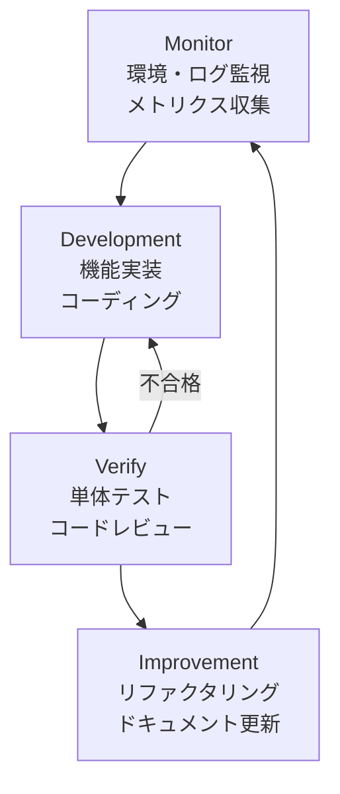

# フェーズ1: 基盤構築 概要

## フェーズ目標

フェーズ1では、プロジェクト全体の開発基盤を確立する。開発環境の標準化、認証・認可基盤の実装、API基盤の設計・構築、データベース設計、CI/CDパイプラインの整備を完了し、フェーズ2以降のコア開発を安全かつ効率的に進めるための土台を構築する。

| 項目 | 内容 |
|------|------|
| フェーズ番号 | Phase 1 |
| 期間 | 2026/04/02〜2026/04/30（約29日間） |
| 作業時間 | 8時間/日（合計約232時間） |
| 主要テーマ | 開発環境・認証・API基盤・DB設計・CI/CD |

---

## 週次タスク一覧

### 第1週（2026/04/02〜2026/04/08）：開発環境構築
- [ ] Docker Compose による開発環境セットアップ
- [ ] Node.js / Python / PostgreSQL / Redis コンテナ設定
- [ ] VSCode 開発設定（extensions, settings.json）
- [ ] `.env` 管理（dotenv / 環境変数設計）
- [ ] GitHub リポジトリ初期設定（branch protection, CODEOWNERS）
- [ ] pre-commit フック設定（flake8, eslint, prettier）

### 第2週（2026/04/09〜2026/04/15）：認証基盤実装
- [ ] JWT トークン発行・検証ロジック実装
- [ ] OAuth2.0 フロー実装（Authorization Code Flow）
- [ ] RBAC（ロールベースアクセス制御）設計・実装
- [ ] MFA（多要素認証）対応実装
- [ ] ユーザー管理API（登録・更新・削除）
- [ ] パスワードポリシー適用

### 第3週（2026/04/16〜2026/04/22）：API基盤構築
- [ ] FastAPI プロジェクト構造設計
- [ ] OpenAPI（Swagger）ドキュメント自動生成設定
- [ ] APIバージョニング戦略実装（/api/v1/）
- [ ] 共通エラーハンドリングミドルウェア実装
- [ ] レート制限（Rate Limiting）実装
- [ ] CORS設定・セキュリティヘッダー設定

### 第4週（2026/04/23〜2026/04/30）：DB設計・CI/CD整備
- [ ] PostgreSQL スキーマ設計（全テーブル）
- [ ] Alembic マイグレーション初期設定
- [ ] インデックス設計・クエリ最適化
- [ ] GitHub Actions CI パイプライン構築
- [ ] CD パイプライン（ステージング環境自動デプロイ）
- [ ] フェーズ1 完了レビュー・ドキュメント整備

---

## 成果物リスト

| # | 成果物 | 種別 | 完了基準 |
|---|-------|------|---------|
| 1 | Docker Compose 開発環境 | 環境 | 全コンテナ正常起動 |
| 2 | 認証基盤（JWT/OAuth2/RBAC） | コード | 認証テスト全通過 |
| 3 | MFA実装 | コード | TOTP認証テスト通過 |
| 4 | FastAPI API基盤 | コード | OpenAPI仕様生成確認 |
| 5 | PostgreSQL スキーマ | DB | マイグレーション正常実行 |
| 6 | GitHub Actions CI/CD | インフラ | プッシュ時自動テスト・デプロイ確認 |
| 7 | API設計ドキュメント | ドキュメント | Swaggerページ確認 |
| 8 | セキュリティ基盤 | コード | OWASP基本チェック通過 |

---

## KPI / 完了条件

| KPI | 目標値 | 測定方法 |
|-----|--------|---------|
| 単体テストカバレッジ | ≥80% | pytest-cov |
| APIレスポンス時間（P95） | ≤200ms | k6負荷テスト |
| CI/CDパイプライン成功率 | ≥95% | GitHub Actions履歴 |
| セキュリティスキャン合格 | 重大・高リスク0件 | Bandit/Safety |
| ドキュメント整備率 | 100%（全API） | Swagger UI確認 |

---

## Monitor → Development → Verify → Improvement ループの適用

### フェーズ1での適用詳細

| ステップ | フェーズ1での具体的活動 |
|---------|----------------------|
| **Monitor** | 開発環境ログ監視、コンテナヘルスチェック、CI/CDパイプライン状態監視 |
| **Development** | Docker環境構築、認証実装、API基盤構築、DB設計、CI/CD整備 |
| **Verify** | 認証フローテスト、APIエンドポイントテスト、DB接続テスト、パイプライン動作確認 |
| **Improvement** | 設定最適化、コード品質改善、ドキュメント整備、セキュリティ強化 |

---

## リスクと対応策

| リスク | 影響度 | 対応策 |
|-------|--------|-------|
| 環境構築の遅延 | 中 | Docker Composeテンプレート事前準備 |
| 認証設計の複雑化 | 高 | 既存ライブラリ（FastAPI-users等）活用 |
| DB設計の手戻り | 高 | フェーズ2以降の要件を事前に確認 |
| CI/CD設定の難航 | 低 | GitHub Actions公式テンプレート活用 |

---

## 依存関係

- このフェーズの完了がPhase 2以降の全開発の前提条件
- 認証基盤はすべてのモジュールで利用される最重要コンポーネント
- DB設計は全モジュールの基盤となるため、Phase 2開始前に確定必須
