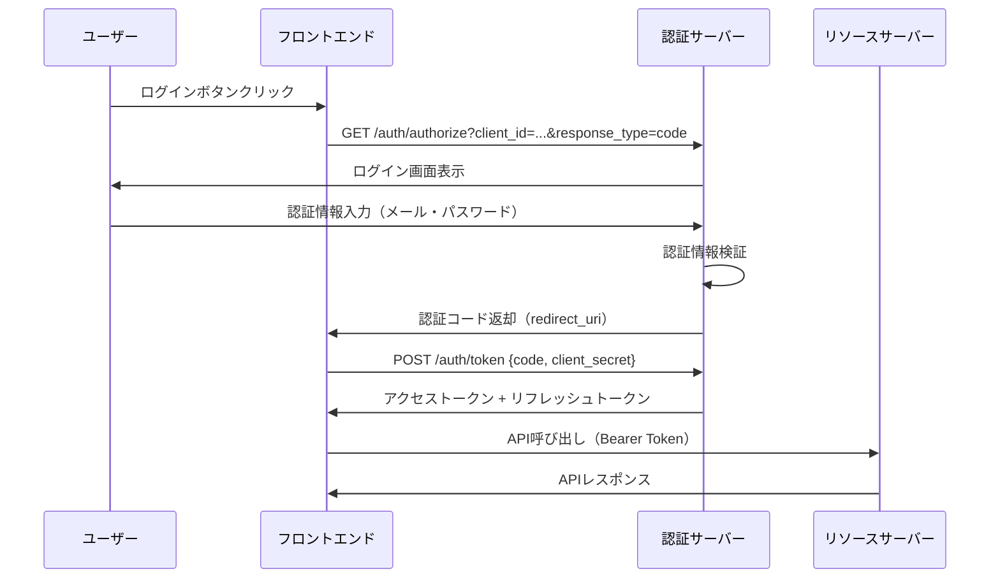
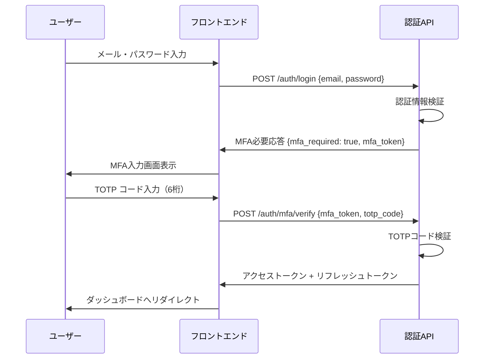

# 認証基盤設計

## 概要

本ドキュメントでは、ServiceHub Construction Platform の認証・認可基盤の設計を説明する。JWT認証、OAuth2.0、RBAC（ロールベースアクセス制御）、MFA（多要素認証）を組み合わせた堅牢な認証基盤を実装する。

---

## 認証方式の選定

| 認証方式 | 採用 | 理由 |
|---------|------|------|
| JWT（JSON Web Token） | ✅ | ステートレス認証、マイクロサービス対応 |
| OAuth2.0 | ✅ | 業界標準プロトコル、社内IdP連携 |
| RBAC | ✅ | ISO27001・SoD要件への対応 |
| MFA（TOTP） | ✅ | セキュリティ強化、管理者・承認者必須 |
| セッションCookie | ❌ | スケーラビリティ課題のため不採用 |

---

## JWT認証設計

### トークン構造

```json
{
  "header": {
    "alg": "HS256",
    "typ": "JWT"
  },
  "payload": {
    "sub": "user_id_uuid",
    "email": "user@example.com",
    "roles": ["field_worker", "site_supervisor"],
    "permissions": ["project:read", "daily_report:write"],
    "iat": 1748822400,
    "exp": 1748824200,
    "jti": "unique_token_id"
  }
}
```

### トークン有効期限

| トークン種別 | 有効期限 | 用途 |
|-----------|--------|------|
| アクセストークン | 30分 | API認証 |
| リフレッシュトークン | 7日間 | アクセストークン再取得 |
| MFAトークン | 5分 | MFA認証中間状態 |

---

## OAuth2.0フロー



---

## MFA（多要素認証）フロー



---

## RBAC設計

### ロール一覧

| ロールID | ロール名 | 対象者 | 説明 |
|---------|---------|-------|------|
| `system_admin` | システム管理者 | IT担当者 | 全権限 |
| `company_admin` | 会社管理者 | 経営者・管理本部 | 会社レベルの管理権限 |
| `project_manager` | 現場所長・PM | 現場所長 | 案件全体の管理権限 |
| `site_supervisor` | 現場監督 | 現場監督 | 担当案件の作業管理 |
| `field_worker` | 現場作業員 | 現場作業員 | 日報・写真の入力権限 |
| `safety_officer` | 安全担当者 | 安全担当 | 安全品質管理権限 |
| `cost_manager` | 原価管理担当 | 経理・積算担当 | 原価情報の閲覧・入力 |
| `readonly_viewer` | 閲覧者 | 外部関係者 | 閲覧のみ |

### 権限マトリクス（主要機能）

| 機能 | system_admin | company_admin | project_manager | site_supervisor | field_worker |
|-----|:---:|:---:|:---:|:---:|:---:|
| 案件作成 | ✅ | ✅ | ✅ | ❌ | ❌ |
| 案件閲覧 | ✅ | ✅ | ✅ | ✅ | ✅ |
| 案件更新 | ✅ | ✅ | ✅ | ❌ | ❌ |
| 日報作成 | ✅ | ✅ | ✅ | ✅ | ✅ |
| 日報承認 | ✅ | ✅ | ✅ | ✅ | ❌ |
| ユーザー管理 | ✅ | ✅ | ❌ | ❌ | ❌ |
| 原価閲覧 | ✅ | ✅ | ✅ | ❌ | ❌ |
| システム設定 | ✅ | ❌ | ❌ | ❌ | ❌ |

---

## SoD（職務分掌分離）設計

職務分掌分離（Segregation of Duties）により、不正防止と内部統制を強化する。

| 業務 | 実行者 | 承認者 | 検証者 |
|-----|-------|-------|-------|
| 日報作成・提出 | field_worker | site_supervisor | project_manager |
| 原価入力 | cost_manager | project_manager | company_admin |
| ユーザー登録 | system_admin | company_admin | - |
| 変更管理承認 | - | project_manager | system_admin |

---

## 実装コード例

### FastAPIでのJWT認証実装

```python
from fastapi import Depends, HTTPException, status
from fastapi.security import OAuth2PasswordBearer
from jose import JWTError, jwt
from datetime import datetime, timedelta
from typing import Optional

SECRET_KEY = "your-secret-key"
ALGORITHM = "HS256"
ACCESS_TOKEN_EXPIRE_MINUTES = 30

oauth2_scheme = OAuth2PasswordBearer(tokenUrl="/api/v1/auth/token")

def create_access_token(data: dict, expires_delta: Optional[timedelta] = None):
    to_encode = data.copy()
    expire = datetime.utcnow() + (expires_delta or timedelta(minutes=ACCESS_TOKEN_EXPIRE_MINUTES))
    to_encode.update({"exp": expire})
    return jwt.encode(to_encode, SECRET_KEY, algorithm=ALGORITHM)

async def get_current_user(token: str = Depends(oauth2_scheme)):
    credentials_exception = HTTPException(
        status_code=status.HTTP_401_UNAUTHORIZED,
        detail="認証情報が無効です",
        headers={"WWW-Authenticate": "Bearer"},
    )
    try:
        payload = jwt.decode(token, SECRET_KEY, algorithms=[ALGORITHM])
        user_id: str = payload.get("sub")
        if user_id is None:
            raise credentials_exception
        return payload
    except JWTError:
        raise credentials_exception
```

---

## セキュリティ考慮事項

- **トークン漏洩対策**：HTTPS必須、HttpOnly Cookie使用、XSS対策
- **ブルートフォース対策**：ログイン失敗5回でアカウントロック（30分）
- **トークン無効化**：ログアウト時にリフレッシュトークンをRedisブラックリストに追加
- **パスワードポリシー**：12文字以上、大小英数記号混在必須
- **監査ログ**：全認証イベント（成功・失敗）をログ記録
