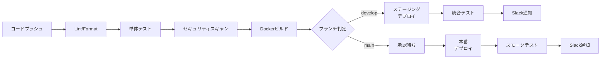

# CI/CD構築設計

## 概要

GitHub Actions を使用して、コードプッシュから本番デプロイまでの継続的インテグレーション・デリバリーパイプラインを構築する。品質ゲートを設け、すべてのチェックを通過したコードのみがデプロイされる仕組みを実現する。

---

## CI/CDパイプライン全体像



---

## ブランチ戦略

| ブランチ | 用途 | デプロイ先 | 保護設定 |
|---------|------|----------|---------|
| `main` | 本番リリース | 本番環境 | PR必須・2名レビュー必須 |
| `develop` | 開発統合 | ステージング | PR必須・1名レビュー必須 |
| `feature/*` | 機能開発 | - | - |
| `fix/*` | バグ修正 | - | - |
| `hotfix/*` | 緊急修正 | 本番環境 | PR必須・2名レビュー必須 |

---

## GitHub Actions ワークフロー設定

### CI ワークフロー（.github/workflows/ci.yml）

```yaml
name: CI Pipeline

on:
  push:
    branches: [develop, main, 'feature/*', 'fix/*']
  pull_request:
    branches: [develop, main]

jobs:
  lint:
    name: Lint & Format Check
    runs-on: ubuntu-22.04
    steps:
      - uses: actions/checkout@v4
      - name: Setup Python
        uses: actions/setup-python@v5
        with:
          python-version: '3.12'
      - name: Install dependencies
        run: |
          pip install flake8 black isort mypy
      - name: Run flake8
        run: flake8 backend/app
      - name: Run black
        run: black --check backend/app
      - name: Run isort
        run: isort --check-only backend/app
      - name: Run mypy
        run: mypy backend/app

  test-backend:
    name: Backend Tests
    runs-on: ubuntu-22.04
    services:
      postgres:
        image: postgres:16
        env:
          POSTGRES_DB: servicehub_test
          POSTGRES_USER: test_user
          POSTGRES_PASSWORD: test_password
        ports:
          - 5432:5432
      redis:
        image: redis:7-alpine
        ports:
          - 6379:6379
    steps:
      - uses: actions/checkout@v4
      - name: Setup Python
        uses: actions/setup-python@v5
        with:
          python-version: '3.12'
      - name: Install dependencies
        run: pip install -r backend/requirements.txt -r backend/requirements-dev.txt
      - name: Run migrations
        run: alembic upgrade head
        working-directory: backend
      - name: Run tests with coverage
        run: pytest --cov=app --cov-report=xml --cov-fail-under=80
        working-directory: backend
      - name: Upload coverage
        uses: codecov/codecov-action@v4
        with:
          file: backend/coverage.xml

  test-frontend:
    name: Frontend Tests
    runs-on: ubuntu-22.04
    steps:
      - uses: actions/checkout@v4
      - name: Setup Node.js
        uses: actions/setup-node@v4
        with:
          node-version: '20'
          cache: 'npm'
          cache-dependency-path: frontend/package-lock.json
      - name: Install dependencies
        run: npm ci
        working-directory: frontend
      - name: Type check
        run: npm run type-check
        working-directory: frontend
      - name: Run tests
        run: npm test -- --coverage
        working-directory: frontend

  security-scan:
    name: Security Scan
    runs-on: ubuntu-22.04
    steps:
      - uses: actions/checkout@v4
      - name: Run Bandit (Python)
        run: |
          pip install bandit
          bandit -r backend/app -f json -o bandit-report.json
      - name: Run Safety (Dependencies)
        run: |
          pip install safety
          safety check -r backend/requirements.txt
      - name: Run npm audit
        run: npm audit --audit-level=high
        working-directory: frontend
      - name: Run Trivy (Container)
        uses: aquasecurity/trivy-action@master
        with:
          scan-type: 'fs'
          scan-ref: '.'
          severity: 'CRITICAL,HIGH'
```

### CD ワークフロー（.github/workflows/cd-staging.yml）

```yaml
name: Deploy to Staging

on:
  push:
    branches: [develop]

jobs:
  deploy-staging:
    name: Deploy to Staging
    runs-on: ubuntu-22.04
    environment: staging
    needs: [lint, test-backend, test-frontend, security-scan]
    steps:
      - uses: actions/checkout@v4
      - name: Build Docker images
        run: docker compose build
      - name: Push to Registry
        run: |
          echo ${{ secrets.REGISTRY_PASSWORD }} | docker login registry.internal -u ${{ secrets.REGISTRY_USER }} --password-stdin
          docker compose push
      - name: Deploy to Staging
        uses: appleboy/ssh-action@master
        with:
          host: ${{ secrets.STAGING_HOST }}
          username: deploy
          key: ${{ secrets.SSH_PRIVATE_KEY }}
          script: |
            cd /opt/servicehub
            docker compose pull
            docker compose up -d
            docker compose exec backend alembic upgrade head
      - name: Run Integration Tests
        run: pytest tests/integration/ --base-url=https://staging.servicehub.internal
      - name: Notify Slack
        uses: slackapi/slack-github-action@v1
        with:
          payload: '{"text": "✅ ステージングデプロイ完了: ${{ github.ref_name }}"}'
        env:
          SLACK_WEBHOOK_URL: ${{ secrets.SLACK_WEBHOOK_URL }}
```

---

## 品質ゲート

| チェック項目 | 合格基準 | ブロッキング |
|-----------|---------|-----------|
| Lintチェック | エラー0件 | ✅ はい |
| 単体テストカバレッジ | ≥80% | ✅ はい |
| セキュリティスキャン | CRITICAL/HIGH脆弱性0件 | ✅ はい |
| 型チェック（mypy/tsc） | エラー0件 | ✅ はい |
| Dockerビルド成功 | ビルド成功 | ✅ はい |

---

## デプロイ環境

| 環境 | URL | デプロイトリガー | 承認 |
|-----|-----|--------------|------|
| 開発 | dev.servicehub.internal | feature/* マージ | 不要 |
| ステージング | staging.servicehub.internal | develop マージ | 不要 |
| 本番 | servicehub.internal | main マージ後 | 2名承認必須 |
