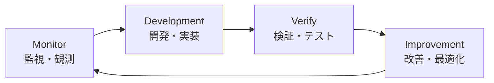
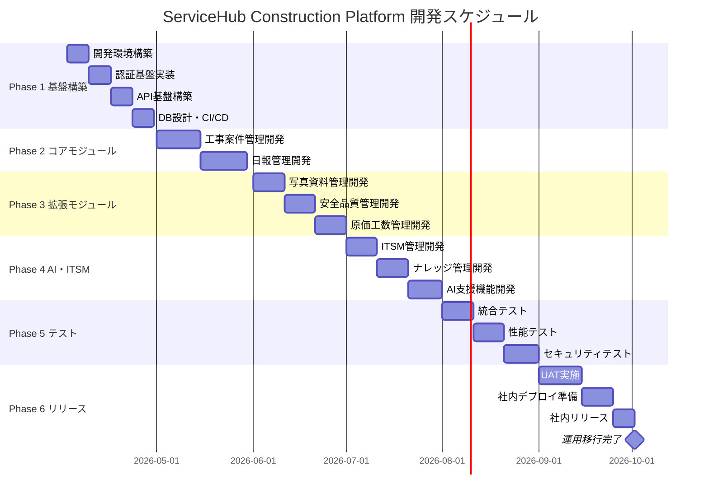

# ServiceHub Construction Platform - 全体開発フェーズ概要

## プロジェクト概要

| 項目 | 内容 |
|------|------|
| プロジェクト名 | ServiceHub Construction Platform |
| 目的 | 建設業向けAI統合業務プラットフォームの構築 |
| GitHub | https://github.com/Kensan196948G/ServiceHub-Construction-Platform |
| 開発開始 | 2026年4月2日 |
| 社内リリース目標 | 2026年10月2日（6ヶ月） |
| 1日の作業時間 | 8時間 |
| 総作業時間（概算） | 約1,000時間 |

本プロジェクトは、建設業の現場業務を効率化・高度化するため、AI統合型の業務プラットフォームを6ヶ月で開発・社内展開することを目標とする。工事案件管理を中核とし、日報管理・写真管理・安全品質管理・原価管理・ITSM運用・ナレッジAI支援の7ドメインを統合した包括的なシステムである。

---

## 6ヶ月フェーズ一覧

| フェーズ | 名称 | 開始日 | 終了日 | 主要成果物 |
|---------|------|--------|--------|-----------|
| Phase 1 | 基盤構築 | 2026/04/02 | 2026/04/30 | 開発環境、認証基盤、API基盤、DB設計、CI/CD |
| Phase 2 | コアモジュール開発 | 2026/05/01 | 2026/05/30 | 工事案件管理、日報管理 |
| Phase 3 | 拡張モジュール開発 | 2026/06/01 | 2026/06/30 | 写真管理、安全品質管理、原価管理 |
| Phase 4 | AI・ITSM統合 | 2026/07/01 | 2026/07/31 | ITSM管理、ナレッジ管理、AI支援 |
| Phase 5 | 統合テスト・品質保証 | 2026/08/01 | 2026/08/31 | 統合テスト、性能テスト、セキュリティテスト |
| Phase 6 | リリース準備・社内展開 | 2026/09/01 | 2026/10/02 | UAT、運用手順、社内デプロイ |

---

## 各フェーズの目標

### Phase 1: 基盤構築（2026/04/02〜2026/04/30）
- Docker/Kubernetes開発環境の構築
- JWT + OAuth2.0 + RBAC 認証基盤の実装
- FastAPI による REST API 基盤の確立
- PostgreSQL スキーマ設計と Alembic マイグレーション整備
- GitHub Actions による CI/CD パイプライン構築

### Phase 2: コアモジュール開発（2026/05/01〜2026/05/30）
- 工事案件管理（CRUD・ステータス管理・担当者アサイン）の完全実装
- 日報管理（作成・承認フロー・工数記録・PDF出力）の完全実装
- モジュール間連携APIの整備

### Phase 3: 拡張モジュール開発（2026/06/01〜2026/06/30）
- 写真・資料管理（S3/MinIO連携・タグ管理・検索）の実装
- 安全品質管理（チェックリスト・ヒヤリハット・是正処置）の実装
- 原価・工数管理（予算管理・差異分析・レポート）の実装

### Phase 4: AI・ITSM統合（2026/07/01〜2026/07/31）
- ITSM準拠（ISO20000）インシデント・問題・変更管理の実装
- ナレッジベース（Elasticsearch全文検索）の構築
- LLM統合（OpenAI API）による AI支援機能の実装

### Phase 5: 統合テスト・品質保証（2026/08/01〜2026/08/31）
- 全モジュール統合テスト実施
- 負荷テスト・性能テスト実施（Locust/k6）
- セキュリティテスト実施（OWASP Top10対応）

### Phase 6: リリース準備・社内展開（2026/09/01〜2026/10/02）
- UAT（ユーザー受入テスト）実施
- 社内デプロイ・告知・サポート体制整備
- 運用引き継ぎ・ユーザー研修実施

---

## 開発ループ：Monitor → Development → Verify → Improvement

本プロジェクトでは、各フェーズを通じて以下の継続改善ループを適用する。

| ステップ | 内容 | 主な活動 |
|---------|------|---------|
| Monitor | 現状把握・課題の観測 | ログ監視、メトリクス収集、ユーザーフィードバック |
| Development | 機能実装・修正 | コーディング、単体テスト、コードレビュー |
| Verify | 動作確認・品質検証 | 統合テスト、性能テスト、セキュリティテスト |
| Improvement | 改善・最適化 | リファクタリング、パフォーマンスチューニング、ドキュメント更新 |

---

## マイルストーン一覧

| マイルストーン | 日付 | 完了条件 |
|-------------|------|---------|
| M1: 開発基盤確立 | 2026/04/30 | 全開発環境起動確認、CI/CD稼働 |
| M2: コアモジュール完成 | 2026/05/30 | 工事案件・日報管理E2Eテスト通過 |
| M3: 拡張モジュール完成 | 2026/06/30 | 写真・安全品質・原価管理テスト通過 |
| M4: AI/ITSM統合完成 | 2026/07/31 | ITSM・ナレッジ・AI機能テスト通過 |
| M5: 品質保証完了 | 2026/08/31 | 全テスト通過、性能・セキュリティ基準達成 |
| M6: 社内リリース | 2026/10/02 | UAT合格、本番環境デプロイ完了 |

---

## ガントチャート（6ヶ月全体）

---

## システムドメイン一覧

| # | ドメイン | 概要 |
|---|---------|------|
| 1 | 工事案件管理（中核） | 案件のライフサイクル全体管理 |
| 2 | 日報管理 | 現場日報の作成・承認・分析 |
| 3 | 写真・資料管理 | 現場写真・工事書類の管理 |
| 4 | 安全・品質管理 | 安全点検・品質検査・是正処置 |
| 5 | 原価・工数管理 | 予算管理・実績原価・工数集計 |
| 6 | ITSM運用管理 | ISO20000準拠の運用管理 |
| 7 | ナレッジ・AI支援 | 全文検索・AI補完・チャットボット |

## 遵守規格

- **ITSM準拠**：ISO20000（ITサービスマネジメント）
- **セキュリティ**：ISO27001 / NIST CSF2.0
- **アクセス制御**：RBAC（ロールベースアクセス制御）必須
- **監査証跡**：全操作の監査ログ記録必須
- **SoD**：職務分掌分離（Segregation of Duties）の実施
