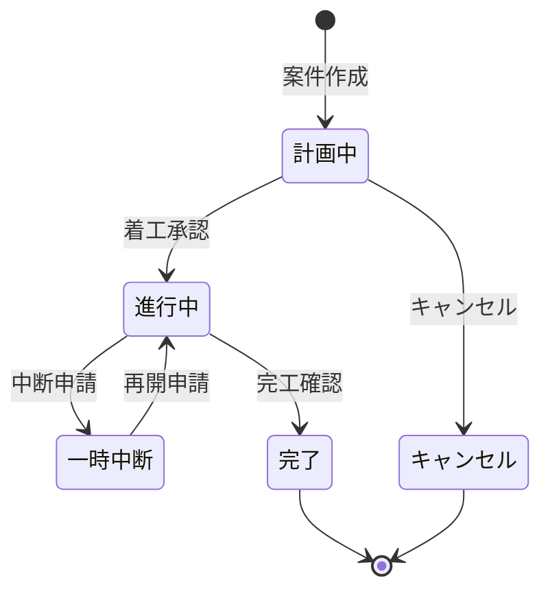
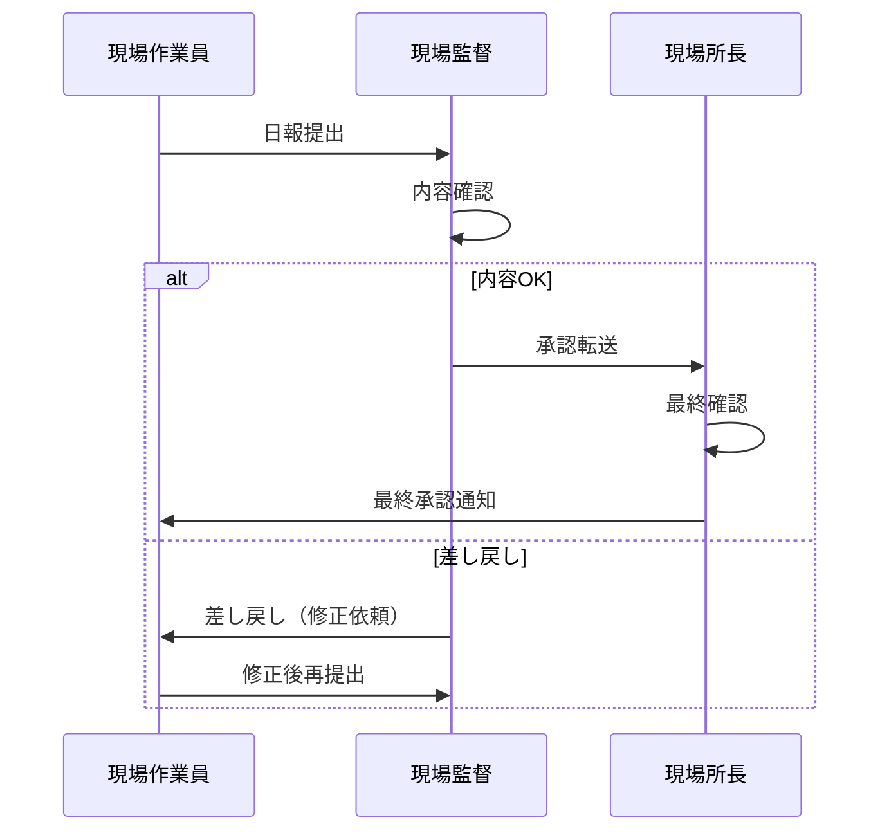

# フェーズ2: コアモジュール開発 概要

## フェーズ目標

フェーズ2では、ServiceHub Construction Platform の中核となる2つのモジュール「工事案件管理」と「日報管理」を完全実装する。フェーズ1で構築した基盤の上に、建設現場の日常業務に直結する機能を開発し、エンドツーエンドのユーザーフローを実現する。

| 項目 | 内容 |
|------|------|
| フェーズ番号 | Phase 2 |
| 期間 | 2026/05/01〜2026/05/30（約30日間） |
| 作業時間 | 8時間/日（合計約240時間） |
| 主要テーマ | 工事案件管理・日報管理 |
| 前提 | フェーズ1（基盤構築）の完了 |

---

## 開発対象モジュール

### 1. 工事案件管理モジュール

建設業における案件のライフサイクル全体を管理するコアモジュール。

| 機能 | 内容 |
|-----|------|
| 案件CRUD | 案件の作成・参照・更新・削除 |
| ステータス管理 | 計画中→進行中→完了→中断のライフサイクル管理 |
| 担当者アサイン | メンバーの追加・削除・ロール設定 |
| 進捗管理 | 工程進捗率の入力・グラフ表示 |
| 案件検索 | 名称・工期・ステータス・担当者での絞り込み |
| 案件詳細画面 | ダッシュボード形式の案件詳細ビュー |

### 2. 日報管理モジュール

現場作業員・現場監督の日次報告業務を効率化するモジュール。

| 機能 | 内容 |
|-----|------|
| 日報作成 | テンプレートベースの日報入力 |
| 承認フロー | 作業員→監督→所長の多段階承認 |
| 工数記録 | 作業種別・時間・人員の記録 |
| 写真添付 | 日報への作業写真添付（最大10枚） |
| PDF出力 | 日報のPDFエクスポート |
| 日報検索 | 日付・案件・作業者での検索 |

---

## 週次タスク一覧

### 第1〜2週（2026/05/01〜2026/05/14）：工事案件管理開発
- [ ] 案件モデル・スキーマ設計
- [ ] 案件CRUD API実装
- [ ] ステータス遷移ロジック実装
- [ ] 担当者アサインAPI実装
- [ ] 案件一覧・詳細フロントエンド実装
- [ ] 案件検索・フィルタリング実装

### 第3〜4週（2026/05/15〜2026/05/30）：日報管理開発
- [ ] 日報モデル・スキーマ設計
- [ ] 日報CRUD API実装
- [ ] 承認フローロジック実装
- [ ] 工数記録機能実装
- [ ] 写真添付機能実装（MinIO連携）
- [ ] PDF生成機能実装（ReportLab）
- [ ] 日報フロントエンド実装

---

## 成果物リスト

| # | 成果物 | 完了基準 |
|---|-------|---------|
| 1 | 工事案件管理API（CRUD・検索） | E2Eテスト通過 |
| 2 | 日報管理API（作成・承認・PDF） | E2Eテスト通過 |
| 3 | 案件管理フロントエンド | ブラウザ動作確認 |
| 4 | 日報管理フロントエンド | ブラウザ動作確認 |
| 5 | モジュール間連携API | 統合テスト通過 |
| 6 | テストコード（単体・統合） | カバレッジ80%以上 |

---

## ステータス遷移図（工事案件）

---

## 日報承認フロー

---

## KPI / 完了条件

| KPI | 目標値 |
|-----|--------|
| 案件管理APIテストカバレッジ | ≥80% |
| 日報管理APIテストカバレッジ | ≥80% |
| APIレスポンス時間 | ≤200ms（P95） |
| 承認フロー動作確認 | 全シナリオ通過 |
| PDF出力品質 | 実際のフォーム要件を満たす |
