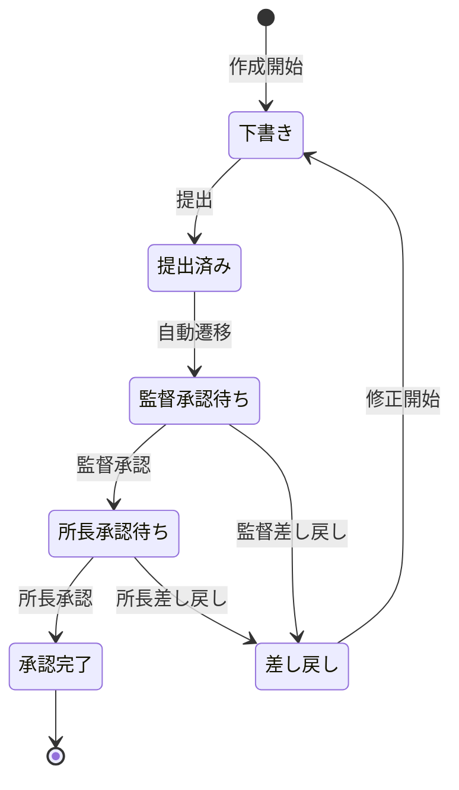

# 日報管理 開発設計

## 概要

日報管理モジュールは、建設現場における日次作業報告書（日報）の作成・承認・保管・分析を支援するモジュールである。現場作業員の日報入力から、現場監督・現場所長による承認、PDF出力・配信までを一元管理する。

---

## 機能一覧

| 機能ID | 機能名 | 優先度 | 説明 |
|-------|-------|--------|------|
| DR-001 | 日報作成 | 高 | テンプレートベースの日報入力 |
| DR-002 | 日報一覧表示 | 高 | 日付・案件・担当者での検索 |
| DR-003 | 日報承認 | 高 | 多段階承認フロー |
| DR-004 | 日報差し戻し | 高 | 修正依頼・再提出 |
| DR-005 | 工数記録 | 高 | 作業種別・人員・時間の記録 |
| DR-006 | 写真添付 | 中 | 作業写真のアップロード（最大10枚） |
| DR-007 | PDF出力 | 中 | 日報のPDF形式エクスポート |
| DR-008 | 日報コピー | 低 | 前日の日報をコピーして編集 |
| DR-009 | 月次集計 | 低 | 月次の作業実績集計レポート |

---

## データモデル

### reports.daily_reports テーブル

```sql
CREATE TABLE reports.daily_reports (
    id              UUID PRIMARY KEY DEFAULT gen_random_uuid(),
    project_id      UUID NOT NULL REFERENCES projects.projects(id),
    report_date     DATE NOT NULL,
    author_id       UUID NOT NULL REFERENCES auth.users(id),
    status          VARCHAR(50) NOT NULL DEFAULT 'draft',
    weather         VARCHAR(20),                    -- 天候
    temperature     DECIMAL(4,1),                   -- 気温
    worker_count    INTEGER NOT NULL DEFAULT 0,     -- 作業員数
    work_summary    TEXT NOT NULL,                  -- 作業概要
    tomorrow_plan   TEXT,                           -- 翌日の作業予定
    issues          TEXT,                           -- 問題・課題
    safety_notes    TEXT,                           -- 安全事項
    submitted_at    TIMESTAMPTZ,                    -- 提出日時
    approved_at     TIMESTAMPTZ,                    -- 最終承認日時
    created_at      TIMESTAMPTZ NOT NULL DEFAULT NOW(),
    updated_at      TIMESTAMPTZ NOT NULL DEFAULT NOW(),
    UNIQUE(project_id, report_date, author_id)
);
```

### reports.report_approvals テーブル

```sql
CREATE TABLE reports.report_approvals (
    id              UUID PRIMARY KEY DEFAULT gen_random_uuid(),
    report_id       UUID NOT NULL REFERENCES reports.daily_reports(id),
    approver_id     UUID NOT NULL REFERENCES auth.users(id),
    approval_level  INTEGER NOT NULL,               -- 1:監督, 2:所長
    status          VARCHAR(20) NOT NULL,           -- approved, rejected
    comment         TEXT,                           -- 承認・差し戻しコメント
    approved_at     TIMESTAMPTZ NOT NULL DEFAULT NOW()
);
```

### reports.work_logs テーブル（工数記録）

```sql
CREATE TABLE reports.work_logs (
    id              UUID PRIMARY KEY DEFAULT gen_random_uuid(),
    report_id       UUID NOT NULL REFERENCES reports.daily_reports(id),
    work_category   VARCHAR(100) NOT NULL,          -- 作業種別
    worker_count    INTEGER NOT NULL DEFAULT 1,     -- 人数
    start_time      TIME NOT NULL,                  -- 開始時刻
    end_time        TIME NOT NULL,                  -- 終了時刻
    hours           DECIMAL(4,2) NOT NULL,          -- 作業時間
    description     TEXT,                           -- 作業内容詳細
    created_at      TIMESTAMPTZ NOT NULL DEFAULT NOW()
);
```

---

## 承認フロー設計



---

## API設計

| メソッド | エンドポイント | 説明 | 権限 |
|--------|------------|------|------|
| GET | /api/v1/daily-reports | 日報一覧 | 全認証ユーザー |
| POST | /api/v1/daily-reports | 日報作成 | field_worker以上 |
| GET | /api/v1/daily-reports/{id} | 日報詳細 | 全認証ユーザー |
| PUT | /api/v1/daily-reports/{id} | 日報更新 | 作成者本人 |
| POST | /api/v1/daily-reports/{id}/submit | 日報提出 | 作成者本人 |
| POST | /api/v1/daily-reports/{id}/approve | 承認 | site_supervisor以上 |
| POST | /api/v1/daily-reports/{id}/reject | 差し戻し | site_supervisor以上 |
| GET | /api/v1/daily-reports/{id}/pdf | PDF出力 | 全認証ユーザー |
| POST | /api/v1/daily-reports/{id}/photos | 写真添付 | 作成者本人 |

---

## PDF生成設計

ReportLab ライブラリを使用してPDFを生成する。

```python
from reportlab.lib.pagesizes import A4
from reportlab.platypus import SimpleDocTemplate, Table, Paragraph
from reportlab.lib.styles import getSampleStyleSheet

def generate_daily_report_pdf(report: DailyReport) -> bytes:
    """日報PDFの生成"""
    buffer = BytesIO()
    doc = SimpleDocTemplate(buffer, pagesize=A4)

    story = []
    styles = getSampleStyleSheet()

    # タイトル
    story.append(Paragraph(f"工事日報　{report.report_date}", styles['Title']))

    # 基本情報テーブル
    data = [
        ["案件名", report.project.project_name],
        ["作業日", str(report.report_date)],
        ["作業員数", f"{report.worker_count}名"],
        ["天候", report.weather or "-"],
    ]
    table = Table(data, colWidths=[100, 350])
    story.append(table)

    doc.build(story)
    return buffer.getvalue()
```

---

## 通知設計

| トリガー | 通知先 | 通知方法 |
|---------|-------|---------|
| 日報提出 | 承認者（現場監督） | アプリ内通知・メール |
| 監督承認 | 現場所長 | アプリ内通知 |
| 最終承認 | 作成者 | アプリ内通知・メール |
| 差し戻し | 作成者 | アプリ内通知・メール |
| 提出期限切れ | 作成者・監督 | アプリ内通知 |

---

## テスト設計

```python
# テストシナリオ
class TestDailyReportWorkflow:
    def test_create_draft_report(self):
        """下書き日報作成"""

    def test_submit_report(self):
        """日報提出"""

    def test_approve_by_supervisor(self):
        """監督による承認"""

    def test_reject_by_supervisor(self):
        """監督による差し戻し"""

    def test_final_approval(self):
        """所長による最終承認"""

    def test_pdf_generation(self):
        """PDF生成"""

    def test_duplicate_report_on_same_day(self):
        """同日の重複日報エラー"""
```
