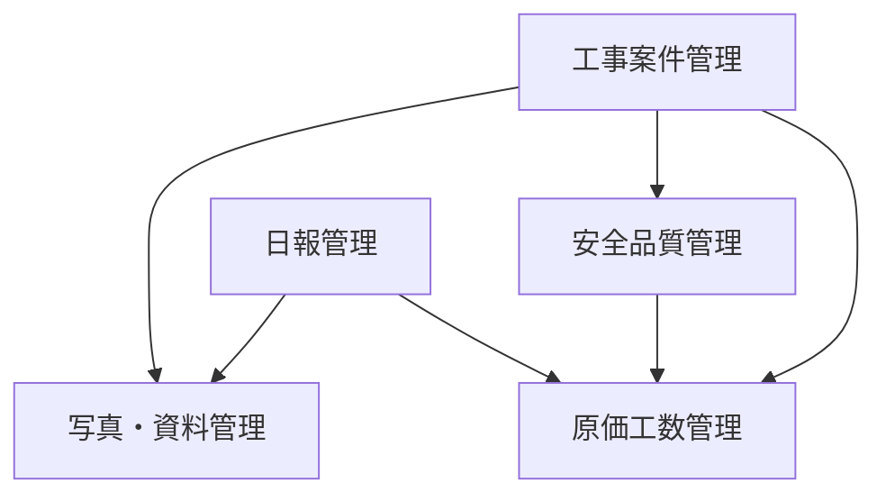

# フェーズ3: 拡張モジュール開発 概要

**リポジトリURL:** https://github.com/Kensan196948G/ServiceHub-Construction-Platform.git

## フェーズ目標

フェーズ3では、建設現場で必要とされる3つの拡張モジュール「写真・資料管理」「安全品質管理」「原価・工数管理」を実装する。フェーズ2のコアモジュールと連携し、現場業務を包括的にカバーするプラットフォームを実現する。

| 項目 | 内容 |
|------|------|
| フェーズ番号 | Phase 3 |
| 期間 | 2026/06/01〜2026/06/30（約30日間） |
| 作業時間 | 8時間/日（合計約240時間） |
| 主要テーマ | 写真管理・安全品質管理・原価工数管理 |
| 前提 | フェーズ2（コアモジュール）の完了 |

---

## 開発対象モジュール

### 1. 写真・資料管理モジュール
- 現場写真・工事書類のアップロード・管理
- MinIO（S3互換）によるオブジェクトストレージ活用
- サムネイル自動生成・タグ管理・全文検索

### 2. 安全品質管理モジュール
- 安全点検チェックリストの作成・記録
- ヒヤリハット（潜在的危険）の報告・管理
- 品質検査記録・是正処置管理

### 3. 原価・工数管理モジュール
- 案件予算の登録・管理
- 実績原価の入力・集計
- 工数集計・差異分析・レポート生成

---

## 週次タスク一覧

### 第1〜1.5週（2026/06/01〜2026/06/10）：写真・資料管理開発
- [ ] MinIO/S3連携設定
- [ ] 写真アップロードAPI実装
- [ ] サムネイル生成バックグラウンド処理実装
- [ ] タグ管理機能実装
- [ ] 写真検索・フィルタリング実装
- [ ] フロントエンド実装

### 第2〜2.5週（2026/06/11〜2026/06/20）：安全品質管理開発
- [ ] 安全点検チェックリストAPI実装
- [ ] ヒヤリハット報告フォーム実装
- [ ] 品質検査記録API実装
- [ ] 是正処置ワークフロー実装
- [ ] フロントエンド実装

### 第3週（2026/06/21〜2026/06/30）：原価工数管理開発
- [ ] 予算管理API実装
- [ ] 実績原価入力API実装
- [ ] 工数集計ロジック実装
- [ ] 差異分析レポート生成
- [ ] フロントエンド実装・Phase3完了レビュー

---

## モジュール間連携

---

## 成果物リスト

| # | 成果物 | 完了基準 |
|---|-------|---------|
| 1 | 写真・資料管理API | アップロード・検索テスト通過 |
| 2 | 安全品質管理API | チェックリスト・ヒヤリハットテスト通過 |
| 3 | 原価工数管理API | 予算・実績・差異分析テスト通過 |
| 4 | フロントエンド画面（全3モジュール） | ブラウザ動作確認 |
| 5 | MinIO連携動作確認 | ファイルアップロード・取得確認 |

---

## KPI / 完了条件

| KPI | 目標値 |
|-----|--------|
| テストカバレッジ（全モジュール） | ≥80% |
| 写真アップロード時間（10MB） | ≤5秒 |
| APIレスポンス時間 | ≤200ms（P95） |
| ファイルストレージ可用性 | 99.9%以上 |
