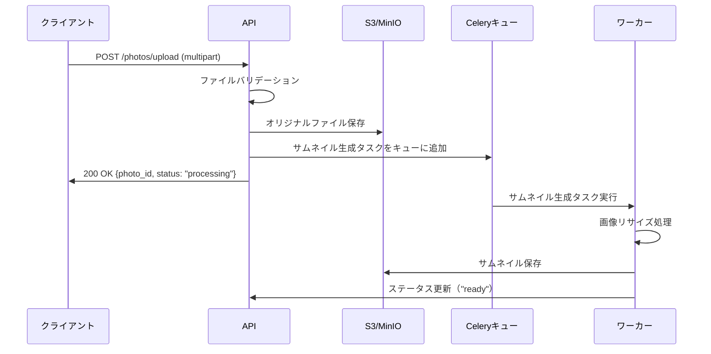

# 写真・資料管理 開発設計

## 概要

写真・資料管理モジュールは、建設現場で撮影された工事写真や各種資料（図面・仕様書・報告書等）を一元管理するモジュールである。MinIO（S3互換オブジェクトストレージ）を活用し、大量ファイルの高速な格納・取得・検索を実現する。

---

## 機能一覧

| 機能ID | 機能名 | 優先度 | 説明 |
|-------|-------|--------|------|
| PH-001 | ファイルアップロード | 高 | 写真・資料のアップロード（最大50MB/件） |
| PH-002 | サムネイル自動生成 | 高 | 画像のサムネイル自動生成（バックグラウンド） |
| PH-003 | ファイル一覧表示 | 高 | グリッド・リスト形式での一覧表示 |
| PH-004 | ファイル詳細表示 | 高 | メタデータ・タグ・コメント表示 |
| PH-005 | タグ管理 | 中 | タグの付与・編集・検索 |
| PH-006 | 検索・フィルタリング | 中 | ファイル名・タグ・日付での検索 |
| PH-007 | ダウンロード | 高 | 単体・一括ダウンロード |
| PH-008 | 案件・日報との紐付け | 高 | 関連エンティティとのリンク |
| PH-009 | アクセス制御 | 高 | RBAC によるファイルアクセス制御 |
| PH-010 | ストレージ使用量管理 | 低 | 案件別・月別使用量集計 |

---

## ストレージ構成

```
MinIO バケット: servicehub-media
├── photos/
│   ├── {project_id}/
│   │   ├── {year}/{month}/{day}/
│   │   │   ├── original/        # 元画像
│   │   │   └── thumbnails/      # サムネイル（150x150, 400x300）
├── documents/
│   ├── {project_id}/
│   │   ├── drawings/            # 図面
│   │   ├── specifications/      # 仕様書
│   │   └── reports/             # 報告書
└── temp/
    └── uploads/                 # アップロード一時領域
```

---

## データモデル

### media.photos テーブル

```sql
CREATE TABLE media.photos (
    id              UUID PRIMARY KEY DEFAULT gen_random_uuid(),
    project_id      UUID REFERENCES projects.projects(id),
    report_id       UUID REFERENCES reports.daily_reports(id),
    file_name       VARCHAR(255) NOT NULL,
    original_name   VARCHAR(255) NOT NULL,
    file_size       BIGINT NOT NULL,
    mime_type       VARCHAR(100) NOT NULL,
    storage_path    VARCHAR(500) NOT NULL,
    thumbnail_path  VARCHAR(500),
    width           INTEGER,
    height          INTEGER,
    taken_at        TIMESTAMPTZ,
    location        VARCHAR(200),
    description     TEXT,
    uploaded_by     UUID REFERENCES auth.users(id),
    created_at      TIMESTAMPTZ NOT NULL DEFAULT NOW(),
    is_deleted      BOOLEAN NOT NULL DEFAULT FALSE
);

CREATE INDEX idx_photos_project ON media.photos(project_id);
CREATE INDEX idx_photos_report ON media.photos(report_id);
CREATE INDEX idx_photos_taken_at ON media.photos(taken_at);
```

### media.photo_tags テーブル

```sql
CREATE TABLE media.photo_tags (
    photo_id    UUID REFERENCES media.photos(id) ON DELETE CASCADE,
    tag         VARCHAR(100) NOT NULL,
    PRIMARY KEY (photo_id, tag)
);

CREATE INDEX idx_photo_tags_tag ON media.photo_tags(tag);
```

---

## API設計

| メソッド | エンドポイント | 説明 |
|--------|------------|------|
| POST | /api/v1/photos/upload | ファイルアップロード（multipart/form-data） |
| GET | /api/v1/photos | ファイル一覧（フィルタリング・ページネーション） |
| GET | /api/v1/photos/{id} | ファイル詳細取得 |
| GET | /api/v1/photos/{id}/download | ファイルダウンロード（署名付きURL発行） |
| PATCH | /api/v1/photos/{id} | メタデータ更新（タグ・説明） |
| DELETE | /api/v1/photos/{id} | ファイル削除 |
| POST | /api/v1/photos/batch-download | 複数ファイル一括ダウンロード（ZIP） |

---

## ファイルアップロード処理フロー



---

## サムネイル生成実装

```python
from PIL import Image
import boto3
from celery import Celery

celery = Celery('tasks', broker='redis://localhost:6379/0')

@celery.task
def generate_thumbnail(photo_id: str, storage_path: str):
    \"\"\"サムネイル生成バックグラウンドタスク\"\"\"
    s3 = boto3.client('s3', endpoint_url=settings.S3_ENDPOINT_URL)
    
    # オリジナル画像をダウンロード
    obj = s3.get_object(Bucket=settings.S3_BUCKET_NAME, Key=storage_path)
    image = Image.open(obj['Body'])
    
    thumbnail_sizes = [(150, 150), (400, 300)]
    thumbnail_paths = {}
    
    for width, height in thumbnail_sizes:
        thumb = image.copy()
        thumb.thumbnail((width, height), Image.LANCZOS)
        
        thumb_path = storage_path.replace('original/', f'thumbnails/{width}x{height}/')
        buffer = BytesIO()
        thumb.save(buffer, format='JPEG', quality=85)
        buffer.seek(0)
        
        s3.put_object(
            Bucket=settings.S3_BUCKET_NAME,
            Key=thumb_path,
            Body=buffer,
            ContentType='image/jpeg'
        )
        thumbnail_paths[f"{width}x{height}"] = thumb_path
    
    # DBのサムネイルパスを更新
    update_photo_thumbnail(photo_id, thumbnail_paths)
```

---

## セキュリティ設計

- **署名付きURL**：ファイルダウンロードには一時的な署名付きURL（有効期限1時間）を使用
- **アクセス制御**：RBACに基づき、所属プロジェクトのファイルのみアクセス可能
- **ウイルススキャン**：アップロード時にClamAVでウイルススキャン実施
- **ファイルタイプ制限**：許可するMIMEタイプを制限（画像: JPEG/PNG/HEIC、文書: PDF/DOCX/XLSX）
- **ファイルサイズ制限**：画像最大20MB、文書最大50MB
