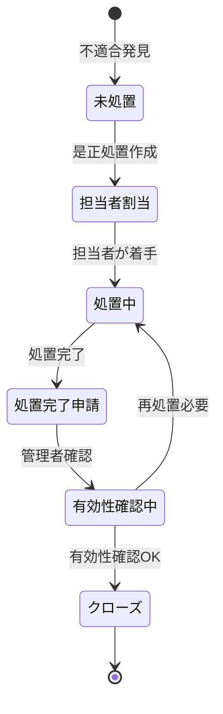

# 安全品質管理 開発設計

## 概要

安全品質管理モジュールは、建設現場における安全管理・品質管理を支援するモジュールである。安全点検チェックリスト、ヒヤリハット報告、品質検査記録、是正処置管理の4つの主要機能を提供し、ISO規格準拠の安全品質管理体制を実現する。

---

## 機能一覧

| 機能ID | 機能名 | 優先度 | 説明 |
|-------|-------|--------|------|
| SQ-001 | 安全点検チェックリスト | 高 | 日次・週次の安全点検記録 |
| SQ-002 | ヒヤリハット報告 | 高 | 潜在的危険事象の報告・管理 |
| SQ-003 | 品質検査記録 | 高 | 品質検査の実施・記録 |
| SQ-004 | 是正処置管理 | 高 | 不適合事象の是正・予防処置 |
| SQ-005 | 安全統計ダッシュボード | 中 | ヒヤリハット件数・安全指標の可視化 |
| SQ-006 | 安全KPI管理 | 中 | 無災害日数・安全点検実施率 |
| SQ-007 | 是正処置期限管理 | 高 | 期限超過アラート通知 |

---

## データモデル

### safety.safety_checks テーブル（安全点検）

```sql
CREATE TABLE safety.safety_checks (
    id              UUID PRIMARY KEY DEFAULT gen_random_uuid(),
    project_id      UUID NOT NULL REFERENCES projects.projects(id),
    check_date      DATE NOT NULL,
    check_type      VARCHAR(50) NOT NULL,       -- daily, weekly, monthly
    inspector_id    UUID REFERENCES auth.users(id),
    overall_result  VARCHAR(20) NOT NULL,       -- pass, fail, conditional
    total_items     INTEGER NOT NULL DEFAULT 0,
    pass_items      INTEGER NOT NULL DEFAULT 0,
    fail_items      INTEGER NOT NULL DEFAULT 0,
    notes           TEXT,
    created_at      TIMESTAMPTZ NOT NULL DEFAULT NOW()
);
```

### safety.safety_check_items テーブル（チェック項目）

```sql
CREATE TABLE safety.safety_check_items (
    id              UUID PRIMARY KEY DEFAULT gen_random_uuid(),
    check_id        UUID NOT NULL REFERENCES safety.safety_checks(id),
    item_category   VARCHAR(100) NOT NULL,     -- 足場, 電気, 重機 等
    item_name       VARCHAR(200) NOT NULL,     -- チェック項目名
    result          VARCHAR(20) NOT NULL,      -- pass, fail, na
    note            TEXT,
    photo_id        UUID REFERENCES media.photos(id)
);
```

### safety.hazard_reports テーブル（ヒヤリハット）

```sql
CREATE TABLE safety.hazard_reports (
    id              UUID PRIMARY KEY DEFAULT gen_random_uuid(),
    project_id      UUID NOT NULL REFERENCES projects.projects(id),
    occurred_at     TIMESTAMPTZ NOT NULL,
    location        VARCHAR(200) NOT NULL,
    hazard_type     VARCHAR(100) NOT NULL,     -- 転倒, 落下, 挟まれ 等
    risk_level      VARCHAR(20) NOT NULL,      -- high, medium, low
    description     TEXT NOT NULL,
    immediate_action TEXT,
    reporter_id     UUID REFERENCES auth.users(id),
    status          VARCHAR(50) NOT NULL DEFAULT 'reported',
    created_at      TIMESTAMPTZ NOT NULL DEFAULT NOW()
);
```

### safety.corrective_actions テーブル（是正処置）

```sql
CREATE TABLE safety.corrective_actions (
    id              UUID PRIMARY KEY DEFAULT gen_random_uuid(),
    source_type     VARCHAR(50) NOT NULL,      -- hazard_report, quality_inspection
    source_id       UUID NOT NULL,
    action_type     VARCHAR(50) NOT NULL,      -- corrective, preventive
    description     TEXT NOT NULL,
    assigned_to     UUID REFERENCES auth.users(id),
    due_date        DATE NOT NULL,
    completed_at    DATE,
    status          VARCHAR(50) NOT NULL DEFAULT 'open',
    verification_notes TEXT,
    created_at      TIMESTAMPTZ NOT NULL DEFAULT NOW()
);
```

---

## 安全点検チェックリスト（標準項目）

| カテゴリ | チェック項目 |
|---------|-----------|
| 足場・架設工事 | 足場の組立・解体手順遵守、手摺の設置状況、足場板の固定状況 |
| 重機・建設機械 | 重機のアウトリガー設置、誘導員配置、点検記録 |
| 電気工事 | 仮設電源の管理、漏電遮断器設置、ケーブル保護 |
| 落下防止 | 開口部の養生、資材・工具の固定、ヘルメット着用 |
| 火気管理 | 溶接・切断作業の許可確認、消火設備の設置 |
| 熱中症対策 | 休憩場所の確保、水分補給、WBGT測定 |

---

## ヒヤリハットリスクレベル定義

| リスクレベル | 基準 | 対応期限 |
|-----------|------|---------|
| 高（High） | 重大な怪我・死亡につながる可能性あり | 即日対応・当日報告 |
| 中（Medium） | 軽傷につながる可能性あり | 3営業日以内 |
| 低（Low） | 軽微なリスク | 1週間以内 |

---

## 是正処置フロー



---

## 安全KPI

| KPI | 定義 | 目標 |
|-----|------|------|
| 無災害継続日数 | 休業災害ゼロ継続日数 | 365日以上 |
| 安全点検実施率 | 実施回数/計画回数 × 100 | 100% |
| ヒヤリハット報告率 | 月次件数/前月比 | 前月比110%以上（積極報告推奨） |
| 是正処置完了率 | 期限内完了件数/全件数 | ≥95% |
