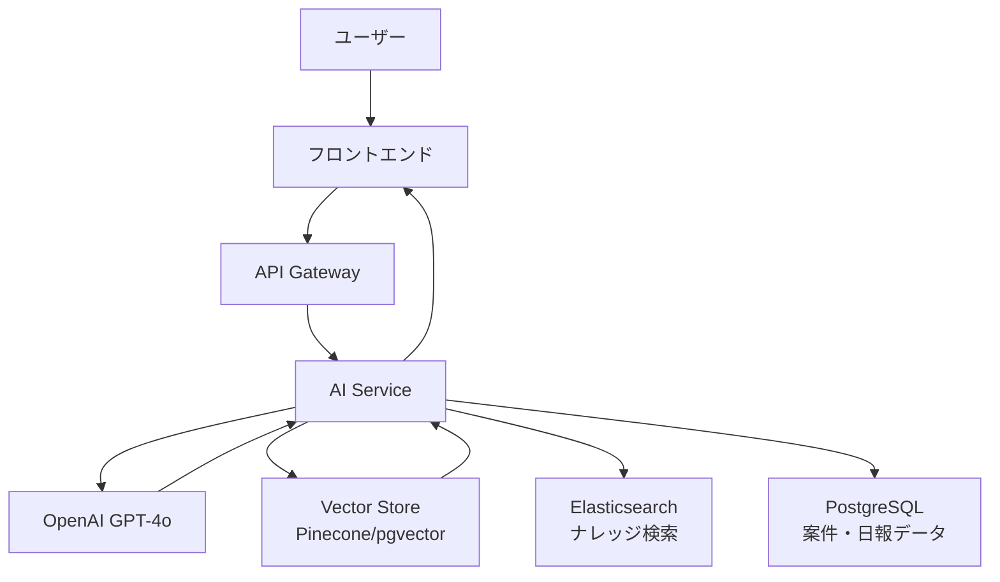

# フェーズ4: AI・ITSM統合 概要

**リポジトリURL:** https://github.com/Kensan196948G/ServiceHub-Construction-Platform.git

## フェーズ目標

フェーズ4では、プラットフォームに高度な知的機能を追加する。ISO20000準拠のITSM管理モジュール、Elasticsearchを活用したナレッジベース、OpenAI APIを統合したAI支援機能を実装し、建設現場のDX化を一段階高める。

| 項目 | 内容 |
|------|------|
| フェーズ番号 | Phase 4 |
| 期間 | 2026/07/01〜2026/07/31（約31日間） |
| 作業時間 | 8時間/日（合計約248時間） |
| 主要テーマ | ITSM管理・ナレッジ管理・AI支援 |
| 前提 | フェーズ3（拡張モジュール）の完了 |

---

## 開発対象モジュール

### 1. ITSM運用管理モジュール（ISO20000準拠）
- インシデント管理（受付・トリアージ・解決・クローズ）
- 問題管理（根本原因分析・既知エラーDB）
- 変更管理（変更要求・承認・スケジュール・実施）
- サービス要求管理

### 2. ナレッジ管理モジュール
- ナレッジ記事の作成・編集・承認
- Elasticsearchによる全文検索
- カテゴリ・タグ管理
- 閲覧制御・バージョン管理

### 3. AI支援機能
- 日報AI補完（LLM活用）
- リスク予測（過去データに基づく）
- ナレッジ推薦（コンテキスト応答）
- AI チャットボット

---

## 週次タスク一覧

### 第1〜1.5週（2026/07/01〜2026/07/10）：ITSM管理開発
- [ ] インシデント管理API実装
- [ ] 問題管理API実装
- [ ] 変更管理API実装
- [ ] SLA管理・アラート実装
- [ ] ITSM フロントエンド実装

### 第2〜2.5週（2026/07/11〜2026/07/20）：ナレッジ管理開発
- [ ] Elasticsearch設定・インデックス設計
- [ ] ナレッジ記事CRUD API実装
- [ ] 全文検索API実装
- [ ] カテゴリ・タグ管理実装
- [ ] ナレッジ フロントエンド実装

### 第3週（2026/07/21〜2026/07/31）：AI支援機能開発
- [ ] OpenAI API統合設定
- [ ] 日報AI補完機能実装
- [ ] ナレッジ推薦機能実装
- [ ] AIチャットボット実装
- [ ] Phase4完了レビュー

---

## AI機能アーキテクチャ

---

## KPI / 完了条件

| KPI | 目標値 |
|-----|--------|
| ITSM SLA達成率 | ≥95% |
| ナレッジ検索精度 | 上位3件の適合率≥80% |
| AI補完応答時間 | ≤3秒 |
| テストカバレッジ | ≥80% |

---

## ITSM プロセス概要

| プロセス | ISO20000条項 | 優先度 |
|---------|------------|-------|
| インシデント管理 | 8.6.1 | 最高 |
| 問題管理 | 8.6.2 | 高 |
| 変更管理 | 8.5.1 | 高 |
| サービス要求管理 | 8.3.2 | 中 |
| ナレッジ管理 | 7.1.6 | 中 |
