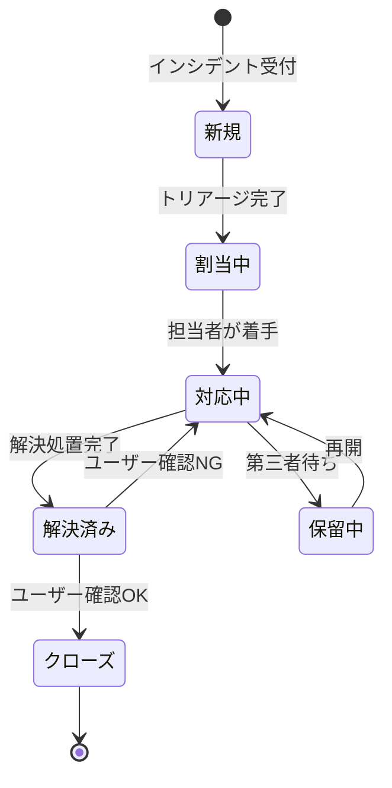
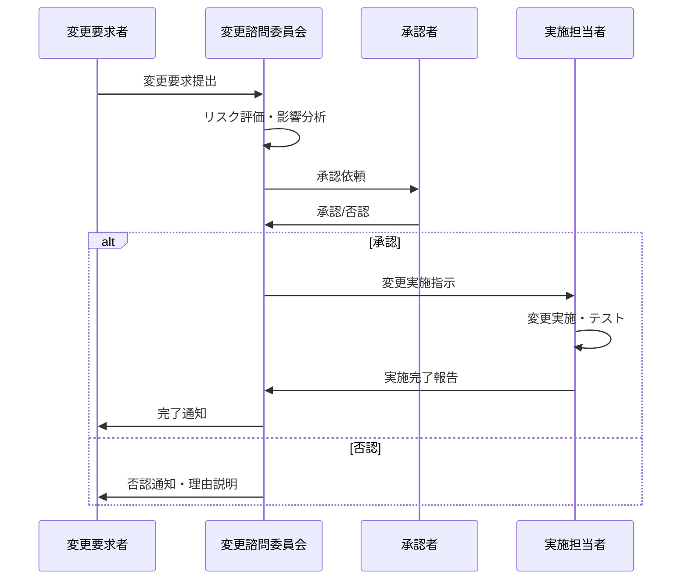

# ITSM運用管理 開発設計

## 概要

ITSM運用管理モジュールは、ISO20000（ITサービスマネジメント）に準拠したシステム運用管理機能を提供する。インシデント管理・問題管理・変更管理の3つのコアプロセスを実装し、プラットフォームの安定稼働を支援する。

---

## ITSM プロセス一覧

| プロセス | ISO20000条項 | 機能概要 |
|---------|------------|---------|
| インシデント管理 | 8.6.1 | システム障害・サービス中断の受付・対応・解決 |
| 問題管理 | 8.6.2 | 繰り返しインシデントの根本原因分析・恒久対策 |
| 変更管理 | 8.5.1 | システム変更の計画・承認・実施・レビュー |
| サービス要求管理 | 8.3.2 | ユーザーからの標準的なサービス要求の処理 |
| SLA管理 | 8.3.1 | サービスレベル目標の設定・測定・報告 |

---

## インシデント管理設計

### インシデント優先度定義

| 優先度 | 影響度 | 緊急度 | 対応時間目標 | 解決時間目標 |
|-------|-------|-------|------------|------------|
| P1（致命的） | 全サービス停止 | 即時 | 15分以内 | 2時間以内 |
| P2（高） | 主要機能停止 | 高 | 30分以内 | 4時間以内 |
| P3（中） | 一部機能低下 | 中 | 2時間以内 | 8時間以内 |
| P4（低） | 軽微な問題 | 低 | 翌営業日 | 5営業日以内 |

### インシデントフロー



---

## データモデル

### itsm.incidents テーブル

```sql
CREATE TABLE itsm.incidents (
    id              UUID PRIMARY KEY DEFAULT gen_random_uuid(),
    incident_number VARCHAR(20) UNIQUE NOT NULL,    -- INC-2026-00001
    title           VARCHAR(200) NOT NULL,
    description     TEXT NOT NULL,
    priority        VARCHAR(10) NOT NULL,           -- P1, P2, P3, P4
    status          VARCHAR(50) NOT NULL DEFAULT 'new',
    category        VARCHAR(100) NOT NULL,
    affected_service VARCHAR(100),
    reporter_id     UUID REFERENCES auth.users(id),
    assignee_id     UUID REFERENCES auth.users(id),
    team            VARCHAR(100),
    reported_at     TIMESTAMPTZ NOT NULL DEFAULT NOW(),
    response_due_at TIMESTAMPTZ,
    resolved_at     TIMESTAMPTZ,
    closed_at       TIMESTAMPTZ,
    resolution      TEXT,
    root_cause      TEXT,
    related_problem_id UUID REFERENCES itsm.problems(id),
    created_at      TIMESTAMPTZ NOT NULL DEFAULT NOW(),
    updated_at      TIMESTAMPTZ NOT NULL DEFAULT NOW()
);

CREATE INDEX idx_incidents_number ON itsm.incidents(incident_number);
CREATE INDEX idx_incidents_status ON itsm.incidents(status);
CREATE INDEX idx_incidents_priority ON itsm.incidents(priority);
```

### itsm.problems テーブル

```sql
CREATE TABLE itsm.problems (
    id              UUID PRIMARY KEY DEFAULT gen_random_uuid(),
    problem_number  VARCHAR(20) UNIQUE NOT NULL,    -- PRB-2026-00001
    title           VARCHAR(200) NOT NULL,
    description     TEXT NOT NULL,
    status          VARCHAR(50) NOT NULL DEFAULT 'open',
    root_cause      TEXT,
    workaround      TEXT,
    permanent_fix   TEXT,
    priority        VARCHAR(10) NOT NULL DEFAULT 'P3',
    assignee_id     UUID REFERENCES auth.users(id),
    is_known_error  BOOLEAN NOT NULL DEFAULT FALSE,
    opened_at       TIMESTAMPTZ NOT NULL DEFAULT NOW(),
    closed_at       TIMESTAMPTZ,
    created_at      TIMESTAMPTZ NOT NULL DEFAULT NOW()
);
```

### itsm.changes テーブル（変更管理）

```sql
CREATE TABLE itsm.changes (
    id              UUID PRIMARY KEY DEFAULT gen_random_uuid(),
    change_number   VARCHAR(20) UNIQUE NOT NULL,    -- CHG-2026-00001
    title           VARCHAR(200) NOT NULL,
    description     TEXT NOT NULL,
    change_type     VARCHAR(50) NOT NULL,           -- standard, normal, emergency
    risk_level      VARCHAR(20) NOT NULL,           -- low, medium, high
    status          VARCHAR(50) NOT NULL DEFAULT 'requested',
    requester_id    UUID REFERENCES auth.users(id),
    implementer_id  UUID REFERENCES auth.users(id),
    scheduled_start TIMESTAMPTZ,
    scheduled_end   TIMESTAMPTZ,
    actual_start    TIMESTAMPTZ,
    actual_end      TIMESTAMPTZ,
    implementation_plan TEXT,
    rollback_plan   TEXT,
    test_plan       TEXT,
    approval_notes  TEXT,
    created_at      TIMESTAMPTZ NOT NULL DEFAULT NOW()
);
```

---

## SLA管理

```python
from datetime import datetime, timedelta

SLA_RESPONSE_TIMES = {
    "P1": timedelta(minutes=15),
    "P2": timedelta(minutes=30),
    "P3": timedelta(hours=2),
    "P4": timedelta(days=1)
}

SLA_RESOLUTION_TIMES = {
    "P1": timedelta(hours=2),
    "P2": timedelta(hours=4),
    "P3": timedelta(hours=8),
    "P4": timedelta(days=5)
}

def calculate_sla_due(priority: str, created_at: datetime) -> dict:
    """SLA期限を計算する"""
    response_due = created_at + SLA_RESPONSE_TIMES[priority]
    resolution_due = created_at + SLA_RESOLUTION_TIMES[priority]
    return {
        "response_due": response_due,
        "resolution_due": resolution_due
    }

def check_sla_breach(incident) -> bool:
    """SLA違反チェック"""
    now = datetime.utcnow()
    if incident.status not in ["resolved", "closed"]:
        return now > incident.response_due_at
    return False
```

---

## 変更管理承認フロー


