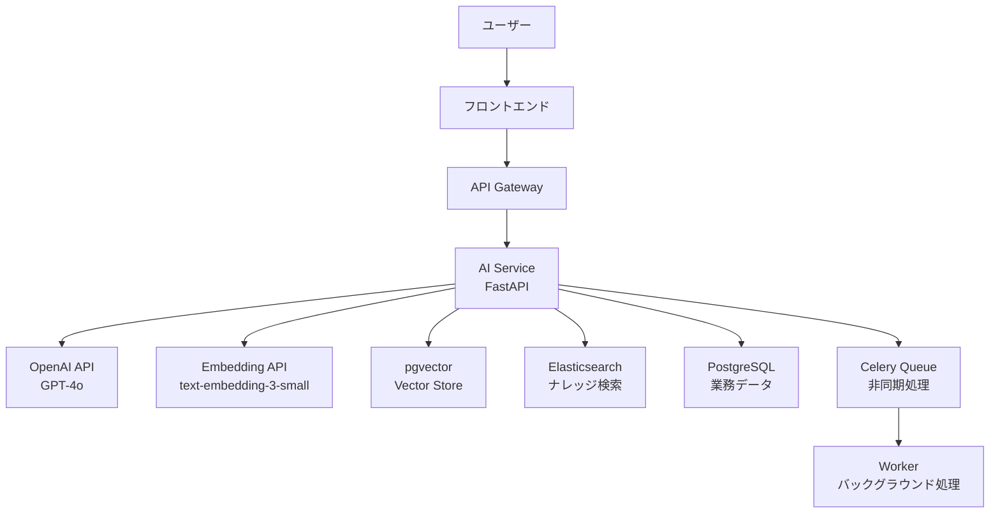

# AI支援機能 開発設計

## 概要

AI支援機能モジュールは、OpenAI APIを活用したLLM統合により、建設現場の業務効率を大幅に向上させる。日報AI補完・リスク予測・ナレッジ推薦・AIチャットボットの4つの主要AI機能を提供する。

---

## AI機能一覧

| 機能ID | 機能名 | 使用技術 | 説明 |
|-------|-------|---------|------|
| AI-001 | 日報AI補完 | GPT-4o | 作業概要から日報テキストを自動生成 |
| AI-002 | リスク予測 | GPT-4o + 過去データ | 工事進捗・気象からリスクを予測 |
| AI-003 | ナレッジ推薦 | Embeddings + Semantic Search | コンテキストに応じたナレッジ推薦 |
| AI-004 | AIチャットボット | GPT-4o + RAG | 業務質問への自然言語応答 |
| AI-005 | 異常検知 | 統計分析 + LLM | 原価・進捗の異常値検知と説明 |

---

## アーキテクチャ



---

## 1. 日報AI補完

### 機能概要
現場作業員が作業のキーワードや箇条書きを入力するだけで、適切な日報テキストをAIが自動生成する。

### プロンプト設計

```python
DAILY_REPORT_PROMPT = """
あなたは建設現場の日報を記述する専門家です。
以下の情報をもとに、現場日報の「作業概要」を記述してください。

案件名: {project_name}
作業日: {report_date}
天候: {weather}
作業人数: {worker_count}名

作業の概要（キーワード・箇条書き）:
{work_keywords}

記述ルール:
- 客観的・具体的な表現を使用
- 数量・寸法など具体的な数値を含める
- 工事業界の専門用語を適切に使用
- 300〜500文字程度で記述
- です・ます調で統一
"""

async def generate_daily_report(request: DailyReportGenerationRequest) -> str:
    client = AsyncOpenAI(api_key=settings.OPENAI_API_KEY)
    
    prompt = DAILY_REPORT_PROMPT.format(
        project_name=request.project_name,
        report_date=request.report_date,
        weather=request.weather,
        worker_count=request.worker_count,
        work_keywords=request.work_keywords
    )
    
    response = await client.chat.completions.create(
        model="gpt-4o",
        messages=[{"role": "user", "content": prompt}],
        temperature=0.3,
        max_tokens=600
    )
    
    return response.choices[0].message.content
```

---

## 2. RAGベースのAIチャットボット

### RAG（Retrieval-Augmented Generation）設計

```python
async def rag_chat(query: str, user_id: str, project_id: str = None) -> str:
    """RAGを使ったチャットボット応答"""
    
    # 1. クエリの埋め込みベクトル生成
    client = AsyncOpenAI(api_key=settings.OPENAI_API_KEY)
    embedding_response = await client.embeddings.create(
        model="text-embedding-3-small",
        input=query
    )
    query_vector = embedding_response.data[0].embedding
    
    # 2. pgvectorで関連ナレッジを検索
    relevant_docs = await vector_search(query_vector, limit=5)
    
    # 3. コンテキストを構築
    context = "\n\n".join([
        f"[{doc.title}]\n{doc.content[:500]}"
        for doc in relevant_docs
    ])
    
    # 4. LLMで回答生成
    system_prompt = f"""
    あなたは建設業務支援AIアシスタントです。
    以下のナレッジベースの情報をもとに、ユーザーの質問に答えてください。
    
    【関連ナレッジ】
    {context}
    
    回答ルール：
    - ナレッジベースにない情報については「確認が必要です」と回答する
    - 安全に関する事項は特に注意深く回答する
    - 簡潔かつ具体的に回答する
    """
    
    response = await client.chat.completions.create(
        model="gpt-4o",
        messages=[
            {"role": "system", "content": system_prompt},
            {"role": "user", "content": query}
        ],
        temperature=0.1,
        max_tokens=800
    )
    
    return response.choices[0].message.content
```

---

## 3. リスク予測

### リスク予測モデル

```python
RISK_PREDICTION_PROMPT = """
以下の工事情報をもとに、今後1週間のリスクを予測してください。

案件名: {project_name}
現在の進捗率: {progress_rate}%
予算消化率: {budget_consumed_rate}%
未解決のヒヤリハット件数: {hazard_count}件
週間天気予報: {weather_forecast}
工期残り日数: {remaining_days}日

以下の形式でリスクを評価してください：
1. リスクレベル（高/中/低）
2. 主要リスク要因（3点以内）
3. 推奨する対策（2点以内）
"""

async def predict_project_risk(project_id: str) -> RiskPredictionResult:
    project_data = await get_project_summary(project_id)
    weather = await get_weather_forecast(project_data.location)
    
    prompt = RISK_PREDICTION_PROMPT.format(**project_data, weather_forecast=weather)
    
    client = AsyncOpenAI(api_key=settings.OPENAI_API_KEY)
    response = await client.chat.completions.create(
        model="gpt-4o",
        messages=[{"role": "user", "content": prompt}],
        temperature=0.1
    )
    
    return parse_risk_prediction(response.choices[0].message.content)
```

---

## コスト管理

| API | 想定月次コール数 | 概算コスト（月） |
|-----|--------------|---------------|
| GPT-4o（日報補完） | 3,000回 | 約$30 |
| GPT-4o（チャット） | 5,000回 | 約$50 |
| text-embedding-3-small | 10,000回 | 約$1 |
| 合計 | - | 約$80/月 |

---

## AI倫理・安全ガイドライン

- **ハルシネーション対策**：RAGによる根拠付き回答・不確実な場合は明示
- **個人情報保護**：OpenAI APIへの個人情報送信の禁止
- **監査証跡**：全AIリクエスト・レスポンスのログ保存（90日間）
- **人間の最終確認**：AI生成コンテンツは必ず人間がレビューする
