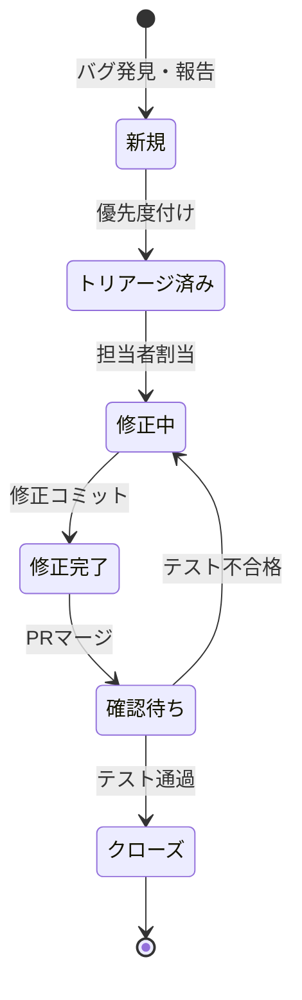

# フェーズ5: 統合テスト・品質保証 概要

## フェーズ目標

フェーズ5では、全モジュールの統合テスト・性能テスト・セキュリティテストを実施し、社内リリースに向けた品質保証を完了させる。フェーズ1〜4で実装した全機能が協調動作し、要件を満たすことを体系的に検証する。

| 項目 | 内容 |
|------|------|
| フェーズ番号 | Phase 5 |
| 期間 | 2026/08/01〜2026/08/31（約31日間） |
| 作業時間 | 8時間/日（合計約248時間） |
| 主要テーマ | 統合テスト・性能テスト・セキュリティテスト |
| 前提 | フェーズ4（AI・ITSM統合）の完了 |

---

## テスト種別と目標

| テスト種別 | 期間 | 目標 |
|---------|------|------|
| 統合テスト | 2026/08/01〜2026/08/10 | モジュール間連携の全シナリオ通過 |
| 性能テスト | 2026/08/11〜2026/08/20 | 全性能指標の目標値達成 |
| セキュリティテスト | 2026/08/21〜2026/08/31 | OWASP Top10 全項目の脆弱性ゼロ確認 |

---

## 品質目標

| 品質指標 | 目標値 | 測定ツール |
|---------|--------|---------|
| テストカバレッジ | ≥85% | pytest-cov / Istanbul |
| P1バグゼロ | 0件 | JIRA |
| P2バグ解消率 | 100% | JIRA |
| APIレスポンス時間（P95） | ≤200ms | k6 |
| 同時接続ユーザー数 | 100名以上 | Locust |
| 可用性 | ≥99.5% | Uptime Robot |
| セキュリティ脆弱性（CRITICAL/HIGH） | 0件 | OWASP ZAP / Trivy |

---

## 週次タスク一覧

### 第1〜1.5週（2026/08/01〜2026/08/10）：統合テスト
- [ ] 統合テスト計画書の最終確認
- [ ] 全モジュール間連携テスト実施
- [ ] E2Eテストシナリオ実行（Playwright）
- [ ] 発見バグの記録・優先度付け・修正
- [ ] 回帰テスト実施

### 第2〜2.5週（2026/08/11〜2026/08/20）：性能テスト
- [ ] k6による負荷テスト実施
- [ ] Locustによる同時接続テスト実施
- [ ] APMによるボトルネック特定
- [ ] パフォーマンスチューニング
- [ ] 性能テスト合格確認

### 第3週（2026/08/21〜2026/08/31）：セキュリティテスト
- [ ] OWASP ZAPによる脆弱性スキャン
- [ ] 手動ペネトレーションテスト実施
- [ ] Trivyによるコンテナスキャン
- [ ] 発見脆弱性の修正・再テスト
- [ ] セキュリティテストレポート作成

---

## テスト環境構成

| 環境 | URL | 用途 |
|-----|-----|------|
| テスト環境 | test.servicehub.internal | 統合テスト・セキュリティテスト |
| 負荷テスト環境 | perf.servicehub.internal | 性能テスト（本番同等スペック） |
| ステージング環境 | staging.servicehub.internal | UAT（フェーズ6） |

---

## バグ管理

---

## 完了条件

- P1・P2バグが0件
- 全統合テストシナリオが通過
- 全性能指標が目標値を達成
- セキュリティテストでCRITICAL/HIGH脆弱性が0件
- テスト完了レポートが承認済み
