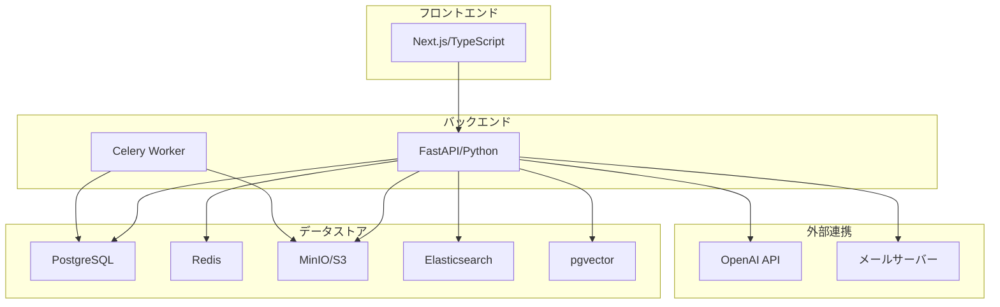

# システム要件概要

## プロジェクト概要

ServiceHub Construction Platform は、建設業向けのAI統合業務プラットフォームである。工事案件管理を中核とし、日報・写真・安全品質・原価・ITSM・ナレッジAI支援の7ドメインを統合する。

---

## システムスコープ

### スコープ内（IN）

| # | 機能領域 | 概要 |
|---|---------|------|
| 1 | 工事案件管理 | 案件のライフサイクル全体管理 |
| 2 | 日報管理 | 現場日報の作成・承認・分析 |
| 3 | 写真・資料管理 | 現場写真・工事書類の管理 |
| 4 | 安全・品質管理 | 安全点検・品質検査・是正処置 |
| 5 | 原価・工数管理 | 予算管理・実績原価・工数集計 |
| 6 | ITSM運用管理 | ISO20000準拠の運用管理 |
| 7 | ナレッジ・AI支援 | 全文検索・AI補完・チャットボット |
| 8 | 認証・認可 | JWT・OAuth2.0・RBAC・MFA |
| 9 | 監査ログ | 全操作の監査ログ記録 |

### スコープ外（OUT）

| # | 機能領域 | 理由 |
|---|---------|------|
| 1 | 会計・給与システム | 既存ERPと連携で対応 |
| 2 | 発注・調達管理 | フェーズ2以降で検討 |
| 3 | 顧客（発注者）向けポータル | 将来機能として検討 |
| 4 | CAD・BIM連携 | 高度な専門システムのため対象外 |

---

## 利害関係者

| ステークホルダー | 役割 | 主なニーズ |
|-------------|------|---------|
| 経営者・管理本部 | スポンサー | 経営情報の可視化・コスト管理 |
| 現場所長・PM | 主要ユーザー | 案件進捗・品質・原価の管理 |
| 現場監督 | 主要ユーザー | 日報承認・安全管理・品質管理 |
| 現場作業員 | 主要ユーザー | 日報入力・写真記録 |
| IT部門 | 運用担当 | システム安定稼働・セキュリティ管理 |
| 経理・積算 | 関連ユーザー | 原価データの確認・分析 |

---

## システム制約

| 制約種別 | 内容 |
|---------|------|
| 技術制約 | Python/FastAPI（バックエンド）、Next.js/TypeScript（フロントエンド） |
| インフラ制約 | オンプレミス/プライベートクラウド環境での稼働 |
| 規格制約 | ISO20000・ISO27001・NIST CSF2.0準拠 |
| 規制制約 | 建設業法・個人情報保護法・労働安全衛生法に準拠 |
| 期間制約 | 2026年10月2日までの社内リリース |
| 予算制約 | 開発費予算内での実装 |

---

## 遵守規格・法令

| 規格/法令 | 対応内容 |
|---------|---------|
| ISO20000 | ITSMプロセス実装（インシデント・問題・変更管理） |
| ISO27001 | 情報セキュリティマネジメントの実装 |
| NIST CSF2.0 | サイバーセキュリティフレームワークの適用 |
| 建設業法 | 工事記録の適正な保管・管理 |
| 個人情報保護法 | 個人情報の適正な取扱い・保護 |
| 労働安全衛生法 | 安全管理記録の保管要件 |

---

## システム全体構成

