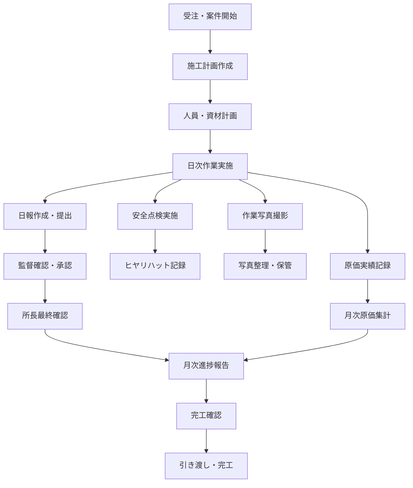
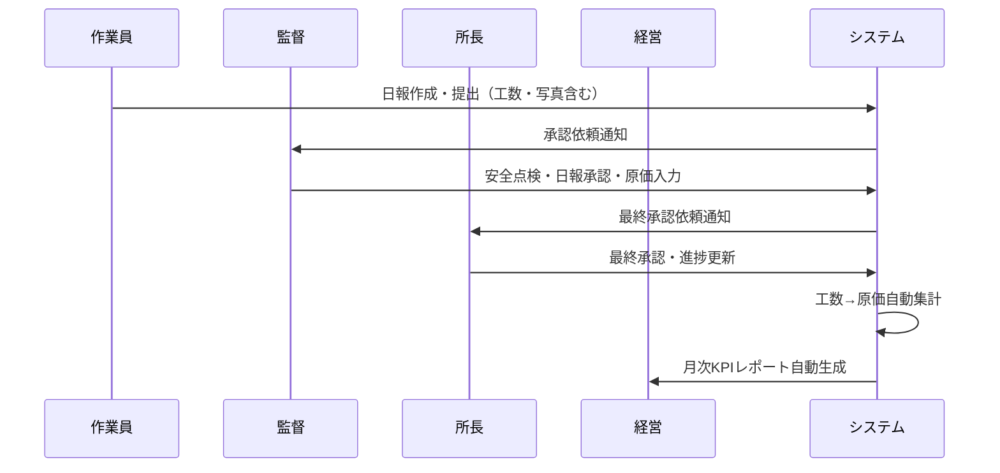

# 業務要件

## 概要

本ドキュメントでは、ServiceHub Construction Platform の対象とする建設業の業務フローと、システムが解決すべき業務課題を定義する。

---

## 建設業の業務フロー



---

## 業務課題と解決策

| # | 業務課題 | 現状 | 解決策 |
|---|---------|------|-------|
| 1 | 日報作成に時間がかかる | 毎日30〜60分手書き or Excel | AI補完機能で10分以内に短縮 |
| 2 | 写真管理が煩雑 | 個人スマホ・共有フォルダで管理 | 統合写真管理で体系的に整理 |
| 3 | 安全情報の共有が遅い | 紙のチェックシート・口頭伝達 | デジタル化・リアルタイム共有 |
| 4 | 原価の可視化が遅れる | 月次Excelで管理・報告遅延 | リアルタイム原価ダッシュボード |
| 5 | 案件情報が分散している | 担当者ごとにExcel管理 | 一元化された案件管理 |
| 6 | ナレッジが共有されない | 経験者の頭の中に眠っている | ナレッジベースで組織知化 |
| 7 | システム障害対応が遅い | 連絡系統が不明確 | ITSM体制の整備 |

---

## 利用シナリオ

### シナリオ1：現場作業員の1日

```
07:30 現場到着・朝礼
  └ システムで本日の作業計画・注意事項を確認

08:00 作業開始
  └ 作業状況の写真をスマートフォンで撮影・アップロード

17:00 作業終了
  └ スマートフォンで日報を開く
  └ AIが作業内容を自動補完 → 修正・確認
  └ 工数（時間・人数）を入力
  └ 写真を日報に添付
  └ 日報を提出（監督に通知）

17:30 退場
```

### シナリオ2：現場監督の業務

```
08:00 事務所到着
  └ ダッシュボードで前日の日報・安全点検結果を確認
  └ 未承認の日報一覧を確認

09:00 現場巡回
  └ 安全点検チェックリストをタブレットで入力
  └ ヒヤリハットを発見した場合はその場で報告

12:00 昼休み
  └ 部下の日報を承認・差し戻し

16:00 本日の作業まとめ
  └ 案件の進捗率を更新
  └ 原価実績を入力

17:00 退場前確認
  └ 翌日の作業計画を確認・修正
```

### シナリオ3：現場所長・PMの業務

```
週次業務:
  月曜: 先週の安全KPI・原価実績を確認
  水曜: 案件の進捗・リスクをAIで分析
  金曜: 月次報告書の確認・承認

緊急時:
  インシデント発生 → ITSM経由で報告・対応管理
  予算超過アラート → 即座に差異分析レポートを確認
  重大ヒヤリハット → 是正処置の進捗を確認
```

---

## ユーザーロール別の主な業務

| ロール | 主な業務 | 頻度 |
|-------|---------|------|
| 現場作業員 | 日報作成・写真アップロード・ヒヤリハット報告 | 毎日 |
| 現場監督 | 日報承認・安全点検・品質検査・原価入力 | 毎日 |
| 現場所長 | 案件管理・最終承認・進捗確認・原価分析 | 毎日 |
| 管理本部 | 全社レポート確認・KPI管理 | 週次/月次 |
| IT部門 | ITSM管理・システム運用 | 随時 |
| 経理担当 | 原価確認・月次集計 | 月次 |

---

## 業務データの流れ


