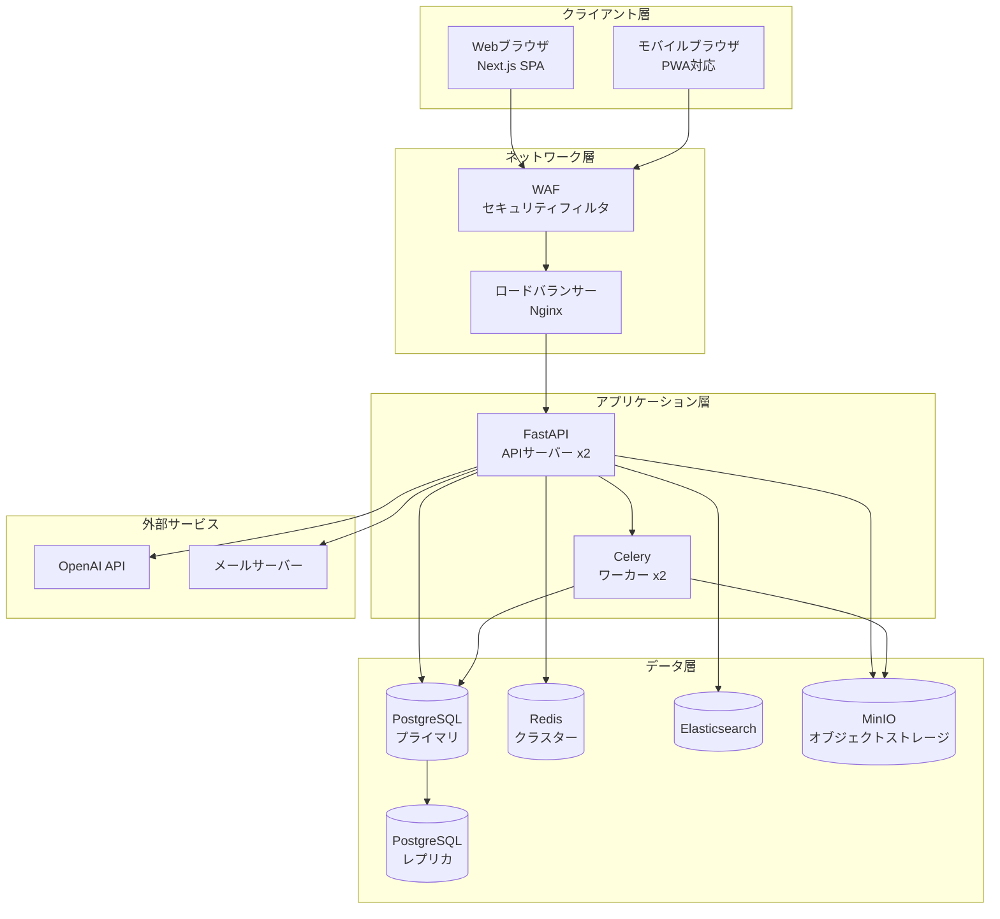
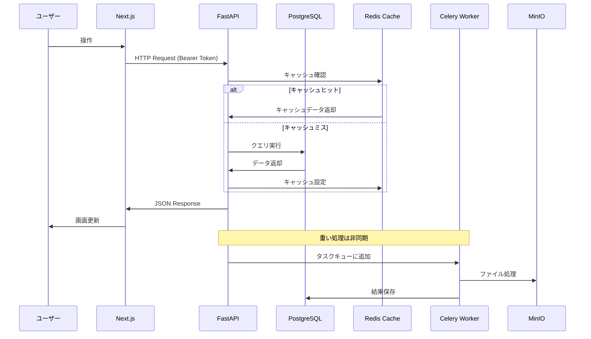

# システムアーキテクチャ設計

## アーキテクチャ概要

ServiceHub Construction Platform は、フロントエンドとバックエンドを分離したSPA（Single Page Application）アーキテクチャを採用する。RESTful APIを介してデータを交換し、マイクロサービス移行を見据えたモジュラーモノリス構成で実装する。

---

## アーキテクチャ方針

| 方針 | 内容 |
|-----|------|
| フロント/バック分離 | Next.js（SPA）とFastAPI（REST API）を分離 |
| モジュラーモノリス | 将来のマイクロサービス分割を見据えた設計 |
| API-First | OpenAPI仕様書を先行作成してから実装 |
| 非同期処理 | 重い処理（PDF生成・画像処理・AI）はCeleryで非同期化 |
| キャッシュ戦略 | Redis を活用した多層キャッシュ |

---

## 技術スタック一覧

| 層 | 技術 | バージョン | 用途 |
|---|------|---------|------|
| フロントエンド | Next.js | 14.x | Webアプリケーション |
| フロントエンド | TypeScript | 5.x | 型安全なフロントエンド開発 |
| フロントエンド | Tailwind CSS | 3.x | UIスタイリング |
| フロントエンド | React Query | 5.x | サーバー状態管理 |
| バックエンド | FastAPI | 0.110.x | REST API サーバー |
| バックエンド | Python | 3.12.x | バックエンド言語 |
| バックエンド | SQLAlchemy | 2.0.x | ORM |
| バックエンド | Celery | 5.x | 非同期タスクキュー |
| DB | PostgreSQL | 16.x | メインDB |
| DB | pgvector | - | ベクトル検索（AI機能） |
| キャッシュ | Redis | 7.x | セッション・キャッシュ |
| 検索 | Elasticsearch | 8.x | 全文検索 |
| ストレージ | MinIO | RELEASE.2024 | オブジェクトストレージ |
| コンテナ | Docker/Kubernetes | 25.x/1.29.x | コンテナ化・オーケストレーション |
| CI/CD | GitHub Actions | - | CI/CDパイプライン |
| 監視 | Prometheus + Grafana | 2.x/10.x | メトリクス収集・可視化 |
| ログ | Loki + Grafana | 2.x | ログ収集・分析 |

---

## コンポーネント図



---

## デプロイ構成

```yaml
# Kubernetes デプロイメント概要
Namespace: production

Deployments:
  - frontend: 2 replicas
  - backend: 2 replicas
  - celery-worker: 2 replicas

StatefulSets:
  - postgresql: primary + 1 replica
  - redis: 3 nodes
  - elasticsearch: 3 nodes
  - minio: 4 nodes

Services:
  - frontend-service: ClusterIP
  - backend-service: ClusterIP
  - postgresql-service: ClusterIP
  - redis-service: ClusterIP

Ingress:
  - servicehub.internal → frontend + backend (API)
```

---

## データフロー


