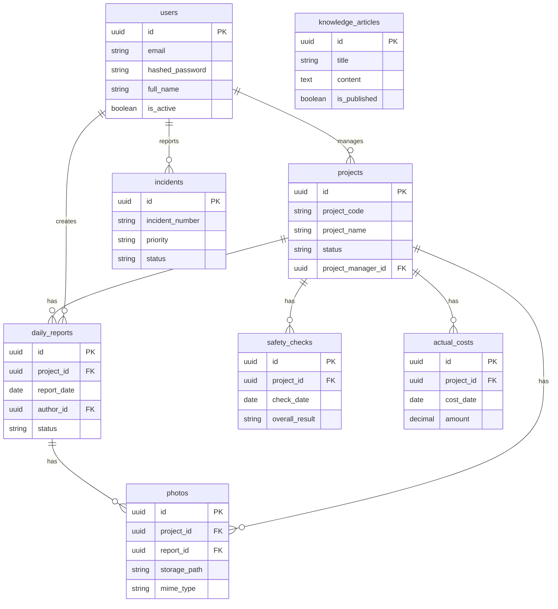

# データベース設計

## ER図概要



---

## テーブル一覧

| スキーマ | テーブル名 | 説明 | 主要カラム数 |
|---------|---------|------|-----------|
| auth | users | ユーザー情報 | 15 |
| auth | roles | ロール定義 | 5 |
| auth | user_roles | ユーザー・ロール | 4 |
| auth | permissions | 権限定義 | 6 |
| auth | role_permissions | ロール・権限 | 3 |
| auth | audit_logs | 認証監査ログ | 10 |
| projects | projects | 工事案件 | 20 |
| projects | project_members | 案件メンバー | 8 |
| projects | project_statuses | ステータス履歴 | 6 |
| projects | work_processes | 工程管理 | 10 |
| reports | daily_reports | 日報 | 18 |
| reports | report_approvals | 承認履歴 | 8 |
| reports | work_logs | 工数記録 | 10 |
| media | photos | 写真・資料 | 15 |
| media | photo_tags | 写真タグ | 3 |
| safety | safety_checks | 安全点検 | 12 |
| safety | safety_check_items | チェック項目 | 8 |
| safety | hazard_reports | ヒヤリハット | 14 |
| safety | corrective_actions | 是正処置 | 12 |
| safety | quality_inspections | 品質検査 | 12 |
| costs | budgets | 予算 | 10 |
| costs | actual_costs | 実績原価 | 14 |
| itsm | incidents | インシデント | 18 |
| itsm | problems | 問題 | 14 |
| itsm | changes | 変更要求 | 16 |
| itsm | service_requests | サービス要求 | 12 |
| knowledge | categories | カテゴリ | 7 |
| knowledge | articles | ナレッジ記事 | 14 |
| knowledge | article_tags | 記事タグ | 3 |
| knowledge | article_versions | 版管理 | 8 |
| audit | audit_logs | 監査ログ | 12 |

---

## 設計原則

| 原則 | 内容 |
|-----|------|
| 正規化 | 第3正規形を基本。性能要件に応じて非正規化を適用 |
| 論理削除 | 全テーブルに `is_deleted`, `deleted_at` カラムを設ける |
| タイムスタンプ | 全テーブルに `created_at`, `updated_at` を設ける |
| UUID | 主キーはすべてUUID（gen_random_uuid()）を使用 |
| スキーマ分離 | ドメインごとにスキーマを分離し独立性を担保 |
| 監査証跡 | 重要テーブルへの変更は監査ログに記録 |

---

## インデックス設計方針

| 種別 | 適用場面 | 例 |
|-----|---------|---|
| B-tree | 等値検索・範囲検索 | status, project_id, created_at |
| GIN | JSONB・全文検索 | 追加属性のJSONBカラム |
| BRIN | 時系列データ | created_at（大テーブル） |
| 部分インデックス | 絞り込み検索 | WHERE is_deleted = FALSE |
| 複合インデックス | 複合条件 | (project_id, report_date) |

---

## マイグレーション管理

```
alembic/
├── versions/
│   ├── 20260402_initial_schema.py
│   ├── 20260409_add_auth_tables.py
│   ├── 20260416_add_projects_tables.py
│   ├── 20260501_add_reports_tables.py
│   ├── 20260601_add_media_safety_tables.py
│   └── 20260701_add_itsm_knowledge_tables.py
├── env.py
└── alembic.ini
```
