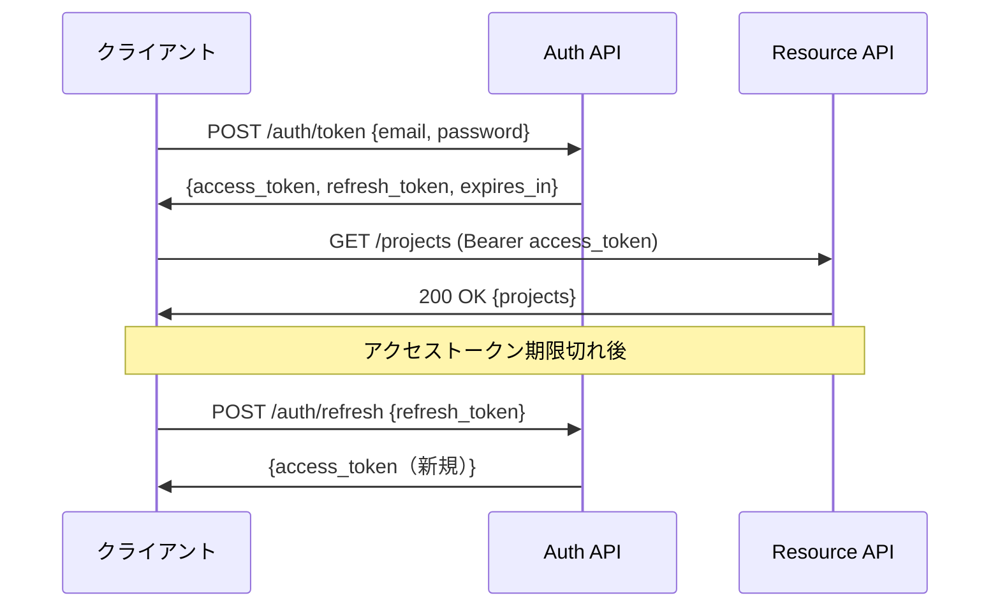

# API設計

## API設計方針

| 方針 | 内容 |
|-----|------|
| プロトコル | REST over HTTPS |
| ベースURL | https://api.servicehub.internal/api/v1/ |
| 認証方式 | JWT Bearer Token |
| レスポンス形式 | JSON |
| ドキュメント | OpenAPI 3.1 / Swagger UI |
| バージョニング | URLパスベース（/api/v1/） |
| エラー形式 | 統一エラーレスポンス形式 |

---

## エンドポイント一覧

### 認証 API

| メソッド | エンドポイント | 説明 | 認証不要 |
|--------|------------|------|-------|
| POST | /api/v1/auth/token | ログイン（トークン取得） | ✅ |
| POST | /api/v1/auth/refresh | トークンリフレッシュ | ✅ |
| POST | /api/v1/auth/logout | ログアウト | - |
| POST | /api/v1/auth/mfa/setup | MFA設定 | - |
| POST | /api/v1/auth/mfa/verify | MFA検証 | ✅ |
| POST | /api/v1/auth/password/reset | パスワードリセット要求 | ✅ |

### 案件管理 API

| メソッド | エンドポイント | 説明 |
|--------|------------|------|
| GET | /api/v1/projects | 案件一覧（検索・フィルタ） |
| POST | /api/v1/projects | 案件作成 |
| GET | /api/v1/projects/{id} | 案件詳細 |
| PUT | /api/v1/projects/{id} | 案件更新 |
| PATCH | /api/v1/projects/{id}/status | ステータス変更 |
| DELETE | /api/v1/projects/{id} | 案件削除 |
| GET | /api/v1/projects/{id}/members | メンバー一覧 |
| POST | /api/v1/projects/{id}/members | メンバー追加 |
| DELETE | /api/v1/projects/{id}/members/{uid} | メンバー削除 |
| GET | /api/v1/projects/{id}/dashboard | ダッシュボードデータ |

### 日報管理 API

| メソッド | エンドポイント | 説明 |
|--------|------------|------|
| GET | /api/v1/daily-reports | 日報一覧 |
| POST | /api/v1/daily-reports | 日報作成 |
| GET | /api/v1/daily-reports/{id} | 日報詳細 |
| PUT | /api/v1/daily-reports/{id} | 日報更新 |
| POST | /api/v1/daily-reports/{id}/submit | 日報提出 |
| POST | /api/v1/daily-reports/{id}/approve | 承認 |
| POST | /api/v1/daily-reports/{id}/reject | 差し戻し |
| GET | /api/v1/daily-reports/{id}/pdf | PDF出力 |
| POST | /api/v1/ai/daily-report/generate | AI補完生成 |

### 写真管理 API

| メソッド | エンドポイント | 説明 |
|--------|------------|------|
| POST | /api/v1/photos/upload | ファイルアップロード |
| GET | /api/v1/photos | ファイル一覧 |
| GET | /api/v1/photos/{id} | ファイル詳細 |
| GET | /api/v1/photos/{id}/download | ダウンロード（署名付きURL） |
| PATCH | /api/v1/photos/{id} | メタデータ更新 |
| DELETE | /api/v1/photos/{id} | ファイル削除 |

### ITSM API

| メソッド | エンドポイント | 説明 |
|--------|------------|------|
| GET | /api/v1/incidents | インシデント一覧 |
| POST | /api/v1/incidents | インシデント登録 |
| GET | /api/v1/incidents/{id} | インシデント詳細 |
| PATCH | /api/v1/incidents/{id}/status | ステータス変更 |
| POST | /api/v1/incidents/{id}/resolve | 解決 |
| GET | /api/v1/changes | 変更要求一覧 |
| POST | /api/v1/changes | 変更要求作成 |
| POST | /api/v1/changes/{id}/approve | 変更承認 |

---

## 共通クエリパラメータ

| パラメータ | 型 | 説明 | デフォルト |
|---------|---|------|---------|
| page | integer | ページ番号 | 1 |
| per_page | integer | 1ページあたり件数（最大100） | 20 |
| sort | string | ソートフィールド | created_at |
| order | string | asc/desc | desc |
| search | string | 全文検索キーワード | - |
| is_deleted | boolean | 削除済み含める | false |

---

## 認証フロー

