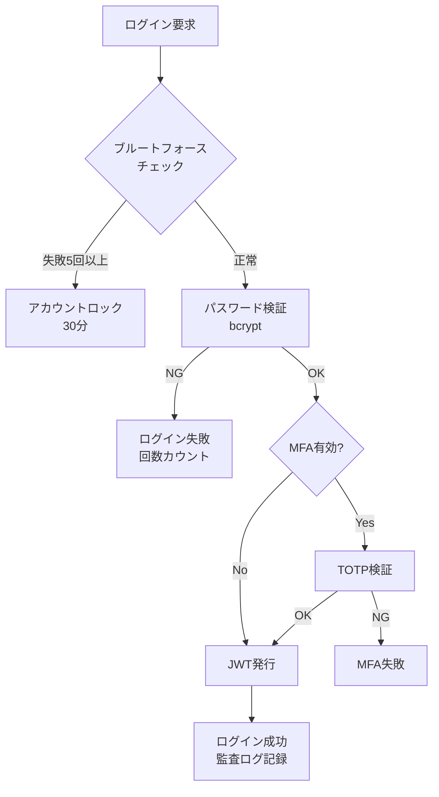

# セキュリティ設計

## セキュリティアーキテクチャ概要

ServiceHub Construction Platform のセキュリティは、多層防御（Defense in Depth）の原則に基づき設計する。ISO27001、NIST CSF2.0、OWASP Top10を参照し、建設業の規制要件に対応したセキュリティ体制を構築する。

---

## セキュリティ設計原則

| 原則 | 内容 |
|-----|------|
| 多層防御 | ネットワーク・アプリケーション・データの各層で防御 |
| 最小権限の原則 | ユーザー・プロセスに必要最小限の権限のみ付与 |
| ゼロトラスト | 内部ネットワークも信頼しない。全アクセスを認証・認可 |
| 監査可能性 | 全操作の監査ログを記録・保管 |
| 暗号化 | 転送時・保存時の暗号化を徹底 |
| SoD | 職務分掌分離（重要操作は複数人の承認が必要） |

---

## 脅威モデリング（STRIDE）

| 脅威 | 対策 |
|-----|------|
| Spoofing（なりすまし） | JWT認証・MFA・アカウントロック |
| Tampering（改ざん） | HMAC署名・HTTPS・入力バリデーション |
| Repudiation（否認） | 監査ログ・電子署名 |
| Information Disclosure（情報漏洩） | 暗号化・RBAC・マスキング |
| Denial of Service（サービス妨害） | レート制限・WAF・DDoS対策 |
| Elevation of Privilege（権限昇格） | RBAC・最小権限・権限チェック |

---

## 認証セキュリティ設計



---

## ネットワークセキュリティ

| 対策 | 内容 |
|-----|------|
| WAF | Webアプリケーションファイアウォールの設置 |
| TLS | TLS 1.2以上を必須（TLS 1.0/1.1は無効化） |
| HSTS | HTTP Strict Transport Securityの設定 |
| CSP | Content Security Policyによるスクリプト制限 |
| IP制限 | 管理者APIへのIPアドレス制限 |
| セグメント分離 | DMZ・アプリ層・DB層のネットワーク分離 |

---

## データセキュリティ

| データ種別 | 保護方法 |
|---------|---------|
| パスワード | bcrypt（コストファクタ12以上）でハッシュ化 |
| JWTシークレット | 環境変数管理、定期ローテーション |
| DB接続情報 | Kubernetes Secrets / HashiCorp Vault |
| ファイルストレージ | MinIOのサーバーサイド暗号化（SSE-S3） |
| 個人情報 | 必要最小限のデータのみ保管 |

---

## 監査ログ設計

```sql
CREATE TABLE audit.audit_logs (
    id          UUID PRIMARY KEY DEFAULT gen_random_uuid(),
    user_id     UUID REFERENCES auth.users(id),
    action      VARCHAR(100) NOT NULL,   -- CREATE, READ, UPDATE, DELETE
    resource    VARCHAR(100) NOT NULL,   -- projects, daily_reports 等
    resource_id VARCHAR(255),
    ip_address  INET,
    user_agent  TEXT,
    request_id  VARCHAR(100),
    old_value   JSONB,
    new_value   JSONB,
    result      VARCHAR(20) NOT NULL,    -- success, failure
    created_at  TIMESTAMPTZ NOT NULL DEFAULT NOW()
);
```

監査ログ保管期間：**5年間**（法的要件への対応）

---

## セキュリティテスト計画

| テスト種別 | 実施タイミング | ツール |
|---------|-------------|-------|
| 静的解析（SAST） | CI/CD毎 | Bandit（Python）、ESLint（TS） |
| 依存脆弱性スキャン | CI/CD毎 | Safety、npm audit |
| コンテナスキャン | CI/CD毎 | Trivy |
| 動的解析（DAST） | リリース前 | OWASP ZAP |
| ペネトレーションテスト | リリース前 | 手動実施 |
