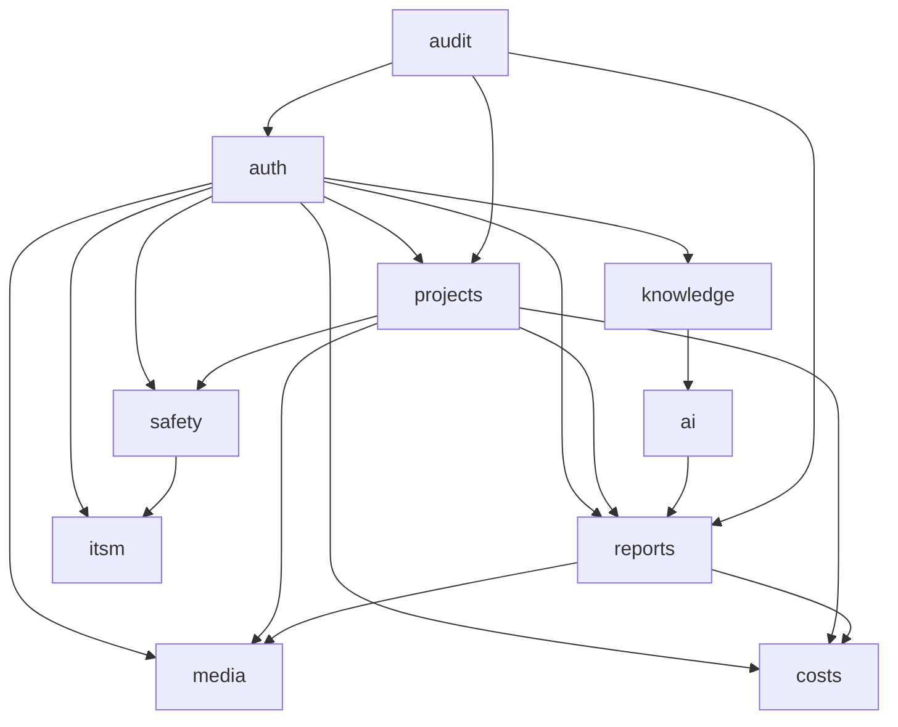

# モジュール設計

## モジュール一覧と責務

| モジュール | 責務 | 主要エンティティ |
|---------|------|-------------|
| auth | 認証・認可・ユーザー管理 | users, roles, permissions |
| projects | 工事案件のライフサイクル管理 | projects, project_members |
| reports | 日報の作成・承認・分析 | daily_reports, work_logs |
| media | ファイル・写真の保存・管理 | photos, documents |
| safety | 安全品質管理 | safety_checks, hazard_reports |
| costs | 原価・工数管理 | budgets, actual_costs |
| itsm | ITSMプロセス管理 | incidents, problems, changes |
| knowledge | ナレッジ管理・AI支援 | articles, categories |
| ai | AI機能（補完・推薦・予測） | - |
| notifications | 通知管理 | notifications |
| audit | 監査ログ管理 | audit_logs |

---

## モジュール間依存関係



---

## バックエンドモジュール構造

```
backend/app/
├── core/
│   ├── config.py           # 設定管理
│   ├── security.py         # JWT・認証ユーティリティ
│   ├── database.py         # DB接続
│   ├── dependencies.py     # FastAPI依存性注入
│   └── exceptions.py       # 例外定義
├── modules/
│   ├── auth/
│   │   ├── router.py       # APIルーター
│   │   ├── service.py      # ビジネスロジック
│   │   ├── models.py       # SQLAlchemyモデル
│   │   ├── schemas.py      # Pydanticスキーマ
│   │   └── repository.py   # DBアクセス層
│   ├── projects/
│   │   ├── router.py
│   │   ├── service.py
│   │   ├── models.py
│   │   ├── schemas.py
│   │   └── repository.py
│   ├── reports/
│   │   ├── router.py
│   │   ├── service.py
│   │   ├── models.py
│   │   ├── schemas.py
│   │   ├── repository.py
│   │   └── pdf_generator.py  # PDF生成ロジック
│   ├── media/
│   │   ├── router.py
│   │   ├── service.py
│   │   ├── models.py
│   │   ├── schemas.py
│   │   ├── repository.py
│   │   └── storage.py        # MinIO連携
│   ├── safety/
│   ├── costs/
│   ├── itsm/
│   ├── knowledge/
│   └── ai/
│       ├── router.py
│       ├── service.py
│       ├── llm_client.py     # OpenAI API クライアント
│       └── rag.py            # RAG実装
├── tasks/                    # Celeryタスク
│   ├── thumbnail.py
│   ├── pdf.py
│   └── notifications.py
└── main.py
```

---

## 各モジュールの設計パターン

### レイヤードアーキテクチャ（各モジュール共通）

```
Router層（HTTP ↔ Service）
  ↓ リクエストのバリデーション・認証確認
Service層（ビジネスロジック）
  ↓ ドメインルール・トランザクション管理
Repository層（DBアクセス）
  ↓ SQLAlchemy ORM クエリ
Model層（DBスキーマ）
```

---

## インターフェース設計（モジュール間）

モジュール間の依存は**インターフェース（抽象）を通じて行う**ことで疎結合を維持する。

```python
# 例: reports モジュールが projects モジュールを使う場合
from app.modules.projects.service import ProjectService

class ReportService:
    def __init__(self, project_service: ProjectService = Depends()):
        self.project_service = project_service
    
    async def create_report(self, data: ReportCreate, user_id: str):
        # プロジェクトの存在確認（projectsモジュールに委譲）
        project = await self.project_service.get_by_id(data.project_id)
        if not project:
            raise HTTPException(404, "案件が見つかりません")
        # 日報作成ロジック
        ...
```
