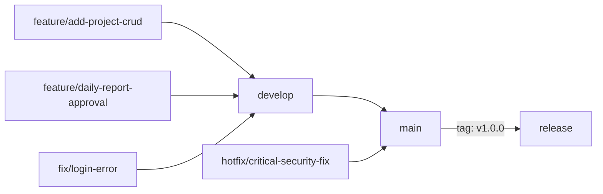

# Git運用規約

## ブランチ戦略

GitHub Flowをベースとしたブランチ戦略を採用する。



---

## ブランチ命名規則

| ブランチ種別 | 命名規則 | 例 |
|-----------|---------|---|
| 機能開発 | `feature/{issue-number}-{短い説明}` | `feature/42-add-project-crud` |
| バグ修正 | `fix/{issue-number}-{短い説明}` | `fix/55-login-null-error` |
| 緊急修正 | `hotfix/{issue-number}-{短い説明}` | `hotfix/77-security-patch` |
| リリース | `release/{version}` | `release/v1.0.0` |
| ドキュメント | `docs/{説明}` | `docs/api-specification` |

---

## コミットメッセージ規約

Conventional Commitsに準拠する。

### フォーマット

```
<type>(<scope>): <subject>

[body]

[footer]
```

### typeの種類

| type | 用途 |
|-----|------|
| feat | 新機能追加 |
| fix | バグ修正 |
| docs | ドキュメントのみの変更 |
| style | コードの意味に影響しない変更（フォーマット等） |
| refactor | バグ修正・機能追加ではないコード変更 |
| test | テストの追加・修正 |
| chore | ビルドプロセス・補助ツールの変更 |
| perf | パフォーマンス改善 |
| ci | CI/CD設定の変更 |
| security | セキュリティ修正 |

### コミットメッセージ例

```
feat(projects): 案件作成APIを実装

工事案件の新規作成エンドポイントを実装した。
バリデーション、重複コードチェック、監査ログ記録を含む。

Closes #42
```

```
fix(auth): ログイン失敗回数のカウントが正しく動作しない問題を修正

Redisのキーの有効期限が設定されていなかったため、
失敗回数がリセットされない問題を修正。

Fixes #55
```

---

## プルリクエスト規約

### PRテンプレート

```markdown
## 変更概要
<!-- 何を変更したか簡潔に説明 -->

## 変更理由
<!-- なぜこの変更が必要か -->

## 変更内容
- [ ] 変更点1
- [ ] 変更点2

## テスト
- [ ] 単体テストを追加・更新した
- [ ] 手動で動作確認した
- [ ] CI/CDが通過している

## スクリーンショット（UI変更の場合）

## 関連Issue
Closes #
```

---

## ブランチ保護設定

| ブランチ | 保護設定 |
|---------|---------|
| main | PRマージ必須・2名のレビュー承認必須・CIパス必須 |
| develop | PRマージ必須・1名のレビュー承認必須・CIパス必須 |

---

## タグ・バージョニング

セマンティックバージョニング（SemVer）を採用する。

```
v{MAJOR}.{MINOR}.{PATCH}
例: v1.0.0, v1.1.0, v1.1.1
```

| バージョン | 意味 |
|---------|------|
| MAJOR | 後方互換性のない変更 |
| MINOR | 後方互換性のある機能追加 |
| PATCH | 後方互換性のあるバグ修正 |
