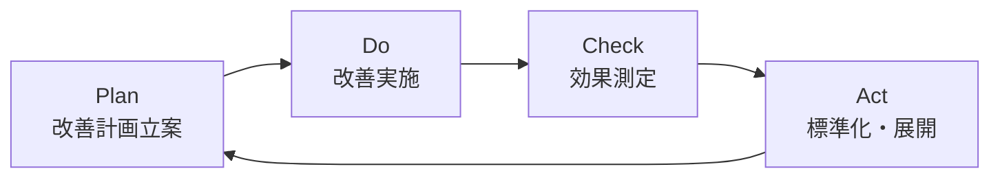

# ITSM設計概要

## 概要

ServiceHub Construction Platform の運用管理は、ISO20000（ITサービスマネジメント）に準拠したITSMフレームワークに基づいて設計する。建設業の業務特性に合わせた実践的なITSM体制を構築する。

---

## ITSM設計方針

| 方針 | 内容 |
|-----|------|
| 準拠規格 | ISO/IEC 20000-1:2018 |
| 参照フレームワーク | ITIL v4 |
| 実装アプローチ | プラットフォーム内のITSMモジュールで管理 |
| 対象範囲 | ServiceHub Construction Platform の運用管理全般 |

---

## ITSMプロセス一覧

| プロセス | ISO20000条項 | 優先度 | 実装フェーズ |
|---------|------------|-------|----------|
| サービス要求管理 | 8.3.2 | 高 | Phase 4 |
| インシデント管理 | 8.6.1 | 最高 | Phase 4 |
| 問題管理 | 8.6.2 | 高 | Phase 4 |
| 変更管理 | 8.5.1 | 高 | Phase 4 |
| リリース管理 | 8.5.2 | 高 | Phase 4 |
| 可用性管理 | 8.7.2 | 中 | Phase 4 |
| 容量・パフォーマンス管理 | 8.7.3 | 中 | Phase 4 |
| ナレッジ管理 | 7.1.6 | 中 | Phase 4 |
| 継続的改善 | 10.1 | 中 | 継続 |

---

## SLA設計

### インシデントSLA

| 優先度 | 判定基準 | 初回応答時間 | 解決時間目標 |
|-------|---------|-----------|-----------|
| P1（致命的） | 全ユーザー利用不可 | 15分 | 2時間 |
| P2（高） | 主要機能が利用不可 | 30分 | 4時間 |
| P3（中） | 一部機能が低下 | 2時間 | 8時間 |
| P4（低） | 軽微な問題 | 翌営業日 | 5営業日 |

### 可用性SLA

| サービス | 月次可用性目標 | 計画メンテナンス時間 |
|---------|------------|-----------------|
| Webアプリケーション | 99.5% | 月1回・深夜2〜4時 |
| API | 99.5% | 月1回・深夜2〜4時 |
| データベース | 99.9% | 月1回・深夜2〜4時 |

---

## ITSMダッシュボード設計

| ウィジェット | 表示内容 |
|---------|---------|
| 未解決インシデント数 | P1〜P4別の未解決件数 |
| SLA達成率 | 今月のSLA達成率（%） |
| MTTR（平均修復時間） | 過去30日間の平均 |
| 変更成功率 | 今月の変更成功率（%） |
| ヒートマップ | 時間帯別インシデント発生傾向 |
| トップ問題カテゴリ | 繰り返し発生する問題のカテゴリ |

---

## 継続的改善（PDCA）

月次レビューで以下を評価する：
- SLA達成率の傾向
- インシデント件数の傾向
- 問題管理の有効性
- 変更による障害発生率
- ユーザー満足度
