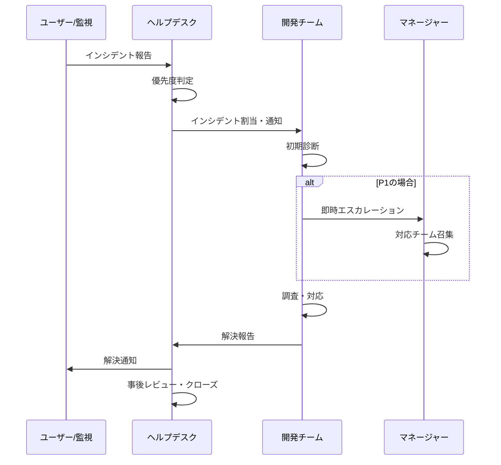

# インシデント管理

## 概要

インシデント管理プロセスは、システム障害やサービス中断を迅速に検知・対応し、サービスを正常な状態に復旧させるためのプロセスである。ISO20000の8.6.1に準拠して設計する。

---

## インシデントの定義

インシデントとは、「ITサービスの計画外の中断、またはITサービスの品質の低下」である。

| 種別 | 例 |
|-----|---|
| システム障害 | アプリケーションのダウン・エラー多発 |
| 性能低下 | レスポンスタイムの著しい低下 |
| セキュリティインシデント | 不正アクセス・データ漏洩の疑い |
| データ不整合 | データが正しく保存・表示されない |
| 外部連携障害 | OpenAI API・メールサーバー接続障害 |

---

## 優先度定義

| 優先度 | 判定基準 | 初回応答 | 解決目標 | エスカレーション先 |
|-------|---------|---------|---------|--------------|
| P1（致命的） | 全ユーザーが利用不可 | 15分 | 2時間 | 経営者・全チーム |
| P2（高） | 主要機能が利用不可（50%以上影響） | 30分 | 4時間 | 開発リード・PM |
| P3（中） | 一部機能低下（50%未満） | 2時間 | 8時間 | 担当開発者 |
| P4（低） | 軽微な問題・回避策あり | 翌営業日 | 5営業日 | 担当開発者 |

---

## インシデント対応フロー



---

## インシデント記録項目

| 項目 | 内容 | 必須 |
|-----|------|------|
| タイトル | インシデントの要約（50文字以内） | ✅ |
| 説明 | 詳細な症状・影響範囲 | ✅ |
| 優先度 | P1〜P4 | ✅ |
| カテゴリ | アプリ障害・DB障害・ネットワーク等 | ✅ |
| 影響サービス | 影響を受けているサービス・機能 | ✅ |
| 報告者 | 報告したユーザー | ✅ |
| 担当者 | 対応担当者 | ✅ |
| 発生日時 | インシデント発生日時 | ✅ |
| 初回応答日時 | 初回応答した日時 | 自動 |
| 解決日時 | 解決した日時 | 解決時 |
| 解決内容 | 実施した対応内容 | 解決時 |
| 根本原因 | 根本的な原因 | 解決時 |

---

## エスカレーションルール

| 条件 | アクション |
|-----|--------|
| P1インシデント発生 | 即時にマネージャー・経営者に通知 |
| 30分間で応答なし（P1） | 自動でより上位の担当者に転送 |
| SLA応答時間超過 | アラートを管理者に送信 |
| 同一カテゴリで月3件以上 | 問題管理プロセスを開始 |

---

## 事後レビュー（ポストモーテム）

P1・P2インシデントは解決後5営業日以内にポストモーテムを実施する。

### ポストモーテムテンプレート

```markdown
## インシデント概要
- インシデント番号:
- 発生日時:
- 解決日時:
- 影響範囲:

## タイムライン
| 時刻 | 出来事 |
|-----|-------|

## 根本原因分析（5Why）
1. なぜ発生したか？
2. なぜ（1）が起きたか？
3. なぜ（2）が起きたか？
4. なぜ（3）が起きたか？
5. なぜ（4）が起きたか？

## 再発防止策
| 対策 | 担当者 | 期限 |
|-----|-------|------|
```
