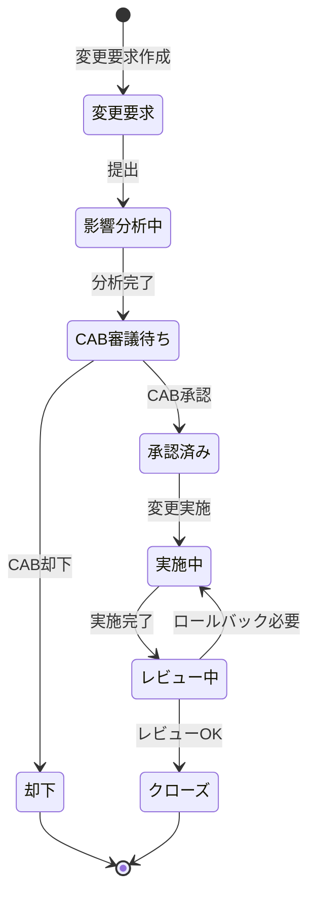

# 変更管理

## 概要

変更管理プロセスは、ITサービスへの変更を計画・承認・実施・レビューする体系的なプロセスである。ISO20000の8.5.1に準拠し、変更によるリスクを最小化しながらサービスの改善を推進する。

---

## 変更種別

| 変更種別 | 定義 | 承認プロセス | 例 |
|---------|------|-----------|---|
| 標準変更 | 事前に承認されたリスクの低い変更 | 事前承認リスト | パスワードリセット対応 |
| 通常変更 | 標準・緊急に該当しない変更 | CABによる通常審議 | 新機能リリース |
| 緊急変更 | 迅速な対応が必要な変更 | 緊急CABによる迅速審議 | P1障害の修正デプロイ |

---

## 変更諮問委員会（CAB）

| 役割 | メンバー | 参加変更種別 |
|-----|---------|-----------|
| CABチェア | IT部門長 | 通常・緊急 |
| 開発代表 | 開発リード | 通常・緊急 |
| 運用代表 | 運用担当 | 通常・緊急 |
| ビジネス代表 | PM | 通常 |
| セキュリティ代表 | セキュリティ担当 | 必要に応じて |

CABは**週次**（毎週月曜）に定例会議を開催する。

---

## 変更フロー

---

## 変更要求（RFC）テンプレート

| 項目 | 内容 |
|-----|------|
| 変更タイトル | 変更の概要（50文字以内） |
| 変更理由 | なぜこの変更が必要か |
| 変更内容 | 具体的な変更内容の詳細 |
| 影響範囲 | 影響を受けるサービス・ユーザー |
| リスクレベル | Low/Medium/High |
| 実施計画 | 変更の実施手順・タイムライン |
| テスト計画 | 変更後の確認内容 |
| ロールバック計画 | 失敗時の復旧手順 |
| 実施予定日時 | 変更実施のスケジュール |
| 担当者 | 変更実施担当者 |

---

## ロールバック判断基準

| 状況 | アクション |
|-----|--------|
| エラー率が変更前比2倍以上 | 即時ロールバック |
| P1インシデント発生 | 即時ロールバック |
| 主要機能が動作しない | 即時ロールバック |
| 性能が50%以上低下 | 1時間以内にロールバック検討 |

---

## 変更管理KPI

| KPI | 目標値 |
|-----|--------|
| 変更成功率 | ≥95% |
| 変更による障害率 | ≤5% |
| 緊急変更比率 | ≤10% |
| ロールバック率 | ≤3% |
