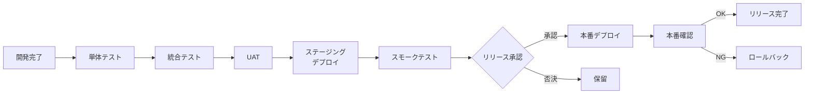

# リリース管理

## 概要

リリース管理プロセスは、ソフトウェアの変更を本番環境へ安全・効率的にデプロイするためのプロセスである。ISO20000の8.5.2に準拠し、品質を確保したリリースを計画的に実施する。

---

## リリース種別

| 種別 | 頻度 | 対象変更 | 承認 |
|-----|------|---------|------|
| メジャーリリース | 四半期ごと | 大規模機能追加 | 経営者承認 |
| マイナーリリース | 2週間ごと | 機能追加・改善 | PM承認 |
| パッチリリース | 随時 | バグ修正 | 開発リード承認 |
| ホットフィックス | 緊急時 | 重大バグ・セキュリティ | 緊急CAB承認 |

---

## リリースパイプライン



---

## デプロイ方式

### ブルー・グリーンデプロイ（採用）

```
本番環境
├── Blue（現行）: v1.0.0 → 全トラフィック
└── Green（新版）: v1.1.0 → テスト中

デプロイ後:
├── Blue（旧版）: v1.0.0 → ロールバック用
└── Green（新版）: v1.1.0 → 全トラフィック
```

メリット：
- ゼロダウンタイムデプロイ
- 即時ロールバック可能
- 本番環境でのスモークテスト実施可能

---

## リリース手順書（本番デプロイ）

```bash
# 1. リリース準備確認
echo "=== リリース前チェックリスト ==="
# □ 変更管理承認済みか
# □ テストが全通過しているか
# □ リリースノートが準備されているか

# 2. バックアップ取得
pg_dump -Fc servicehub > backup_$(date +%Y%m%d_%H%M%S).dump

# 3. Greenにデプロイ
kubectl set image deployment/backend-green \
  backend=registry.internal/servicehub-backend:v1.1.0

# 4. Greenのヘルスチェック
kubectl rollout status deployment/backend-green
curl -f https://green.servicehub.internal/health

# 5. スモークテスト実施
pytest tests/smoke/ --base-url=https://green.servicehub.internal

# 6. トラフィック切り替え
kubectl patch service backend-service \
  -p '{"spec":{"selector":{"version":"green"}}}'

# 7. 本番確認
curl -f https://servicehub.internal/health
```

---

## リリースカレンダー（2026年）

| リリース | 予定日 | 内容 |
|---------|-------|------|
| v1.0.0 | 2026/10/02 | 初回本番リリース（全機能） |
| v1.0.1 | 2026/10/16 | 初期バグ修正 |
| v1.1.0 | 2026/11/01 | 機能改善・フィードバック対応 |
| v1.2.0 | 2026/12/01 | 機能追加（第2フェーズ） |
