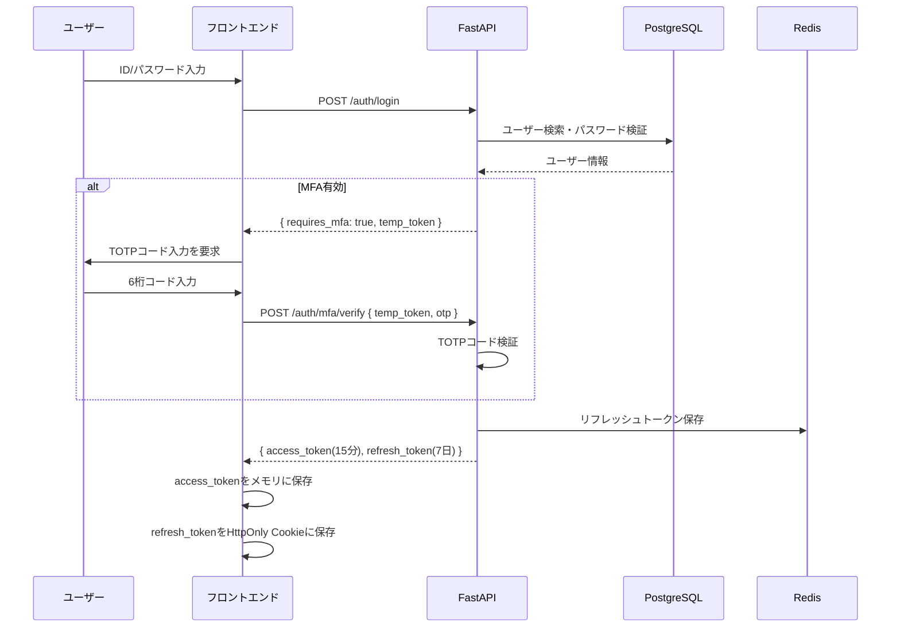
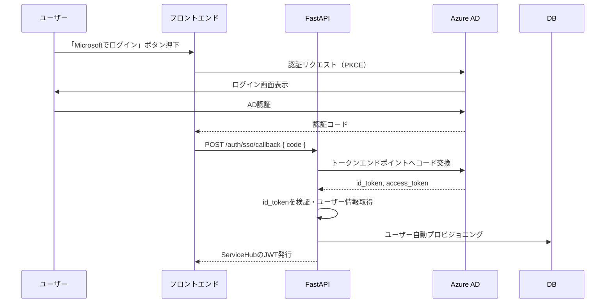

# 認証認可設計（Authentication & Authorization Design）

## 1. 認証方式

### 認証フロー概要



### トークン設計

```python
# アクセストークンペイロード
ACCESS_TOKEN_PAYLOAD = {
    "sub": "user_id",           # ユーザーID（UUID）
    "email": "user@example.com",
    "roles": ["supervisor"],    # ロール一覧
    "session_id": "uuid",       # セッション識別子
    "iat": 1700000000,          # 発行時刻
    "exp": 1700000900,          # 有効期限（15分後）
}

# JWT設定
JWT_ALGORITHM = "RS256"         # RSA署名（非対称鍵）
ACCESS_TOKEN_EXPIRE_MINUTES = 15
REFRESH_TOKEN_EXPIRE_DAYS = 7
```

---

## 2. RBAC権限マトリクス

### ロール定義

| ロール | コード | 説明 |
|--------|--------|------|
| システム管理者 | admin | 全権限保持、ユーザー・システム設定管理 |
| プロジェクト管理者 | project_manager | 担当案件の全管理権限 |
| 現場監督 | supervisor | 担当案件の日報承認・安全管理 |
| 原価担当 | cost_manager | 予算・原価の管理 |
| 品質担当 | quality_manager | 品質検査・是正処置管理 |
| 現場作業員 | worker | 日報作成・写真アップロード・安全点検 |
| 経営者 | executive | 全データの参照のみ |
| 監査員 | auditor | 監査ログ・全データの参照のみ |
| ITサービスデスク | service_desk | ITSM操作権限 |

### 権限マトリクス（工事案件管理）

| 操作 | admin | project_manager | supervisor | cost_manager | worker | executive |
|------|:-----:|:---------------:|:----------:|:------------:|:------:|:---------:|
| 案件作成 | ✓ | ✓ | - | - | - | - |
| 案件参照 | ✓ | ✓（全） | ✓（担当） | ✓（担当） | ✓（担当） | ✓（全） |
| 案件更新 | ✓ | ✓（担当） | ✓（担当） | - | - | - |
| 案件削除 | ✓ | - | - | - | - | - |
| 担当者変更 | ✓ | ✓ | - | - | - | - |
| 予算閲覧 | ✓ | ✓ | ✓（担当） | ✓ | - | ✓ |
| 予算編集 | ✓ | - | - | ✓ | - | - |
| 予算承認 | ✓ | ✓ | - | - | - | - |

---

## 3. セッション管理

### セッションストア（Redis）

```python
# セッション情報の保存構造
SESSION_KEY = "session:{user_id}:{session_id}"
SESSION_DATA = {
    "user_id": "uuid",
    "refresh_token_hash": "bcrypt_hash",
    "ip_address": "192.168.1.1",
    "user_agent": "Mozilla/5.0...",
    "created_at": "2026-06-10T09:00:00Z",
    "last_activity": "2026-06-10T10:00:00Z",
}
SESSION_TTL = 60 * 60 * 24 * 7  # 7日間

# 異常検知
SUSPICIOUS_CONDITIONS = {
    "ip_change": True,      # IPアドレス変化
    "ua_change": True,      # User-Agent変化
    "rapid_requests": 100,  # 1分間100リクエスト超過
}
```

### 強制ログアウト機能

```python
# 管理者による強制ログアウト
async def force_logout_user(user_id: UUID, admin_id: UUID):
    """全セッションを無効化"""
    # Redisからセッション削除
    pattern = f"session:{user_id}:*"
    keys = await redis.scan(pattern=pattern)
    await redis.delete(*keys)
    
    # 監査ログ記録
    await audit_log.record(
        action="FORCE_LOGOUT",
        actor_id=admin_id,
        target_user_id=user_id,
    )
```

---

## 4. MFA（多要素認証）設計

### TOTP（Time-based One-Time Password）実装

```python
import pyotp
import qrcode

async def setup_mfa(user_id: UUID) -> MFASetupResponse:
    """MFA設定（QRコード生成）"""
    secret = pyotp.random_base32()
    
    # 秘密鍵を暗号化してDBに保存
    encrypted_secret = encrypt_aes256(secret, key=settings.MFA_ENCRYPTION_KEY)
    await user_repo.update_mfa_secret(user_id, encrypted_secret)
    
    # QRコード生成
    user = await user_repo.get_by_id(user_id)
    otp_uri = pyotp.totp.TOTP(secret).provisioning_uri(
        name=user.email,
        issuer_name="ServiceHub Construction"
    )
    
    qr_image = qrcode.make(otp_uri)
    qr_base64 = image_to_base64(qr_image)
    
    return MFASetupResponse(
        qr_code=qr_base64,
        manual_entry_key=secret,
    )

async def verify_mfa(user_id: UUID, otp: str) -> bool:
    """TOTPコード検証"""
    user = await user_repo.get_by_id(user_id)
    secret = decrypt_aes256(user.mfa_secret, key=settings.MFA_ENCRYPTION_KEY)
    
    totp = pyotp.TOTP(secret)
    return totp.verify(otp, valid_window=1)  # ±30秒許容
```

---

## 5. Azure AD連携（SSO）

### OIDC認証フロー



---

## 6. アカウントセキュリティ

### パスワードポリシー実装

```python
class PasswordValidator:
    RULES = [
        (lambda p: len(p) >= 12, "12文字以上"),
        (lambda p: any(c.isupper() for c in p), "大文字を含む"),
        (lambda p: any(c.islower() for c in p), "小文字を含む"),
        (lambda p: any(c.isdigit() for c in p), "数字を含む"),
        (lambda p: any(c in "!@#$%^&*" for c in p), "記号を含む"),
    ]
    
    def validate(self, password: str) -> list[str]:
        errors = []
        for rule_fn, error_msg in self.RULES:
            if not rule_fn(password):
                errors.append(error_msg)
        return errors
```

### アカウントロック

| 条件 | アクション |
|------|----------|
| 5回連続ログイン失敗 | 30分間アカウントロック |
| 10回連続ログイン失敗 | 管理者解除まで永続ロック |
| 90日間パスワード未変更 | 次回ログイン時に強制変更 |
| 180日間未ログイン | アカウント無効化（管理者確認後） |
