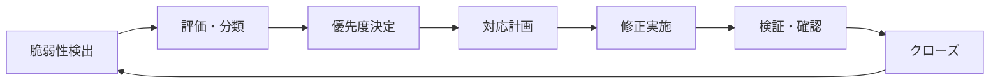

# 脆弱性管理

## 概要
ServiceHub建設プラットフォームにおける脆弱性の検出・評価・対応プロセスを定義する。

## 脆弱性管理サイクル



## 脆弱性スキャン体制

| スキャン種別 | ツール | 頻度 | 対象 |
|------------|--------|------|------|
| 依存関係スキャン | Dependabot, Safety | 毎日 | Python/Node.js依存関係 |
| SCASTスキャン | CodeQL, Bandit | PR毎 | ソースコード |
| コンテナスキャン | Trivy | イメージビルド毎 | Dockerイメージ |
| 動的スキャン | OWASP ZAP | 週次 | 実行中アプリケーション |
| ペネトレーションテスト | 外部業者 | 四半期 | システム全体 |
| インフラスキャン | Checkov | デプロイ毎 | Kubernetes/Terraform |

## CVSSSスコアリング基準

| スコア範囲 | 重大度 | 対応期限 | エスカレーション |
|-----------|--------|---------|----------------|
| 9.0 - 10.0 | Critical | 24時間以内 | CTO・セキュリティチーム即時 |
| 7.0 - 8.9 | High | 7日以内 | セキュリティチーム・PM |
| 4.0 - 6.9 | Medium | 30日以内 | 開発チームリーダー |
| 0.1 - 3.9 | Low | 90日以内 | 通常スプリントで対応 |
| 0.0 | Informational | 次回計画時 | ドキュメント記録のみ |

## 依存関係管理

### Python (requirements.txt / pyproject.toml)
```bash
# 依存関係の脆弱性チェック
pip install safety
safety check --full-report

# 依存関係の更新
pip list --outdated
pip install --upgrade パッケージ名
```

### Node.js (package.json)
```bash
# npm audit実行
npm audit
npm audit fix

# 強制修正（破壊的変更あり）
npm audit fix --force
```

## OWASP Top 10対策状況

| リスク | 対策内容 | 実装状況 |
|--------|---------|---------|
| A01:Broken Access Control | RBAC実装、最小権限原則 | ✅ 実装済 |
| A02:Cryptographic Failures | TLS 1.3、AES-256暗号化 | ✅ 実装済 |
| A03:Injection | パラメータ化クエリ、入力検証 | ✅ 実装済 |
| A04:Insecure Design | セキュリティ設計レビュー | ✅ 実装済 |
| A05:Security Misconfiguration | 設定自動チェック | ✅ 実装済 |
| A06:Vulnerable Components | 自動スキャン導入 | ✅ 実装済 |
| A07:Authentication Failures | MFA、セッション管理 | ✅ 実装済 |
| A08:Software/Data Integrity | 署名検証、整合性チェック | 🔄 対応中 |
| A09:Security Logging Failures | 包括的監査ログ | ✅ 実装済 |
| A10:SSRF | URLホワイトリスト | ✅ 実装済 |

## GitHub Actions セキュリティワークフロー

```yaml
name: Security Scan
on:
  push:
    branches: [main, develop]
  pull_request:
  schedule:
    - cron: '0 2 * * *'

jobs:
  codeql:
    runs-on: ubuntu-latest
    steps:
      - uses: actions/checkout@v4
      - uses: github/codeql-action/init@v3
        with:
          languages: python, javascript
      - uses: github/codeql-action/analyze@v3

  trivy:
    runs-on: ubuntu-latest
    steps:
      - uses: actions/checkout@v4
      - name: Trivy vulnerability scanner
        uses: aquasecurity/trivy-action@master
        with:
          scan-type: 'fs'
          severity: 'CRITICAL,HIGH'
          exit-code: '1'
```

## 脆弱性対応フロー

1. **検出**: 自動スキャンまたは報告による発見
2. **トリアージ**: CVSSスコア算出、影響範囲確認
3. **通知**: 重大度に応じたエスカレーション
4. **修正**: パッチ適用またはワークアラウンド実装
5. **検証**: 修正確認テスト実施
6. **記録**: インシデントレポート作成・保存

## 脆弱性開示ポリシー

- セキュリティ報告窓口: security@servicehub.example.com
- 報告受領後72時間以内に初期対応
- 90日間の責任ある開示期間
- 報告者への謝辞（希望者のみ）
