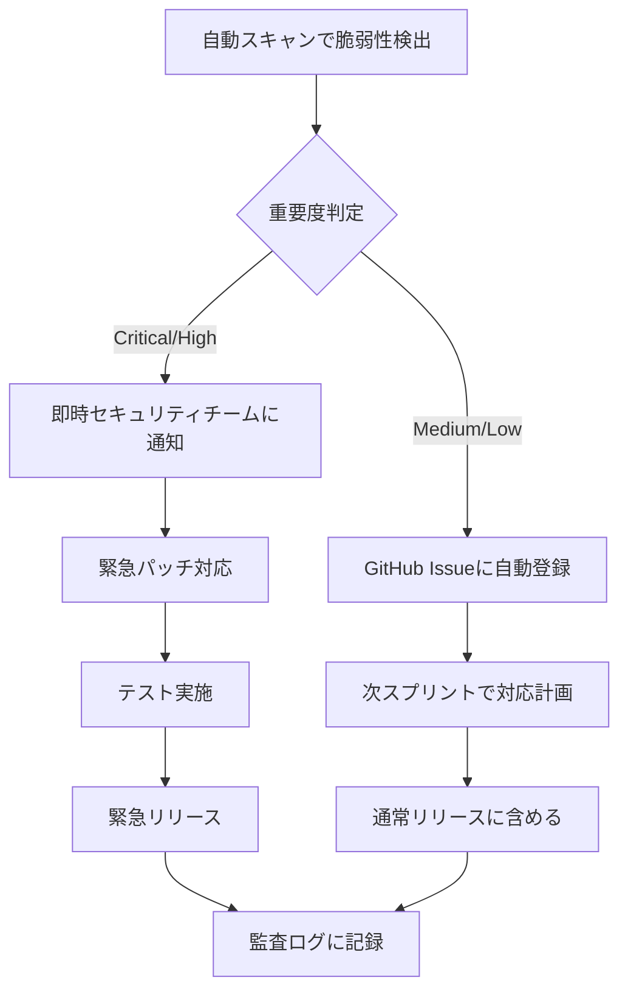

# 脆弱性管理（Vulnerability Management）

## 1. 脆弱性管理方針

NIST CSF 2.0の「識別・防御・検出・対応・復旧」フレームワークに基づき、継続的な脆弱性管理を実施する。

---

## 2. 脆弱性スキャン体制

### スキャンツール一覧

| ツール | 対象 | 実行タイミング | 目的 |
|--------|------|-------------|------|
| Bandit | Pythonコード | CI（毎PR） | コード品質・セキュリティ |
| Safety | Python依存パッケージ | CI（毎PR）+ 日次 | 既知脆弱性検出 |
| npm audit | Node.js依存パッケージ | CI（毎PR）+ 日次 | 既知脆弱性検出 |
| OWASP ZAP | Webアプリ（動的） | 週次 | OWASPTop10対応 |
| Trivy | Dockerイメージ | CI（毎ビルド） | イメージ脆弱性 |
| truffleHog | Gitリポジトリ | CI（毎PR） | シークレット漏洩検出 |
| SonarQube | 全ソースコード | 日次 | 総合コード品質 |

---

## 3. 脆弱性の重要度分類

| 重要度 | CVSS基準 | 対応期限 | 例 |
|--------|---------|---------|---|
| Critical | CVSS 9.0-10.0 | 24時間以内 | SQLインジェクション、RCE |
| High | CVSS 7.0-8.9 | 7日以内 | 認証バイパス、情報漏洩 |
| Medium | CVSS 4.0-6.9 | 30日以内 | XSS、CSRF |
| Low | CVSS 0.1-3.9 | 90日以内 | 情報漏洩リスク（低） |
| Informational | 0 | 次回リリース | ベストプラクティス改善 |

---

## 4. 依存パッケージ管理

### Python依存関係管理

```bash
# 定期的な脆弱性チェック（CI/日次実行）
safety check --json > safety-report.json

# Dependabot設定（GitHub）
# .github/dependabot.yml
version: 2
updates:
  - package-ecosystem: "pip"
    directory: "/backend"
    schedule:
      interval: "weekly"
    open-pull-requests-limit: 10
    
  - package-ecosystem: "npm"
    directory: "/frontend"
    schedule:
      interval: "weekly"
    open-pull-requests-limit: 10
    
  - package-ecosystem: "docker"
    directory: "/"
    schedule:
      interval: "weekly"
```

### 脆弱性発見時のフロー



---

## 5. OWASP Top 10 対応状況

| # | 脆弱性名 | 対応方法 | 状態 |
|---|---------|---------|------|
| A01 | アクセス制御の不備 | RBAC + サーバーサイド権限チェック | 対応済 |
| A02 | 暗号化の失敗 | TLS1.3 + AES-256 + bcrypt | 対応済 |
| A03 | インジェクション | SQLAlchemy ORM + パラメータバインド | 対応済 |
| A04 | 安全でない設計 | 脅威モデリング + セキュリティレビュー | 対応中 |
| A05 | セキュリティの設定ミス | IaCによる設定管理 + CISベンチマーク | 対応中 |
| A06 | 脆弱で古いコンポーネント | Dependabot + Safety + npm audit | 対応済 |
| A07 | 認証・認可の失敗 | JWT + MFA + セッション管理 | 対応済 |
| A08 | ソフトウェアとデータの整合性の失敗 | 署名付きコミット + CI/CDセキュリティ | 対応中 |
| A09 | セキュリティログと監視の失敗 | 監査ログ + ELK + アラート | 対応済 |
| A10 | サーバーサイドリクエストフォージェリ | URLホワイトリスト + 外部リクエスト制限 | 対応済 |

---

## 6. ペネトレーションテスト計画

### Phase 5（2026/08）での実施計画

| テスト種別 | 対象 | 実施者 | 期間 |
|-----------|------|-------|------|
| Webアプリ診断 | 全APIエンドポイント | 外部セキュリティベンダー | 2026/08/11〜08/15 |
| 認証・認可テスト | 認証機能・RBAC | 外部セキュリティベンダー | 2026/08/18〜08/22 |
| インフラ診断 | サーバー・ネットワーク | 内部セキュリティ担当 | 2026/08/25〜08/29 |

### ペネトレーションテストスコープ

```
対象:
  - https://staging.servicehub-construction.example.com/
  - /api/v1/* の全エンドポイント

対象外:
  - 本番環境
  - DoS/DDoS攻撃
  - サードパーティサービス（OpenAI等）
```

---

## 7. 脆弱性管理KPI

| KPI | 目標値 | 計測頻度 |
|-----|--------|---------|
| Critical脆弱性の24時間以内対応率 | 100% | 都度 |
| High脆弱性の7日以内対応率 | 95%以上 | 週次 |
| 既知脆弱性のある依存パッケージ数（Critical/High） | 0件 | 日次 |
| セキュリティスキャン実施率（CI） | 100% | 日次 |
| 未対応脆弱性数（Medium以上） | 10件以下 | 月次 |
