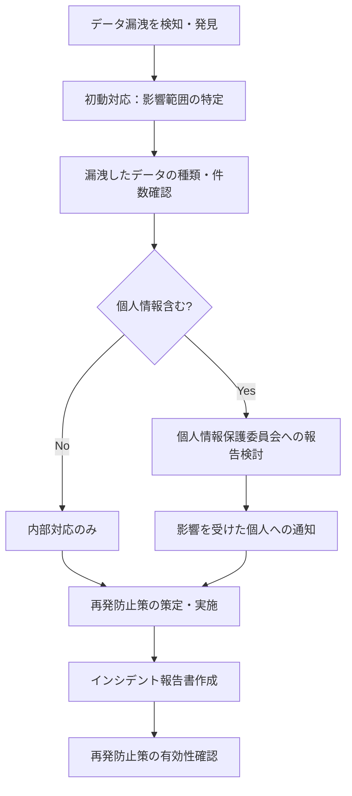

# データ保護方針（Data Protection Policy）

## 1. データ保護の基本方針

ServiceHub Construction Platformで取り扱うデータを適切に保護し、個人情報保護法・ISO 27001・建設業法の要件を遵守する。

---

## 2. データ分類

| 分類 | 定義 | 例 | 保護レベル |
|------|------|---|----------|
| 機密 | 漏洩時に重大な影響 | 認証情報、MFA秘密鍵、パスワード | 最高 |
| 社外秘 | 社内限定情報 | 工事金額、原価データ、個人情報 | 高 |
| 内部 | 業務上必要な情報 | 案件詳細、日報内容、安全記録 | 中 |
| 公開 | 公開可能な情報 | ナレッジ記事（公開設定）、マニュアル | 低 |

---

## 3. 個人情報の取り扱い

### 収集する個人情報

| 情報項目 | 目的 | 保管期間 | 第三者提供 |
|---------|------|---------|---------|
| 氏名 | ユーザー識別・日報記録 | 退職後7年 | なし |
| メールアドレス | ログイン・通知 | 退職後7年 | なし |
| 社員番号 | ユーザー識別 | 退職後7年 | なし |
| 所属部署・役職 | 権限管理 | 退職後7年 | なし |
| IPアドレス（ログ） | セキュリティ監視 | 7年 | なし |
| 位置情報（任意） | 現場写真メタデータ | 写真削除まで | なし |

### 個人情報保護の実装

```python
# 個人情報フィールドの暗号化
class User(Base):
    __tablename__ = "users"
    
    id = Column(UUID, primary_key=True)
    # 平文で保存（識別用）
    username = Column(String(64), unique=True, nullable=False)
    # ハッシュ化（認証用）
    hashed_password = Column(String(512), nullable=False)
    # 暗号化（個人情報）
    _email = Column("email", EncryptedString(255), nullable=False)
    _full_name = Column("full_name", EncryptedString(128), nullable=False)
    # MFA秘密鍵は別途暗号化
    mfa_secret = Column(EncryptedString(512))
    
    @property
    def email(self):
        return decrypt(self._email)
    
    @email.setter
    def email(self, value):
        self._email = encrypt(value)
```

---

## 4. データ暗号化

### 保存時（At Rest）

| データ | 暗号化方式 | 鍵管理 |
|--------|----------|------|
| パスワード | bcrypt (cost=12) | ソルト自動生成 |
| MFA秘密鍵 | AES-256-GCM | 環境変数（本番はVault） |
| 個人情報フィールド | AES-256-CBC | DBマスターキー（Vault） |
| ファイルストレージ | AES-256（MinIOサーバー側） | MinIO内部管理 |
| バックアップ | AES-256 | 専用バックアップキー |
| DB全体（将来） | PostgreSQL TDE | HSM |

### 通信時（In Transit）

| 通信経路 | プロトコル | 証明書 |
|---------|---------|------|
| ブラウザ↔Nginx | TLS 1.3 | 社内CA / Let's Encrypt |
| Nginx↔FastAPI | TLS 1.2以上（社内） | 自己署名証明書 |
| FastAPI↔PostgreSQL | SSL接続 | PostgreSQL証明書 |
| FastAPI↔MinIO | TLS 1.2以上 | MinIO証明書 |
| FastAPI↔Redis | TLS 1.2以上 | Redis証明書 |

---

## 5. データ保持・廃棄

### 保持期間一覧

| データ種別 | 保持期間 | 根拠 |
|-----------|---------|------|
| 工事案件記録 | 竣工後7年 | 建設業法 |
| 日報・安全記録 | 3年以上 | 労働安全衛生法 |
| 財務・原価データ | 7年 | 会計帳簿保存要件 |
| 個人情報 | 退職後7年 | 社内規程 |
| 監査ログ | 7年 | ISO 27001 |
| システムログ | 1年 | セキュリティ要件 |
| セッション情報 | 7日 | セキュリティ要件 |

### データ廃棄手順

```python
async def anonymize_user_data(user_id: UUID, reason: str):
    """退職者の個人情報匿名化処理"""
    user = await get_user(user_id)
    
    # 個人識別情報を匿名化（業務記録は保持）
    await update_user(user_id, {
        "full_name": f"退職者_{user.employee_no}",
        "email": f"deleted_{user.employee_no}@deleted.invalid",
        "is_active": False,
        "deleted_at": datetime.utcnow(),
    })
    
    # 監査ログに記録
    await audit_log.record(
        action="USER_ANONYMIZED",
        resource_id=user_id,
        metadata={"reason": reason},
    )
```

---

## 6. アクセス制御

### データアクセスの最小権限

| ロール | アクセス範囲 | 制限 |
|--------|-----------|------|
| 現場作業員 | 担当案件のデータのみ | 他案件データへのアクセス不可 |
| 現場監督 | 担当案件 + 配下作業員データ | 他案件の原価データ不可 |
| 原価担当 | 担当案件の予算・原価データ | 他案件の詳細不可 |
| 管理者 | 全データ | 削除は承認必要 |
| 経営者 | 集計・サマリーデータのみ | 個別レコードの詳細閲覧制限 |

---

## 7. データ漏洩インシデント対応



### 報告期限

| 報告先 | 期限 | 条件 |
|--------|------|------|
| 個人情報保護委員会 | 検知後3〜5日以内（速報） | 要配慮個人情報・1000件以上の漏洩 |
| 個人情報保護委員会 | 検知後30日以内（確報） | 同上 |
| 影響を受けた個人 | 確報後、速やかに | 同上 |
| 経営層 | 24時間以内 | 全件 |
