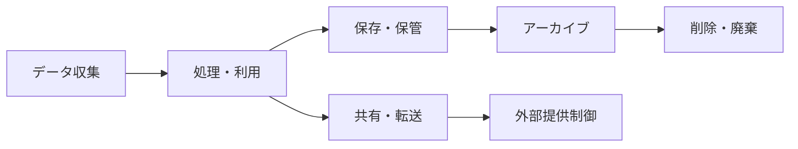

# データ保護方針

## 概要
ServiceHub建設プラットフォームにおける個人情報・機密データの保護方針を定義する。個人情報保護法、GDPR準拠を基本方針とする。

## 保護対象データ分類

| データ分類 | 具体例 | 保護レベル | 暗号化要件 |
|-----------|--------|----------|----------|
| 極秘 | 認証情報、暗号鍵 | Level 4 | AES-256必須 |
| 機密 | 個人情報、財務データ | Level 3 | 保存・転送時暗号化 |
| 社外秘 | 工事情報、設計図書 | Level 2 | 転送時暗号化 |
| 公開 | 一般告知情報 | Level 1 | 不要 |

## 個人情報の取り扱い

### 収集する個人情報
- 氏名・従業員番号
- メールアドレス・電話番号
- 所属部署・役職
- 作業記録・位置情報（工事現場）

### 利用目的
1. 業務システムの利用認証
2. 工事記録・日報の管理
3. 緊急時の連絡
4. システム利用統計・改善

## データライフサイクル管理



## データ保存期間

| データ種別 | 保存期間 | 根拠 | 削除方法 |
|-----------|---------|------|---------|
| 工事案件データ | 完了後10年 | 建設業法 | 安全削除 |
| 日報・作業記録 | 5年 | 社内規程 | 安全削除 |
| 監査ログ | 7年 | セキュリティポリシー | 安全削除 |
| 個人情報 | 在職中+3年 | 個人情報保護法 | 完全消去 |
| バックアップ | 90日 | 運用要件 | 自動削除 |
| セッションデータ | 24時間 | セキュリティ要件 | 自動削除 |

## 暗号化実装

### データベース暗号化
```python
# PostgreSQL TDE (Transparent Data Encryption)
# postgresql.conf設定
# ssl = on
# ssl_cert_file = 'server.crt'
# ssl_key_file = 'server.key'

# アプリケーションレベル暗号化
from cryptography.fernet import Fernet
import base64
import os

class DataEncryption:
    def __init__(self):
        key = os.environ.get('ENCRYPTION_KEY')
        self.cipher = Fernet(key.encode())
    
    def encrypt(self, data: str) -> str:
        return self.cipher.encrypt(data.encode()).decode()
    
    def decrypt(self, token: str) -> str:
        return self.cipher.decrypt(token.encode()).decode()
```

### ファイルストレージ暗号化
```python
# MinIO サーバーサイド暗号化
import boto3
from botocore.config import Config

s3_client = boto3.client(
    's3',
    endpoint_url='http://minio:9000',
    aws_access_key_id=os.environ['MINIO_ACCESS_KEY'],
    aws_secret_access_key=os.environ['MINIO_SECRET_KEY'],
)

# SSE-S3暗号化でオブジェクトアップロード
s3_client.put_object(
    Bucket='construction-docs',
    Key='sensitive-file.pdf',
    Body=file_content,
    ServerSideEncryption='AES256'
)
```

## アクセス制御原則

1. **最小権限の原則**: 業務に必要な最小限のアクセス権のみ付与
2. **職務分離**: 重要操作は複数名の承認を要求
3. **Need-to-Know**: 担当業務外のデータへのアクセス禁止
4. **定期レビュー**: 四半期毎のアクセス権棚卸し

## データ侵害対応手順

| ステップ | 対応内容 | 担当 | 期限 |
|---------|---------|------|------|
| 1. 検知 | システムアラート・報告受信 | セキュリティチーム | 即時 |
| 2. 封じ込め | 影響範囲の隔離 | IT運用 | 1時間以内 |
| 3. 評価 | 流出データ・影響の確認 | セキュリティ+法務 | 24時間以内 |
| 4. 通知 | 監督機関・影響者への通知 | 経営・法務 | 72時間以内 |
| 5. 復旧 | システム復旧・強化 | IT運用 | 状況次第 |
| 6. 再発防止 | 原因分析・対策実施 | 全チーム | 30日以内 |

## コンプライアンス要件

- **個人情報保護法**: 個人情報の適正取得・利用・管理
- **GDPR**: EU居住者の個人データ保護（将来対応）
- **建設業法**: 工事記録の適切な保存・管理
- **ISO 27001**: 情報セキュリティマネジメント準拠
