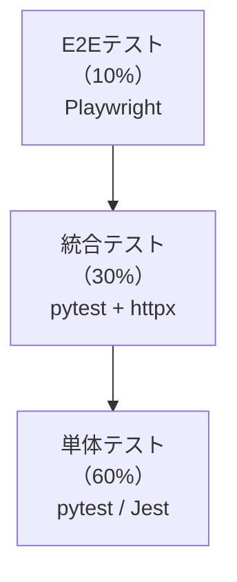

# テスト戦略（Test Strategy）

## 1. テスト戦略の概要

ServiceHub Construction Platformのテストは、テストピラミッドモデルに基づき、複数レベルのテストを組み合わせて品質を確保する。



---

## 2. テストレベルと種類

| テストレベル | 目的 | ツール | カバレッジ目標 | 実行タイミング |
|-----------|------|-------|------------|------------|
| 単体テスト | 関数・クラスの動作確認 | pytest / Jest | 85%以上 | CI（毎PR） |
| 統合テスト | APIエンドポイント・DB連携 | pytest + httpx | 全エンドポイント | CI（毎PR） |
| E2Eテスト | ユーザーシナリオ全体 | Playwright | 主要シナリオ20件 | 日次（staging） |
| パフォーマンステスト | 性能・負荷 | Locust / k6 | - | Phase5 / 月次 |
| セキュリティテスト | 脆弱性・認証認可 | OWASP ZAP / Bandit | - | Phase5 / 週次 |
| UAT | ユーザー受け入れ | 手動 | シナリオ95%合格 | Phase6 |

---

## 3. テスト環境

| 環境 | 目的 | データ | 自動化 |
|------|------|--------|--------|
| ローカル | 開発者の動作確認 | テストデータ | 手動 / CI |
| CI（GitHub Actions） | PR毎の自動テスト | テストデータ | 完全自動 |
| Staging | 結合・E2Eテスト | 本番相当のダミーデータ | 日次自動 |
| Performance | 負荷テスト | 大量テストデータ | Phase5で実施 |

---

## 4. テスト自動化方針

### バックエンド（pytest）

```python
# テストディレクトリ構造
tests/
├── conftest.py          # 共通フィクスチャ
├── unit/                # 単体テスト
│   ├── test_services/   # サービス層テスト
│   └── test_utils/      # ユーティリティテスト
├── integration/         # 統合テスト（APIテスト）
│   ├── test_auth/
│   ├── test_projects/
│   ├── test_reports/
│   └── ...
└── e2e/                 # E2Eシナリオ（Playwright）

# pytest設定
# pytest.ini
[pytest]
asyncio_mode = auto
testpaths = tests
addopts = 
    --cov=app 
    --cov-report=html 
    --cov-fail-under=80
    -v
```

### フロントエンド（Vitest + Testing Library）

```typescript
// テスト例: 日報作成コンポーネント
import { render, screen, fireEvent, waitFor } from '@testing-library/react';
import { ReportCreateForm } from './ReportCreateForm';

describe('ReportCreateForm', () => {
  it('必須項目が空の場合、バリデーションエラーが表示される', async () => {
    render(<ReportCreateForm projectId="test-uuid" />);
    
    const submitButton = screen.getByRole('button', { name: '提出' });
    fireEvent.click(submitButton);
    
    await waitFor(() => {
      expect(screen.getByText('作業内容を入力してください')).toBeInTheDocument();
    });
  });
});
```

---

## 5. テストデータ管理

### テストフィクスチャ

```python
# conftest.py
import pytest
from httpx import AsyncClient
from app.main import app
from app.core.database import get_db

@pytest.fixture
async def test_db():
    """テスト用データベース（トランザクションロールバック）"""
    async with TestDatabase() as db:
        yield db
        await db.rollback()

@pytest.fixture
async def client(test_db):
    """テスト用HTTPクライアント"""
    async with AsyncClient(app=app, base_url="http://test") as client:
        yield client

@pytest.fixture
def auth_header(test_user):
    """認証済みヘッダー"""
    token = create_access_token(subject=str(test_user.id))
    return {"Authorization": f"Bearer {token}"}

@pytest.fixture
async def test_project(test_db, test_user):
    """テスト用工事案件"""
    project = Project(
        name="テスト工事",
        project_code="TEST-001",
        pm_id=test_user.id,
    )
    test_db.add(project)
    await test_db.commit()
    return project
```

---

## 6. 継続的テスト（CI設定）

```yaml
# .github/workflows/test.yml
name: Test

on:
  pull_request:
    branches: [develop, main]

jobs:
  backend-test:
    runs-on: ubuntu-latest
    services:
      postgres:
        image: postgres:16
        env:
          POSTGRES_PASSWORD: testpass
          POSTGRES_DB: servicehub_test
      redis:
        image: redis:7
    
    steps:
      - uses: actions/checkout@v4
      - uses: actions/setup-python@v5
        with:
          python-version: '3.12'
      - run: pip install -r requirements.txt
      - run: pytest tests/ --cov=app --cov-report=xml
      - uses: codecov/codecov-action@v3
  
  frontend-test:
    runs-on: ubuntu-latest
    steps:
      - uses: actions/checkout@v4
      - uses: actions/setup-node@v4
        with:
          node-version: '20'
      - run: npm ci
      - run: npm run test:coverage
```

---

## 7. テスト品質指標

| 指標 | 目標値 | 計測方法 |
|------|--------|---------|
| バックエンドカバレッジ | 85%以上 | pytest-cov |
| フロントエンドカバレッジ | 70%以上 | Vitest |
| テスト実行時間（CI） | 10分以内 | GitHub Actions |
| テストフレークレート | 1%未満 | 月次計測 |
| E2Eシナリオ合格率 | 98%以上 | 日次計測 |
