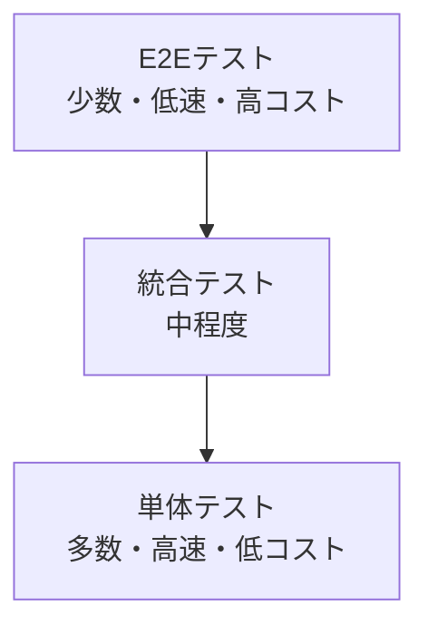

# テスト戦略

## 概要
ServiceHub建設プラットフォームの品質保証のための包括的テスト戦略を定義する。テストピラミッドに基づいた段階的テストアプローチを採用する。

## テストピラミッド



## テスト種別と目標カバレッジ

| テスト種別 | 担当 | 実行タイミング | 目標カバレッジ | ツール |
|-----------|------|-------------|-------------|--------|
| 単体テスト | 開発者 | コード変更毎 | 80%以上 | pytest, Jest |
| 統合テスト | 開発者 | PR作成時 | 70%以上 | pytest, Cypress |
| APIテスト | QA | リリース前 | 全エンドポイント | pytest, Postman |
| E2Eテスト | QA | リリース前 | 主要シナリオ | Playwright |
| 性能テスト | QA | フェーズ5 | SLA基準値 | k6, Locust |
| セキュリティテスト | セキュリティ | 月次 | OWASP Top 10 | ZAP, Bandit |
| UAT | ユーザー | フェーズ6 | 業務シナリオ | 手動 |

## テスト環境構成

| 環境 | 用途 | データ | アクセス |
|------|------|--------|---------|
| dev | 開発・単体テスト | モックデータ | 開発者 |
| test | 統合・自動テスト | テストデータセット | 開発者・QA |
| staging | UAT・性能テスト | 本番同等匿名化データ | QA・ユーザー代表 |
| production | 本番運用 | 実データ | 制限付き |

## CI/CDパイプラインでのテスト自動化

```yaml
# .github/workflows/test.yml
name: Test Pipeline
on: [push, pull_request]

jobs:
  unit-test:
    runs-on: ubuntu-latest
    steps:
      - uses: actions/checkout@v4
      - name: Backend unit tests
        run: |
          pip install -r requirements.txt
          pytest tests/unit/ --cov=app --cov-report=xml
      - name: Frontend unit tests
        run: |
          cd frontend && npm ci
          npm run test -- --coverage

  integration-test:
    needs: unit-test
    services:
      postgres:
        image: postgres:16
        env:
          POSTGRES_PASSWORD: test
    steps:
      - name: Integration tests
        run: pytest tests/integration/ -v
```

## テスト品質指標

| 指標 | 目標値 | 測定方法 |
|------|--------|---------|
| コードカバレッジ | ≥80% | pytest-cov, Istanbul |
| テスト成功率 | ≥99% | CI/CDレポート |
| テスト実行時間 | <10分（単体） | GitHub Actions |
| バグ検出率 | ≥70%（テストで発見） | バグトラッカー |
| 回帰バグ率 | <5% | リリース毎計測 |

## フェーズ別テスト計画

| フェーズ | 期間 | テスト内容 | 完了基準 |
|---------|------|----------|---------|
| フェーズ1-4 | 各フェーズ内 | 単体・統合テスト | カバレッジ80% |
| フェーズ5 | 2026/08 | 統合・性能・セキュリティ | 全テスト合格 |
| フェーズ6 | 2026/09-10 | UAT・受入テスト | ユーザー承認 |

## テスト管理ツール

- **テストケース管理**: GitHub Issues + ラベル
- **バグトラッキング**: GitHub Issues
- **テストレポート**: pytest-html, Allure
- **カバレッジ可視化**: Codecov
