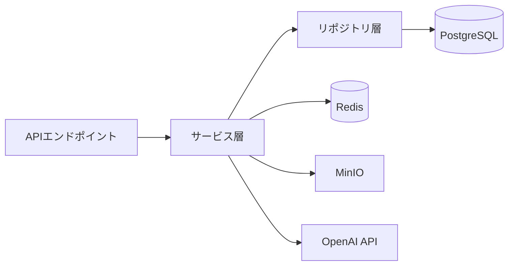

# 結合テスト計画

## 概要
複数モジュール間の連携、APIエンドポイントのテスト、外部サービス統合のテスト計画。

## 結合テスト範囲



## APIエンドポイントテスト

```python
# tests/integration/test_projects_api.py
import pytest
from httpx import AsyncClient
from app.main import app
from tests.fixtures import create_test_user, create_test_project

class TestProjectsAPI:
    @pytest.fixture(autouse=True)
    async def setup(self, db_session):
        self.user = await create_test_user(db_session)
        self.token = await get_auth_token(self.user)
        self.headers = {"Authorization": f"Bearer {self.token}"}
    
    async def test_create_project(self, async_client: AsyncClient):
        """工事案件作成APIテスト"""
        response = await async_client.post(
            "/api/v1/projects",
            json={
                "name": "テスト工事案件",
                "client_name": "テスト株式会社",
                "start_date": "2026-04-01",
                "end_date": "2026-09-30",
                "budget": 50000000
            },
            headers=self.headers
        )
        assert response.status_code == 201
        data = response.json()
        assert data["name"] == "テスト工事案件"
        assert data["status"] == "planning"
    
    async def test_get_project_list(self, async_client: AsyncClient):
        """工事案件一覧取得APIテスト"""
        await create_test_project(self.user)
        
        response = await async_client.get(
            "/api/v1/projects?page=1&per_page=10",
            headers=self.headers
        )
        assert response.status_code == 200
        data = response.json()
        assert data["total"] >= 1
        assert len(data["items"]) >= 1
    
    async def test_unauthorized_access(self, async_client: AsyncClient):
        """未認証アクセスのテスト"""
        response = await async_client.get("/api/v1/projects")
        assert response.status_code == 401
```

## データベース統合テスト

| テストシナリオ | 確認内容 | 期待結果 |
|-------------|---------|---------|
| トランザクション整合性 | 複数テーブル更新 | ACID保証 |
| 外部キー制約 | 親レコード削除時 | CASCADE/RESTRICT動作 |
| インデックス効果 | 大量データ検索 | <100ms |
| 同時書き込み | 楽観的ロック | 競合検出・リトライ |
| コネクションプール | 高負荷時 | 適切な接続管理 |

## 外部サービス統合テスト

### OpenAI API統合
```python
async def test_ai_daily_report_summary():
    """AI日報要約機能の統合テスト"""
    report_content = "本日は基礎工事の配筋作業を実施した..."
    
    with patch('openai.AsyncOpenAI') as mock_openai:
        mock_openai.return_value.chat.completions.create.return_value = \
            AsyncMock(choices=[{"message": {"content": "基礎工事配筋作業完了"}}])
        
        result = await ai_service.summarize_report(report_content)
        assert "基礎工事" in result
        assert len(result) < len(report_content)
```

### MinIOファイルストレージ統合
```python
async def test_photo_upload_flow():
    """写真アップロードフローの統合テスト"""
    test_image = b"fake_image_data"
    
    photo_id = await photo_service.upload(
        file_data=test_image,
        filename="test.jpg",
        project_id=1
    )
    
    # アップロード確認
    photo = await photo_service.get(photo_id)
    assert photo.url is not None
    assert photo.file_size > 0
    
    # サムネイル自動生成確認
    assert photo.thumbnail_url is not None
```

## テスト実行順序と依存関係

| テストグループ | 前提条件 | 実行順序 |
|-------------|---------|---------|
| 認証テスト | なし | 1 |
| マスタデータテスト | 認証 | 2 |
| 案件管理テスト | 認証+マスタ | 3 |
| 日報テスト | 案件管理 | 4 |
| 写真テスト | 案件管理 | 5 |
| AI機能テスト | 案件+日報 | 6 |

## 結合テスト環境セットアップ

```bash
# docker-compose.test.yml起動
docker-compose -f docker-compose.test.yml up -d

# テスト用データベース初期化
python scripts/init_test_db.py

# 結合テスト実行
pytest tests/integration/ -v --tb=short

# クリーンアップ
docker-compose -f docker-compose.test.yml down -v
```
