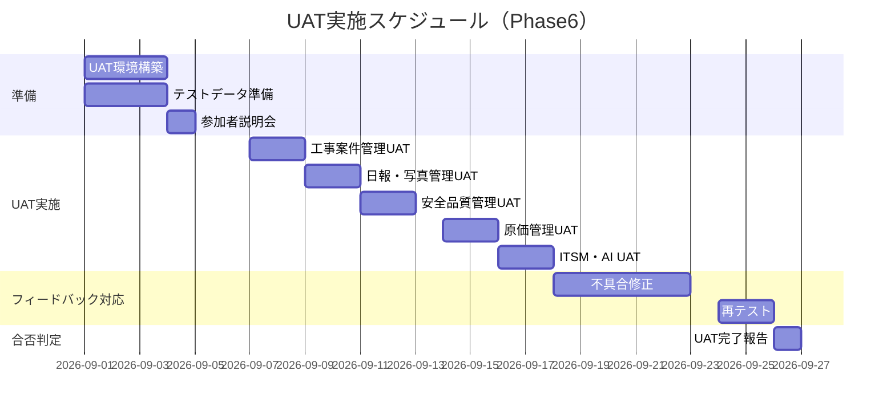

# 受入テスト計画（Acceptance Test Plan）

## 1. 受入テスト概要

| 項目 | 内容 |
|------|------|
| テスト目的 | システムが業務要件・ユーザーストーリーを満たすことを確認 |
| 実施時期 | Phase6（2026/09/01〜09/26） |
| 実施場所 | 社内Staging環境（本番同等構成） |
| 参加者 | 現場監督3名、管理者2名、IT担当2名 |
| 合否基準 | シナリオ合格率95%以上 + Critical不具合ゼロ |

---

## 2. UATシナリオ一覧

### 工事案件管理

| シナリオID | シナリオ名 | 実施者 | 優先度 |
|-----------|----------|-------|--------|
| UAT-PRJ-001 | 新規工事案件の登録から担当者アサインまで | 管理者 | 高 |
| UAT-PRJ-002 | 案件一覧での検索・フィルタリング | 現場監督 | 高 |
| UAT-PRJ-003 | 案件進捗の更新とダッシュボード反映確認 | 現場監督 | 高 |
| UAT-PRJ-004 | 案件ステータスの変更（施工中→完了） | 管理者 | 中 |

### 日報管理

| シナリオID | シナリオ名 | 実施者 | 優先度 |
|-----------|----------|-------|--------|
| UAT-RPT-001 | タブレットでの日報作成・写真添付・提出 | 現場作業員 | 高 |
| UAT-RPT-002 | AI補完機能を使った日報作成 | 現場作業員 | 中 |
| UAT-RPT-003 | 現場監督による日報承認・差し戻し | 現場監督 | 高 |
| UAT-RPT-004 | 日報のPDF出力 | 管理者 | 高 |
| UAT-RPT-005 | 工数集計レポートの確認 | 管理者 | 中 |

### 安全品質管理

| シナリオID | シナリオ名 | 実施者 | 優先度 |
|-----------|----------|-------|--------|
| UAT-SAF-001 | 朝の安全点検チェックリスト入力 | 現場作業員 | 高 |
| UAT-SAF-002 | ヒヤリハット報告の登録から是正処置作成 | 現場監督 | 高 |
| UAT-SAF-003 | 安全KPIダッシュボードの確認 | 管理者 | 中 |

### 原価管理

| シナリオID | シナリオ名 | 実施者 | 優先度 |
|-----------|----------|-------|--------|
| UAT-CST-001 | 予算登録から承認フローまで | 管理者・原価担当 | 高 |
| UAT-CST-002 | 実績原価の入力と差異分析確認 | 原価担当 | 高 |
| UAT-CST-003 | 月次原価レポートのPDF/Excel出力 | 管理者 | 高 |

---

## 3. UATシナリオ詳細例

### UAT-RPT-001: タブレットでの日報作成

```
前提条件:
  - テストユーザー（作業員権限）でログイン済み
  - 担当案件が1件以上登録されている
  
手順:
  1. ホーム画面から「日報作成」ボタンをタップ
  2. 案件を選択する（プルダウン）
  3. 作業日が本日になっていることを確認
  4. 天気アイコンを選択
  5. 作業内容に「1階躯体工事施工」と入力
  6. AI補完ボタンをタップし、提案を確認（採用or却下）
  7. 工数（正規：8時間）を入力
  8. カメラボタンから写真を3枚撮影・添付
  9. 「提出」ボタンをタップ
  10. 確認ダイアログで「OK」をタップ

合格基準:
  - 手順1〜9が10分以内に完了できる
  - 日報一覧に「承認待ち」で表示される
  - 監督者にプッシュ通知が届く
  - タブレット（iPad 10インチ）で正常に操作できる
```

---

## 4. 受け入れ基準

### 定量的基準

| 指標 | 合格ライン |
|------|---------|
| シナリオ全体合格率 | 95%以上 |
| Critical不具合数 | 0件 |
| High不具合数 | 3件以下（リリースまでに修正） |
| 平均操作完了時間 | シナリオ別目標値の120%以内 |
| システム応答時間 | 重要操作2秒以内 |

### 定性的基準

| 評価項目 | 評価方法 |
|---------|---------|
| 操作のわかりやすさ | 参加者アンケート（5段階評価で4.0以上） |
| 機能の網羅性 | 業務要件との対比チェックリスト |
| 現場での実用性 | 現場監督・作業員からのフィードバック |

---

## 5. 不具合分類と対応

| 重要度 | 定義 | 対応方針 |
|--------|------|---------|
| Critical | 業務が完全に停止する | リリースブロッカー・即時修正 |
| High | 主要機能に重大な支障 | リリースまでに修正 |
| Medium | 一部機能に問題あるが業務継続可 | 次のスプリントで修正 |
| Low | 軽微な表示問題など | リリース後に修正 |

---

## 6. UAT実施スケジュール


