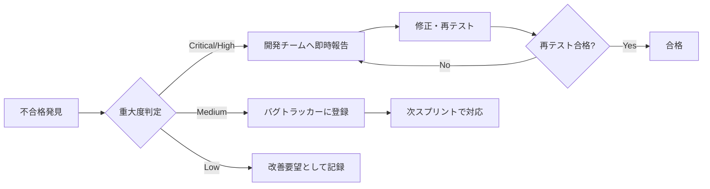

# 受入テスト計画（UAT）

## 概要
フェーズ6（2026/09〜2026/10）にて実施するユーザー受入テストの計画を定義する。実際のユーザーが業務シナリオに基づいて動作確認を行う。

## UAT実施概要

| 項目 | 内容 |
|------|------|
| 実施期間 | 2026/09/01〜2026/09/30 |
| 実施環境 | staging環境 |
| 参加者 | 各部門代表ユーザー（15名程度） |
| テストシナリオ | 50シナリオ |
| 合格基準 | 重要シナリオ100%合格、全体95%以上合格 |

## テスト参加者

| 役割 | 部門 | 人数 | 担当テスト領域 |
|------|------|------|-------------|
| 現場監督 | 工事部 | 3名 | 案件管理、日報、写真 |
| 安全管理者 | 安全部 | 2名 | 安全品質チェック |
| 経理担当 | 経理部 | 2名 | 原価管理 |
| IT管理者 | 情報システム部 | 2名 | ITSM機能 |
| 一般社員 | 全部門 | 6名 | 基本機能全般 |

## 主要UATシナリオ

### シナリオ1: 工事案件登録から完了まで
```
前提条件: 現場監督ロールでログイン済み

手順:
1. ダッシュボードから「新規案件作成」をクリック
2. 案件基本情報を入力（名称、発注者、工期、予算）
3. チームメンバーをアサイン
4. 案件を「進行中」ステータスに変更
5. 工事完了後、完了報告を提出
6. 案件を「完了」ステータスに変更

確認ポイント:
✓ 入力フォームのバリデーションが適切に動作する
✓ ステータス変更が正しく反映される
✓ 関係者に通知が送信される
✓ 案件一覧で検索・フィルタリングできる
```

### シナリオ2: 日報作成とAI支援
```
前提条件: 工事案件に紐づいた日報作成権限あり

手順:
1. 担当案件の日報作成画面を開く
2. 本日の作業内容を入力
3. 「AI要約」ボタンをクリック
4. 生成された要約を確認・編集
5. 写真を添付
6. 日報を提出

確認ポイント:
✓ AI要約が2秒以内に生成される
✓ 要約内容が適切（作業内容を正確に要約）
✓ 写真のアップロードが正常動作
✓ 提出後に上長へ通知が届く
```

### シナリオ3: 安全チェックシート記入
```
手順:
1. 対象案件の安全管理メニューを開く
2. 本日の安全チェックシートを選択
3. 各チェック項目に回答（OK/NG/N-A）
4. NG項目に対して是正措置を記入
5. 写真証拠を添付
6. チェックシートを提出・承認申請

確認ポイント:
✓ NG項目が赤くハイライトされる
✓ 是正措置なしでは提出できない
✓ 承認フローが正しく動作する
```

## 合格基準

| 重大度 | 説明 | 許容件数 |
|--------|------|---------|
| Critical | システムが使えない障害 | 0件 |
| High | 主要機能が動作しない | 0件 |
| Medium | 代替手段がある機能不具合 | 5件以下 |
| Low | 軽微な表示・操作性問題 | 制限なし |

## UAT不合格時の対応



## UAT完了報告書

UATが完了した際には以下を含む完了報告書を作成する：
- テスト実施期間・参加者
- テストシナリオ実施結果（合格/不合格/保留）
- 検出バグ一覧と対応状況
- ユーザーからのフィードバック
- リリース可否の推奨
