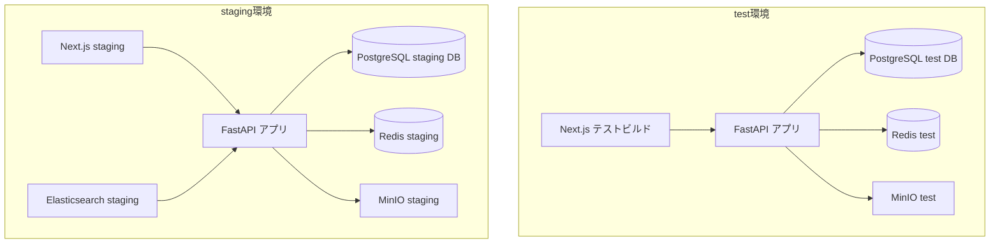

# テスト環境設計

## 概要
各テスト工程で使用する環境の構成・管理方法を定義する。

## 環境一覧

| 環境名 | 用途 | 管理者 | 更新頻度 |
|--------|------|--------|---------|
| local | 開発者個人環境 | 各開発者 | 随時 |
| dev | 開発統合環境 | 開発チーム | PRマージ毎 |
| test | 自動テスト専用 | CI/CD | テスト実行毎 |
| staging | UAT・性能テスト | QAチーム | リリース候補毎 |
| production | 本番 | 運用チーム | リリース時のみ |

## テスト環境アーキテクチャ



## Docker Compose テスト構成

```yaml
# docker-compose.test.yml
version: '3.9'

services:
  api:
    build:
      context: ./backend
      target: test
    environment:
      DATABASE_URL: postgresql://test:test@db:5432/servicehub_test
      REDIS_URL: redis://redis:6379/1
      MINIO_ENDPOINT: minio:9000
      OPENAI_API_KEY: ${OPENAI_API_KEY_TEST}
    depends_on:
      - db
      - redis
      - minio

  db:
    image: postgres:16-alpine
    environment:
      POSTGRES_USER: test
      POSTGRES_PASSWORD: test
      POSTGRES_DB: servicehub_test
    tmpfs:
      - /var/lib/postgresql/data  # インメモリDBで高速化

  redis:
    image: redis:7-alpine
    command: redis-server --save "" --appendonly no

  minio:
    image: minio/minio
    command: server /data --console-address ":9001"
    environment:
      MINIO_ROOT_USER: testuser
      MINIO_ROOT_PASSWORD: testpassword

  frontend:
    build:
      context: ./frontend
      target: test
    environment:
      NEXT_PUBLIC_API_URL: http://api:8000
```

## テストデータ管理

### フィクスチャ設計
```python
# tests/conftest.py
import pytest
from sqlalchemy.ext.asyncio import AsyncSession, create_async_engine

@pytest.fixture(scope="session")
async def engine():
    engine = create_async_engine(TEST_DATABASE_URL, echo=False)
    async with engine.begin() as conn:
        await conn.run_sync(Base.metadata.create_all)
    yield engine
    async with engine.begin() as conn:
        await conn.run_sync(Base.metadata.drop_all)

@pytest.fixture(scope="function")
async def db_session(engine):
    """各テストで独立したトランザクションを使用"""
    async with AsyncSession(engine) as session:
        async with session.begin():
            yield session
            await session.rollback()

@pytest.fixture
async def test_user(db_session):
    user = User(
        email="test@example.com",
        name="テストユーザー",
        role="engineer"
    )
    db_session.add(user)
    await db_session.flush()
    return user
```

## 環境変数管理

| 変数名 | test環境 | staging環境 | 管理方法 |
|--------|---------|------------|---------|
| DATABASE_URL | テストDB | ステージングDB | GitHub Secrets |
| REDIS_URL | テストRedis | ステージングRedis | GitHub Secrets |
| OPENAI_API_KEY | テスト用キー | 本番用キー | GitHub Secrets |
| MINIO_ACCESS_KEY | テスト用 | ステージング用 | GitHub Secrets |
| LOG_LEVEL | DEBUG | INFO | 環境変数 |

## テスト実行時間目標

| テスト種別 | 目標実行時間 | 対策 |
|-----------|------------|------|
| 単体テスト | 3分以内 | 並列実行、モック活用 |
| 統合テスト | 10分以内 | DBインメモリ化 |
| E2Eテスト | 30分以内 | 並列ブラウザ実行 |
| 性能テスト | 60分以内 | 専用環境 |

## テスト環境の初期化・クリーンアップ

```bash
#!/bin/bash
# scripts/setup_test_env.sh

# テスト環境の起動
docker-compose -f docker-compose.test.yml up -d --wait

# マイグレーション実行
docker-compose -f docker-compose.test.yml exec api \
    python -m alembic upgrade head

# テストデータ投入
docker-compose -f docker-compose.test.yml exec api \
    python scripts/seed_test_data.py

echo "テスト環境の準備が完了しました"
```
