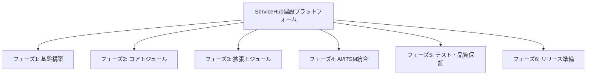

# WBS（Work Breakdown Structure）

## 概要
ServiceHub建設プラットフォームの全開発タスクをWBS形式で整理する。

## WBS全体構造

## WBS詳細

### フェーズ1: 基盤構築（2026/04/02〜2026/05/01）

| ID | タスク | 担当 | 工数(日) | 依存 |
|----|--------|------|---------|------|
| 1.1 | プロジェクト環境構築 | インフラ | 3 | - |
| 1.1.1 | Docker/K8s環境構築 | インフラ | 2 | - |
| 1.1.2 | CI/CDパイプライン構築 | DevOps | 3 | 1.1.1 |
| 1.1.3 | 開発環境ドキュメント作成 | リーダー | 1 | 1.1.2 |
| 1.2 | 認証基盤開発 | バックエンド | 5 | 1.1 |
| 1.2.1 | JWT認証実装 | バックエンド | 2 | 1.1 |
| 1.2.2 | RBAC実装 | バックエンド | 2 | 1.2.1 |
| 1.2.3 | MFA実装 | バックエンド | 2 | 1.2.2 |
| 1.3 | API基盤開発 | バックエンド | 3 | 1.1 |
| 1.3.1 | FastAPI基本構造実装 | バックエンド | 1 | 1.1 |
| 1.3.2 | API共通ミドルウェア実装 | バックエンド | 2 | 1.3.1 |
| 1.4 | データベース基盤構築 | バックエンド | 4 | 1.1 |
| 1.4.1 | PostgreSQL設計・構築 | バックエンド | 2 | 1.1 |
| 1.4.2 | マイグレーション基盤構築 | バックエンド | 1 | 1.4.1 |
| 1.4.3 | Redis設定 | インフラ | 1 | 1.1 |
| 1.5 | フロントエンド基盤 | フロントエンド | 4 | 1.1 |
| 1.5.1 | Next.js基本構造実装 | フロントエンド | 1 | 1.1 |
| 1.5.2 | 認証UIコンポーネント | フロントエンド | 2 | 1.5.1, 1.2 |
| 1.5.3 | 共通UIコンポーネントライブラリ | フロントエンド | 1 | 1.5.1 |

### フェーズ2: コアモジュール開発（2026/05/02〜2026/06/01）

| ID | タスク | 担当 | 工数(日) | 依存 |
|----|--------|------|---------|------|
| 2.1 | 工事案件管理 | バックエンド+フロント | 10 | 1.x完了 |
| 2.1.1 | 案件CRUDエンドポイント | バックエンド | 3 | - |
| 2.1.2 | 案件検索・フィルタリング | バックエンド | 2 | 2.1.1 |
| 2.1.3 | 案件管理UI | フロントエンド | 4 | 2.1.1 |
| 2.1.4 | テスト作成 | 全員 | 1 | 2.1.3 |
| 2.2 | 日報管理 | バックエンド+フロント | 8 | 2.1 |
| 2.2.1 | 日報CRUDエンドポイント | バックエンド | 2 | - |
| 2.2.2 | 承認ワークフロー | バックエンド | 2 | 2.2.1 |
| 2.2.3 | 日報作成UI | フロントエンド | 3 | 2.2.1 |
| 2.2.4 | テスト作成 | 全員 | 1 | 2.2.3 |

### フェーズ3-6（要約）

| フェーズ | 主要タスク | 工数合計 |
|---------|----------|---------|
| フェーズ3 | 写真管理、安全品質、原価管理 | 45日 |
| フェーズ4 | ITSM、ナレッジ管理、AI支援 | 40日 |
| フェーズ5 | 統合テスト、性能テスト、バグ修正 | 25日 |
| フェーズ6 | UAT、リリース準備、運用移行 | 20日 |

## マイルストーン

| マイルストーン | 日付 | 完了基準 |
|-------------|------|---------|
| 基盤完成 | 2026/05/01 | 認証・API・DB動作確認 |
| コアモジュール完成 | 2026/06/01 | 案件・日報管理動作 |
| 拡張モジュール完成 | 2026/07/01 | 写真・安全・原価動作 |
| AI/ITSM統合完成 | 2026/08/01 | AI・ITSM機能動作 |
| テスト完了 | 2026/09/01 | 全テスト合格 |
| リリース | 2026/10/02 | 社内本番稼働 |
