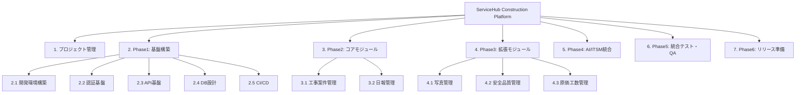

# WBS（Work Breakdown Structure）

## 1. WBS概要

| 項目 | 内容 |
|------|------|
| プロジェクト名 | ServiceHub Construction Platform |
| 開始日 | 2026年4月2日 |
| 終了日 | 2026年10月2日 |
| 総工数 | 約1,000時間（8時間/日 × 125日） |
| 開発体制 | 1〜2名（AI支援による高効率開発） |

---

## 2. WBS全体図

---

## 3. WBS詳細（Phase1: 基盤構築）

| WBS-ID | タスク | 工数（h） | 開始日 | 終了日 | 担当 |
|--------|--------|---------|-------|-------|------|
| 1.1.1 | 開発環境構築（Docker/Git/CI初期設定） | 16 | 2026/04/02 | 2026/04/03 | 開発者 |
| 1.1.2 | GitHubリポジトリ・ブランチ戦略設定 | 4 | 2026/04/02 | 2026/04/02 | 開発者 |
| 1.1.3 | Pythonプロジェクト構造設計 | 8 | 2026/04/06 | 2026/04/06 | 開発者 |
| 1.2.1 | JWT認証API実装 | 24 | 2026/04/07 | 2026/04/09 | 開発者 |
| 1.2.2 | MFA（TOTP）実装 | 16 | 2026/04/10 | 2026/04/11 | 開発者 |
| 1.2.3 | RBAC権限管理実装 | 24 | 2026/04/13 | 2026/04/15 | 開発者 |
| 1.3.1 | FastAPI基本設定・ミドルウェア | 8 | 2026/04/16 | 2026/04/16 | 開発者 |
| 1.3.2 | エラーハンドリング共通化 | 8 | 2026/04/17 | 2026/04/17 | 開発者 |
| 1.3.3 | ログ・監査ログ基盤実装 | 16 | 2026/04/20 | 2026/04/21 | 開発者 |
| 1.4.1 | PostgreSQLスキーマ設計 | 16 | 2026/04/22 | 2026/04/23 | 開発者 |
| 1.4.2 | Alembicマイグレーション設定 | 8 | 2026/04/24 | 2026/04/24 | 開発者 |
| 1.5.1 | GitHub Actions CI設定 | 8 | 2026/04/27 | 2026/04/27 | 開発者 |
| 1.5.2 | CD（Staging自動デプロイ）設定 | 8 | 2026/04/28 | 2026/04/28 | 開発者 |
| 1.5.3 | フェーズ1レビュー・ドキュメント更新 | 8 | 2026/04/29 | 2026/04/30 | 開発者 |

---

## 4. WBS詳細（Phase2〜4）

### Phase2: コアモジュール（2026/05/01〜05/30）

| WBS-ID | タスク | 工数（h） |
|--------|--------|---------|
| 2.1.1 | 工事案件管理 DB設計・API実装 | 40 |
| 2.1.2 | 工事案件管理 フロントエンド | 40 |
| 2.1.3 | 工事案件管理 テスト | 16 |
| 2.2.1 | 日報管理 DB設計・API実装 | 40 |
| 2.2.2 | 日報承認ワークフロー実装 | 24 |
| 2.2.3 | 日報 フロントエンド | 40 |
| 2.2.4 | 日報 PDF出力実装 | 16 |

### Phase3: 拡張モジュール（2026/06/01〜06/30）

| WBS-ID | タスク | 工数（h） |
|--------|--------|---------|
| 3.1.1 | 写真管理 API + MinIO連携 | 32 |
| 3.1.2 | サムネイル生成（Celery） | 16 |
| 3.1.3 | 写真管理 フロントエンド | 32 |
| 3.2.1 | 安全管理 API実装 | 32 |
| 3.2.2 | 安全管理 フロントエンド | 24 |
| 3.3.1 | 原価管理 API実装 | 32 |
| 3.3.2 | EVM分析実装 | 16 |
| 3.3.3 | 原価管理 フロントエンド + グラフ | 32 |

### Phase4: AI/ITSM統合（2026/07/01〜07/31）

| WBS-ID | タスク | 工数（h） |
|--------|--------|---------|
| 4.1.1 | ITSM管理 API実装 | 40 |
| 4.1.2 | ITSM管理 フロントエンド | 32 |
| 4.2.1 | ナレッジ管理 + Elasticsearch | 32 |
| 4.3.1 | OpenAI API連携 | 16 |
| 4.3.2 | AI日報補完機能 | 24 |
| 4.3.3 | リスク予測機能（基本） | 24 |

---

## 5. マイルストーン一覧

| マイルストーン | 日付 | 完了条件 |
|------------|------|---------|
| M1: 基盤構築完了 | 2026/04/30 | 認証・DB・CI/CDが動作する |
| M2: コアモジュール完了 | 2026/05/30 | 案件管理・日報がエンドツーエンドで動作 |
| M3: 拡張モジュール完了 | 2026/06/30 | 写真・安全・原価が動作 |
| M4: AI/ITSM統合完了 | 2026/07/31 | ITSM・AI機能が動作 |
| M5: 品質保証完了 | 2026/08/31 | 統合テスト・性能テスト合格 |
| M6: 社内リリース | 2026/10/02 | UAT合格・デプロイ完了 |

---

## 6. 工数サマリー

| フェーズ | 期間 | 工数（h） | 割合 |
|---------|------|---------|------|
| Phase1: 基盤構築 | 1ヶ月 | 160 | 16% |
| Phase2: コアモジュール | 1ヶ月 | 176 | 18% |
| Phase3: 拡張モジュール | 1ヶ月 | 176 | 18% |
| Phase4: AI/ITSM統合 | 1ヶ月 | 168 | 17% |
| Phase5: 統合テスト | 1ヶ月 | 176 | 18% |
| Phase6: リリース準備 | 1ヶ月 | 144 | 14% |
| **合計** | **6ヶ月** | **1,000** | **100%** |
