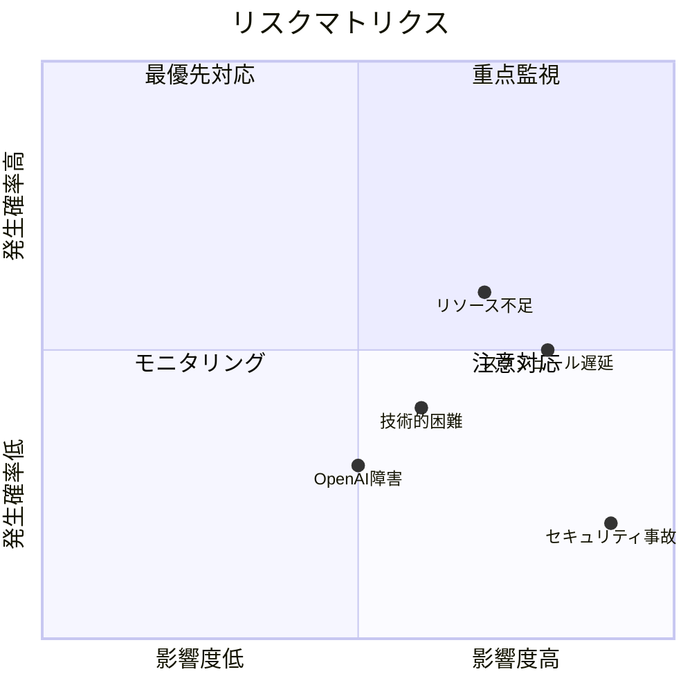

# リスク管理計画

## 概要
プロジェクト期間中に発生し得るリスクを識別・評価し、対応策を定義する。

## リスクマトリクス



## リスク一覧

| ID | リスク | 確率 | 影響 | レベル | オーナー |
|----|--------|------|------|--------|---------|
| R01 | 主要開発者の退職・離脱 | 中 | 高 | 高 | PM |
| R02 | スケジュール遅延 | 高 | 高 | 最高 | PM |
| R03 | 技術的負債の蓄積 | 中 | 中 | 中 | リーダー |
| R04 | セキュリティインシデント | 低 | 最高 | 高 | セキュリティ |
| R05 | OpenAI APIサービス障害 | 低 | 中 | 中 | バックエンド |
| R06 | 要件変更 | 高 | 中 | 高 | PM |
| R07 | パフォーマンス要件未達 | 中 | 高 | 高 | バックエンド |
| R08 | 外部サービス料金超過 | 低 | 中 | 低 | PM |
| R09 | テスト工程不足 | 中 | 高 | 高 | QA |
| R10 | ユーザー受入拒否 | 低 | 最高 | 高 | PM |

## リスク対応策詳細

### R01: 主要開発者の離脱
- **予防**: ナレッジ共有、ペアプログラミング、ドキュメント充実
- **対応**: バス係数3以上を維持、外部委託先の確保
- **監視**: 月次チームサーベイ

### R02: スケジュール遅延
- **予防**: バッファ10%確保、週次進捗確認
- **対応**: スコープ調整、リソース追加、残業
- **監視**: バーンダウンチャート毎日確認

### R04: セキュリティインシデント
- **予防**: 定期セキュリティスキャン、コードレビュー
- **対応**: インシデント対応計画の発動
- **監視**: セキュリティダッシュボード24時間監視

### R07: パフォーマンス要件未達
- **予防**: 開発初期からの負荷テスト
- **対応**: クエリ最適化、キャッシュ強化、スケールアウト
- **監視**: 月次パフォーマンステスト実施

## リスク監視スケジュール

| 頻度 | 活動 | 参加者 |
|------|------|--------|
| 週次 | リスクステータス確認 | PM・リーダー |
| 月次 | リスク全体レビュー | プロジェクトチーム |
| 四半期 | リスク再評価・更新 | PM・ステークホルダー |
| インシデント発生時 | 緊急リスク対応 | 全員 |

## エスカレーション基準

```
リスクレベル「最高」→ 即時CTO・PM通知
リスクレベル「高」→ 24時間以内にPM通知
リスクレベル「中」→ 週次会議で報告
リスクレベル「低」→ 月次レポートで記録
```
