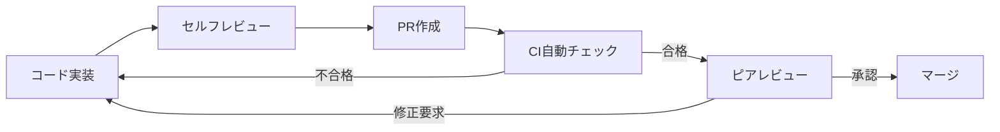

# 品質管理計画

## 概要
ServiceHub建設プラットフォームの品質目標・管理方法・改善プロセスを定義する。

## 品質目標

| 品質指標 | 目標値 | 測定方法 | 頻度 |
|---------|--------|---------|------|
| バグ密度 | <1件/KLOC | バグトラッカー | スプリント毎 |
| コードカバレッジ | ≥80% | pytest-cov | PR毎 |
| コードレビュー率 | 100% | GitHub PR | 毎コミット |
| ドキュメント完成度 | ≥90% | チェックリスト | フェーズ毎 |
| SLA達成率 | ≥99.5% | Prometheus | 月次 |
| 応答時間（P95） | <2秒 | APM | 継続的 |
| セキュリティスキャン合格 | 100% | CI/CD | PR毎 |

## 品質ゲート

各フェーズの完了判定に使用する品質ゲート基準：

### フェーズ完了品質ゲート
```
✅ 単体テストカバレッジ ≥ 80%
✅ 統合テスト全件合格
✅ セキュリティスキャン合格
✅ コードレビュー完了
✅ ドキュメント更新完了
✅ 性能目標値達成（フェーズ5以降）
```

## コードレビュープロセス



## 欠陥管理

### バグ重大度分類
| 重大度 | 定義 | 対応期限 |
|--------|------|---------|
| Critical | システム停止・データ損失 | 即時対応 |
| High | 主要機能が使用不能 | 24時間 |
| Medium | 機能が部分的に動作しない | 1週間 |
| Low | 軽微な問題、回避手段あり | 次スプリント |

### バグライフサイクル
```
新規(New) → トリアージ(Triaged) → 対応中(In Progress) 
         → レビュー(In Review) → 検証(Verified) → クローズ(Closed)
```

## 技術的負債管理

| 指標 | 目標 | ツール |
|------|------|--------|
| 循環的複雑度 | <10/関数 | radon, ESLint |
| 重複コード率 | <5% | SonarQube相当 |
| 未使用コード | 0% | pylint, ESLint |
| TODO/FIXME件数 | <20件 | コードスキャン |

## 品質レポーティング

### 週次品質レポート内容
- 新規バグ件数・解決件数
- テストカバレッジ推移
- パフォーマンス指標
- セキュリティスキャン結果
- 技術的負債状況

### 月次品質レビュー
参加者: PM、リーダー、QAリード  
内容: 品質KPI評価、改善施策の決定、次月目標設定
