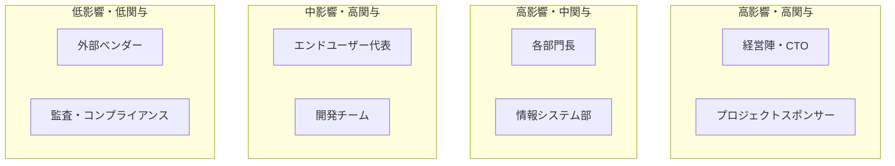

# ステークホルダー管理計画

## 概要
プロジェクトの成功に影響を与える全ステークホルダーを識別し、関与方針を定義する。

## ステークホルダーマップ

## ステークホルダー一覧

| ステークホルダー | 役割 | 関与レベル | 影響度 | 主要関心事 |
|---------------|------|----------|--------|----------|
| CTO | 意思決定者 | 高 | 最高 | 技術方針、ROI |
| プロジェクトスポンサー | 予算承認 | 中 | 最高 | 予算、スケジュール |
| 工事部長 | 業務オーナー | 高 | 高 | 現場使いやすさ |
| 安全管理部長 | 業務オーナー | 中 | 高 | 安全機能の完成度 |
| 経理部長 | 業務オーナー | 中 | 高 | 原価管理精度 |
| 情報システム部長 | 技術監督 | 高 | 高 | セキュリティ、保守性 |
| 現場監督（代表） | エンドユーザー | 高 | 中 | 操作性、速度 |
| 開発チームリーダー | 実行責任者 | 最高 | 高 | 技術品質、工数 |

## コミュニケーション計画

| ステークホルダー | 報告頻度 | 報告内容 | 方法 |
|---------------|---------|---------|------|
| CTO・スポンサー | 月次 | 進捗サマリー、主要課題 | 報告会 |
| 各部門長 | 隔週 | 機能開発状況 | Teams会議 |
| エンドユーザー代表 | 月次 | デモ・フィードバック | デモ会 |
| 開発チーム | 日次 | デイリースクラム | Slack+オンライン |
| 全社 | フェーズ完了時 | マイルストーン達成報告 | メール・社内掲示 |

## ステークホルダー関与戦略

### CTO・経営陣
- 月次経営報告でのROI・リスク報告
- 重要意思決定事項の事前説明
- マイルストーン達成の可視化

### 業務部門長
- 要件定義への積極的参画依頼
- プロトタイプ・デモによる早期フィードバック
- UAT時の協力依頼

### エンドユーザー
- ユーザーインタビューによるニーズ収集
- β版での先行体験機会の提供
- 研修・マニュアル提供によるオンボーディング支援

## 反対・懸念の管理

| 懸念事項 | 対応方針 |
|---------|---------|
| 「新システムで業務が複雑になる」 | UX改善、段階的移行、研修充実 |
| 「データ移行時のリスク」 | 並行運用期間の設定、ロールバック計画 |
| 「セキュリティ不安」 | セキュリティ監査結果の共有 |
| 「コスト超過懸念」 | 月次予算報告、早期アラート |
