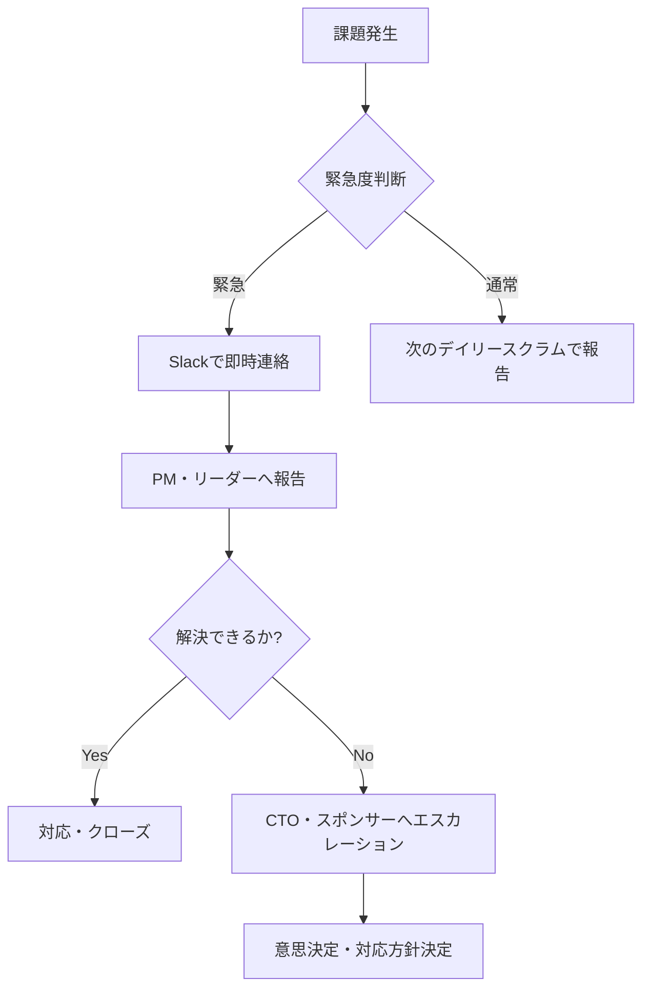

# コミュニケーション計画

## 概要
プロジェクト内外のコミュニケーション方法・頻度・責任者を定義する。

## コミュニケーションチャネル

| チャネル | 用途 | 参加者 | 頻度 |
|---------|------|--------|------|
| Slack #servicehub-dev | 開発日常連絡 | 開発チーム | 随時 |
| Slack #servicehub-alert | アラート通知 | 全チーム | 自動 |
| GitHub Issues/PR | 技術課題・レビュー | 開発チーム | 随時 |
| Teams会議 | 定例・報告 | 各種 | 定期 |
| メール | 正式通知・外部連絡 | 全社・外部 | 必要時 |
| Confluence/Wiki | ドキュメント共有 | 全チーム | 更新時 |

## 定例会議体

### デイリースクラム
- **頻度**: 毎日（土日除く）
- **時間**: 9:30-9:45（15分）
- **参加者**: 開発チーム全員
- **内容**: 昨日の作業・今日の予定・ブロッカー
- **形式**: オンライン（Teams）

### スプリントレビュー
- **頻度**: 2週間毎（スプリント末）
- **時間**: 14:00-15:30（90分）
- **参加者**: 開発チーム + ステークホルダー代表
- **内容**: 完成機能デモ、フィードバック収集

### スプリントレトロスペクティブ
- **頻度**: 2週間毎（スプリントレビュー後）
- **時間**: 15:30-16:30（60分）
- **参加者**: 開発チームのみ
- **内容**: KPT（Keep/Problem/Try）

### 月次ステークホルダー報告
- **頻度**: 月次（第3週火曜日）
- **時間**: 15:00-16:00（60分）
- **参加者**: PM・リーダー + 各部門長
- **内容**: 進捗・課題・予算状況

## エスカレーションパス

## ドキュメント管理

| ドキュメント種別 | 保管場所 | 更新担当 | レビュー頻度 |
|---------------|---------|---------|------------|
| 技術仕様書 | GitHub docs/ | 開発者 | PR時 |
| 議事録 | Confluence | PM | 会議後24時間 |
| 進捗報告 | SharePoint | PM | 週次 |
| リスク台帳 | SharePoint | PM | 月次 |
| 障害報告 | GitHub Issues | 担当者 | 発生時 |

## 情報セキュリティとコミュニケーション

- 機密情報はSlack DM禁止 → 暗号化メール使用
- 本番環境のアクセス情報は絶対Slack/メールに記載禁止
- 外部ベンダーとのやり取りはNDA締結後のみ
- 公開情報・非公開情報の明確な区別

## コミュニケーション改善

四半期毎にコミュニケーション計画の見直しを実施し、チームの状況・フィードバックに基づいて改善を行う。
