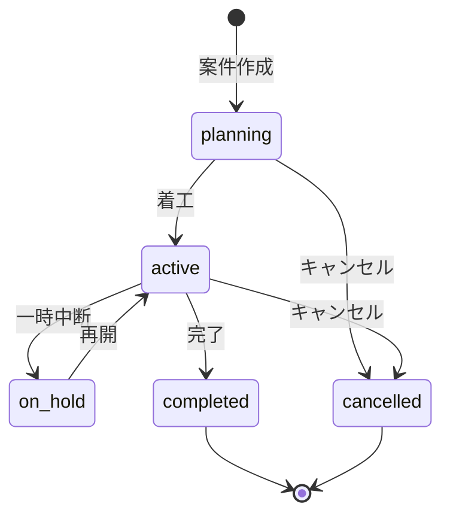

# 案件管理API仕様

## 概要
工事案件（プロジェクト）の管理に関するAPI仕様を定義する。

## エンドポイント一覧

| メソッド | エンドポイント | 説明 | 権限 |
|---------|-------------|------|------|
| GET | /projects | 案件一覧取得 | project:read |
| POST | /projects | 案件作成 | project:create |
| GET | /projects/{id} | 案件詳細取得 | project:read |
| PUT | /projects/{id} | 案件更新 | project:update |
| DELETE | /projects/{id} | 案件削除 | project:delete |
| POST | /projects/{id}/members | メンバー追加 | project:manage |
| DELETE | /projects/{id}/members/{user_id} | メンバー削除 | project:manage |
| GET | /projects/{id}/statistics | 案件統計取得 | project:read |
| PUT | /projects/{id}/status | ステータス変更 | project:update |

## GET /projects

### クエリパラメータ
| パラメータ | 型 | 必須 | 説明 | 例 |
|----------|---|----|------|---|
| page | integer | - | ページ番号（デフォルト1） | 1 |
| per_page | integer | - | 件数（最大100） | 20 |
| status | string | - | ステータスフィルタ | active |
| search | string | - | 名称・顧客名検索 | 山田建設 |
| start_date_from | date | - | 開始日（from） | 2026-04-01 |
| start_date_to | date | - | 開始日（to） | 2026-12-31 |
| sort | string | - | ソートキー | created_at |
| order | string | - | ソート順 | desc |

### レスポンス
```json
{
  "success": true,
  "data": {
    "items": [
      {
        "id": 1,
        "project_code": "PRJ-2026-001",
        "name": "山田建設 本社ビル改修工事",
        "client_name": "山田建設株式会社",
        "status": "active",
        "start_date": "2026-04-15",
        "end_date": "2026-09-30",
        "budget": 50000000,
        "progress": 35,
        "manager": {
          "id": 5,
          "name": "田中一郎"
        },
        "created_at": "2026-04-01T10:00:00+09:00"
      }
    ],
    "pagination": {
      "total": 45,
      "page": 1,
      "per_page": 20,
      "total_pages": 3
    }
  }
}
```

## POST /projects

### リクエスト
```json
{
  "name": "山田建設 本社ビル改修工事",
  "client_name": "山田建設株式会社",
  "client_contact": "山田花子",
  "start_date": "2026-04-15",
  "end_date": "2026-09-30",
  "budget": 50000000,
  "address": "東京都千代田区大手町1-1-1",
  "description": "本社ビル外壁・内装改修工事",
  "manager_id": 5,
  "tags": ["改修", "ビル", "外壁"]
}
```

### レスポンス (201 Created)
```json
{
  "success": true,
  "data": {
    "id": 46,
    "project_code": "PRJ-2026-046",
    "name": "山田建設 本社ビル改修工事",
    "status": "planning",
    "created_at": "2026-04-15T09:30:00+09:00"
  }
}
```

## 案件ステータス遷移



## PUT /projects/{id}/status

### リクエスト
```json
{
  "status": "active",
  "reason": "2026年4月15日より着工開始",
  "effective_date": "2026-04-15"
}
```

## バリデーションルール

| フィールド | ルール |
|-----------|--------|
| name | 必須、1〜200文字 |
| start_date | 必須、ISO8601形式 |
| end_date | 必須、start_dateより後 |
| budget | 必須、0以上の整数 |
| manager_id | 必須、存在するユーザーID |
