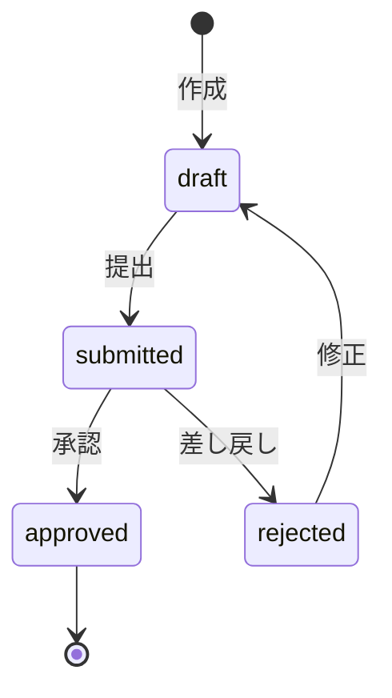

# 日報管理API仕様

## 概要
工事現場の日報（作業報告）管理に関するAPI仕様を定義する。

## エンドポイント一覧

| メソッド | エンドポイント | 説明 | 権限 |
|---------|-------------|------|------|
| GET | /projects/{id}/daily-reports | 日報一覧取得 | report:read |
| POST | /projects/{id}/daily-reports | 日報作成 | report:write |
| GET | /daily-reports/{id} | 日報詳細取得 | report:read |
| PUT | /daily-reports/{id} | 日報更新 | report:write |
| DELETE | /daily-reports/{id} | 日報削除 | report:delete |
| POST | /daily-reports/{id}/submit | 日報提出 | report:write |
| POST | /daily-reports/{id}/approve | 日報承認 | report:approve |
| POST | /daily-reports/{id}/reject | 日報差し戻し | report:approve |
| POST | /daily-reports/{id}/ai-summary | AI要約生成 | report:write |

## POST /projects/{id}/daily-reports

### リクエスト
```json
{
  "report_date": "2026-04-15",
  "weather": "晴れ",
  "temperature": 18.5,
  "work_description": "1階基礎コンクリート打設作業を実施した。打設量は50m³で、品質試験も合格。",
  "workers_count": 12,
  "work_hours": 8.0,
  "progress_rate": 45,
  "safety_incidents": [],
  "tomorrow_plan": "1階スラブ配筋作業",
  "notes": "天候良好、作業予定通り進捗"
}
```

### レスポンス (201 Created)
```json
{
  "success": true,
  "data": {
    "id": 128,
    "project_id": 1,
    "report_date": "2026-04-15",
    "status": "draft",
    "author": {
      "id": 3,
      "name": "鈴木一郎"
    },
    "created_at": "2026-04-15T18:30:00+09:00"
  }
}
```

## POST /daily-reports/{id}/ai-summary

AIによる日報要約を生成するエンドポイント。

### リクエスト
```json
{
  "language": "ja",
  "max_length": 200,
  "include_keywords": true
}
```

### レスポンス (200 OK)
```json
{
  "success": true,
  "data": {
    "summary": "4月15日、晴天の下で1階基礎コンクリート打設作業を実施。12名体制で8時間作業し、打設量50m³を完了。品質試験合格、作業進捗45%。安全インシデントなし。",
    "keywords": ["コンクリート打設", "基礎工事", "品質試験"],
    "sentiment": "positive",
    "model": "gpt-4o",
    "tokens_used": 450,
    "generated_at": "2026-04-15T18:32:15+09:00"
  }
}
```

## 日報承認フロー



## GET /projects/{id}/daily-reports クエリパラメータ

| パラメータ | 型 | 説明 |
|----------|---|----- |
| date_from | date | 開始日フィルタ |
| date_to | date | 終了日フィルタ |
| status | string | ステータスフィルタ(draft/submitted/approved/rejected) |
| author_id | integer | 作成者フィルタ |
| page | integer | ページ番号 |
| per_page | integer | 1ページ件数 |

## バリデーションルール

| フィールド | ルール |
|-----------|--------|
| report_date | 必須、ISO8601、未来日不可 |
| weather | 任意、最大20文字 |
| work_description | 必須、最低50文字 |
| workers_count | 必須、1以上の整数 |
| progress_rate | 任意、0〜100の整数 |
