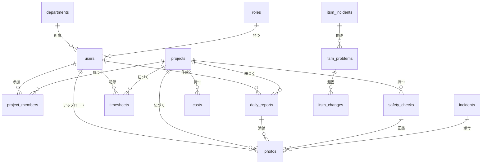

# ER図概要

## 概要
ServiceHub建設プラットフォームのデータベース全体構造とエンティティ関係を定義する。

## エンティティ一覧

| エンティティ | テーブル名 | 説明 |
|------------|----------|------|
| ユーザー | users | システム利用者 |
| 部署 | departments | 組織部署 |
| ロール | roles | 権限ロール |
| 工事案件 | projects | 工事プロジェクト |
| 案件メンバー | project_members | 案件参加者 |
| 日報 | daily_reports | 作業日報 |
| 写真 | photos | 現場写真 |
| 安全チェック | safety_checks | 安全確認記録 |
| インシデント | incidents | 事故・ヒヤリハット |
| 品質チェック | quality_checks | 品質検査記録 |
| 原価 | costs | 原価データ |
| 工数 | timesheets | 作業工数 |
| インシデント管理(ITSM) | itsm_incidents | ITSMインシデント |
| 問題管理 | itsm_problems | ITSM問題 |
| 変更管理 | itsm_changes | ITSM変更要求 |
| ナレッジ記事 | knowledge_articles | ナレッジベース |
| AI会話 | ai_chat_sessions | AI会話履歴 |
| 通知 | notifications | 通知 |
| 監査ログ | audit_logs | 操作ログ |

## ER図（主要エンティティ）



## テーブル命名規則

- スネークケース（snake_case）を使用
- 複数形でテーブル名を定義
- 結合テーブルは両エンティティ名をアンダースコアで連結
- プレフィックス: itsm_ (ITSM関連), ai_ (AI関連)

## 共通カラム

全テーブルに以下の共通カラムを持つ：

```sql
id          BIGSERIAL PRIMARY KEY,
created_at  TIMESTAMP WITH TIME ZONE NOT NULL DEFAULT NOW(),
updated_at  TIMESTAMP WITH TIME ZONE NOT NULL DEFAULT NOW(),
deleted_at  TIMESTAMP WITH TIME ZONE  -- 論理削除
```

## インデックス戦略

| インデックス種別 | 使用場面 | 例 |
|---------------|---------|---|
| B-treeインデックス | 等値・範囲検索 | status, created_at |
| 複合インデックス | 複数条件検索 | (project_id, status) |
| 部分インデックス | 特定条件のみ | WHERE deleted_at IS NULL |
| GINインデックス | JSONBカラム検索 | metadata JSONB |
| テキスト検索 | 全文検索 | Elasticsearch連携 |

## パーティショニング戦略

大容量テーブルには範囲パーティショニングを適用：

```sql
-- audit_logsテーブルの月次パーティション
CREATE TABLE audit_logs (
    id BIGSERIAL,
    created_at TIMESTAMP WITH TIME ZONE NOT NULL
) PARTITION BY RANGE (created_at);

CREATE TABLE audit_logs_2026_04 
    PARTITION OF audit_logs
    FOR VALUES FROM ('2026-04-01') TO ('2026-05-01');
```
