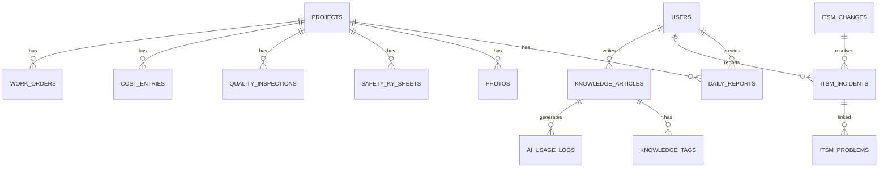

# 🗄️ ER図概要（ER Diagram Overview）

**リポジトリURL:** https://github.com/Kensan196948G/ServiceHub-Construction-Platform.git

## データベース方針
- PostgreSQL 15
- 全テーブルに `created_at`, `updated_at`, `deleted_at`（論理削除）
- 全テーブルに `created_by`, `updated_by`（監査証跡）
- 主キーは UUID

## 主要エンティティ関係

## テーブル一覧

| # | テーブル名 | 説明 |
|---|-----------|------|
| 1 | users | ユーザーマスター |
| 2 | roles | ロールマスター |
| 3 | user_roles | ユーザーロール紐付け |
| 4 | projects | 工事案件 |
| 5 | daily_reports | 日報 |
| 6 | photos | 写真・資料 |
| 7 | safety_ky_sheets | KYシート |
| 8 | hazard_reports | ヒヤリハット |
| 9 | quality_inspections | 品質検査記録 |
| 10 | quality_corrections | 是正指示 |
| 11 | cost_entries | 原価入力 |
| 12 | workloads | 工数記録 |
| 13 | itsm_incidents | インシデント |
| 14 | itsm_problems | 問題 |
| 15 | itsm_changes | 変更 |
| 16 | itsm_requests | リクエスト |
| 17 | knowledge_articles | ナレッジ記事 |
| 18 | ai_usage_logs | AI利用ログ |
| 19 | audit_logs | 監査ログ |
| 20 | notifications | 通知 |
