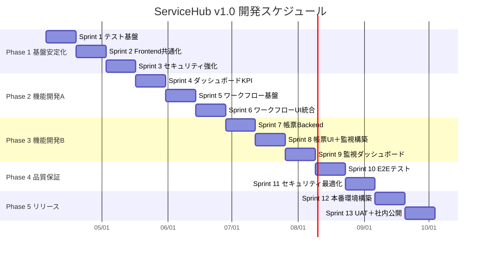

# ServiceHub Construction Platform — 第2期開発計画（v1.0 社内リリース）

## プロジェクト概要

| 項目 | 内容 |
|------|------|
| プロジェクト名 | ServiceHub Construction Platform |
| GitHub | https://github.com/Kensan196948G/ServiceHub-Construction-Platform |
| 計画種別 | 第2期（MVP→v1.0 社内リリース） |
| 開発開始 | 2026-04-03 |
| リリース目標 | 2026-10-03（6ヶ月） |
| 開発頻度 | 土日 × 8時間/日 |
| 週あたり工数 | 16時間 |
| 総工数 | 約416時間（26週 × 16h） |
| デプロイ先 | 社内オンプレ単一サーバー（Docker Compose） |

---

## 現状評価（計画策定時点: 2026-04-03）

| 領域 | 完成度 | 評価 |
|------|--------|------|
| バックエンド | 80% | 9ドメイン42+API実装済、Repository/Service層が不完全 |
| フロントエンド | 65% | 全11ページ動作、テスト0件、共通コンポーネント未整備 |
| インフラ | 80% | Docker Compose 3構成、CI/CD動作中、監視未実装 |
| テスト | 50% | Backend 111テスト/94%カバレッジ、Frontend 0テスト |
| ドキュメント | 60% | docs/ 10カテゴリ、API仕様・運用手順は部分的 |
| **総合** | **72/100** | **MVP段階 — 社内リリースには安定化＋機能追加が必要** |

---

## v1.0 リリーススコープ

### 安定化（既存機能の品質向上）

- Backend Repository/Service層の完成
- Frontend テスト基盤構築（目標カバレッジ60%+）
- Frontend 共通コンポーネント抽出（ErrorBoundary、フォーム、モーダル）
- セキュリティ強化（トークン無効化、レート制限、CSP）
- Redis キャッシュ活用

### 新機能追加（4機能）

| # | 機能 | 概要 |
|---|------|------|
| 1 | ダッシュボード強化 | KPI表示、Rechartsグラフ、リアルタイム集計 |
| 2 | ワークフロー承認 | 日報・変更要求の承認フロー、ステータス遷移 |
| 3 | 帳票出力 | PDF/Excel生成（日報、原価レポート、安全レポート） |
| 4 | 監視基盤 | Prometheus + Grafana + Node Exporter + Alertmanager |

---

## フェーズ構成（イテレーティブ型 5フェーズ / 13スプリント）

### フェーズ一覧

| フェーズ | 名称 | 期間 | スプリント | 工数 | 主要成果物 |
|---------|------|------|-----------|------|-----------|
| Phase 1 | 基盤安定化 | 4/5 - 5/17 | Sprint 1-3 | 96h | テスト基盤、共通化、セキュリティ強化 |
| Phase 2 | 機能開発A | 5/18 - 6/28 | Sprint 4-6 | 96h | ダッシュボード強化、ワークフロー承認 |
| Phase 3 | 機能開発B | 6/29 - 8/9 | Sprint 7-9 | 96h | 帳票出力、監視基盤 |
| Phase 4 | 品質保証 | 8/10 - 9/6 | Sprint 10-11 | 64h | E2E、負荷、セキュリティテスト |
| Phase 5 | リリース | 9/7 - 10/3 | Sprint 12-13 | 64h | 本番構築、UAT、社内公開 |

---

## ClaudeOS ループ運用

各8時間セッションは以下のループで運用する。

| ループ | 時間 | 活動内容 |
|--------|------|---------|
| 🔍 Monitor | 1h | GitHub Issues/PR確認、前回残課題確認、当日目標設定、README更新 |
| 🔨 Development | 2h | スプリントタスクの設計・実装 |
| ✔ Verify | 2h | テスト実行、lint/build確認、STABLE判定 |
| 🔧 Improvement | 3h | レビュー、リファクタリング、ドキュメント更新、次回準備 |

### STABLE判定基準

| 条件 | 基準値 |
|------|--------|
| テスト | 全件PASS |
| CI | 全パイプライン成功 |
| lint | エラー0 |
| build | 成功 |
| セキュリティ | Critical 0 |

| 変更規模 | 連続成功回数 |
|----------|-------------|
| 小規模（コメント・軽微修正） | N=2 |
| 通常（機能追加・バグ修正） | N=3 |
| 重要（認証・DB・セキュリティ） | N=5 |

---

## リスク管理

| リスク | 影響 | 対策 |
|--------|------|------|
| 週末のみ開発で進捗が遅延 | スケジュール超過 | スプリント単位で優先度調整、スコープカット可能な設計 |
| テスト基盤構築に想定以上の時間 | Phase 2以降が圧迫 | Phase 1で最小限のテスト環境を整備、段階的に拡充 |
| 新機能の技術的困難 | 工数超過 | 帳票出力・監視はOSS活用で工数削減 |
| オンプレサーバーの制約 | パフォーマンス問題 | 負荷テストを Phase 4 で実施、リソース要件を早期確定 |

---

## 成功基準（v1.0 リリース判定）

- [ ] 全既存機能が安定動作
- [ ] 4新機能が実装・テスト済み
- [ ] Backend テストカバレッジ 90%+
- [ ] Frontend テストカバレッジ 60%+
- [ ] E2Eテスト全件PASS
- [ ] セキュリティスキャン Critical 0
- [ ] 社内サーバーにデプロイ完了
- [ ] 監視基盤（Prometheus/Grafana）稼働
- [ ] 運用手順書・ユーザーマニュアル完成
- [ ] UAT 完了・承認取得
