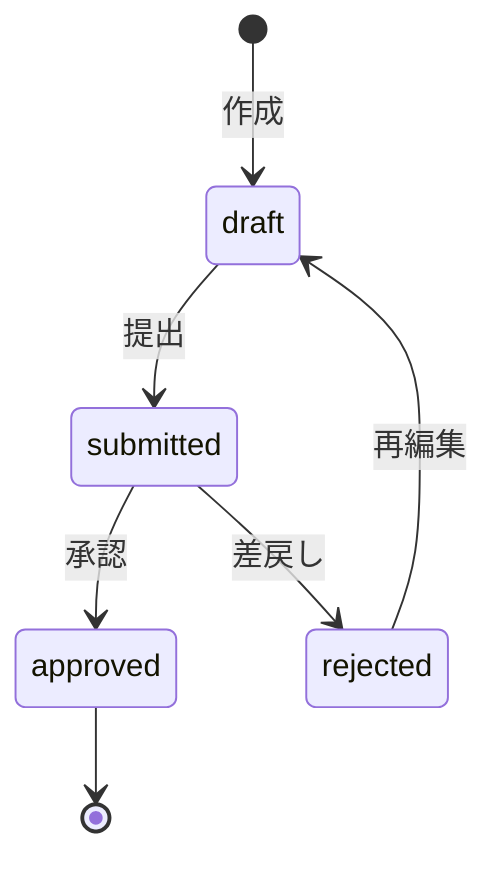

# Sprint 5: ワークフロー承認基盤（Backend）

## 概要

| 項目 | 内容 |
|------|------|
| 期間 | 2026-06-01 〜 2026-06-14 |
| 工数 | 32時間（4日 × 8h） |
| テーマ | 日報・変更要求の承認ワークフローをBackendに実装 |

## ワークフロー設計

### 承認対象

| エンティティ | 承認フロー | 承認者ロール |
|-------------|-----------|-------------|
| 日報（DailyReport） | 作成→提出→承認/差戻し | PROJECT_MANAGER, MANAGER, ADMIN |
| 変更要求（ChangeRequest） | 申請→レビュー→承認/却下 | ADMIN（SoD原則による） |

### ステータス遷移



### データモデル追加

```
ApprovalLog テーブル:
  - id (UUID)
  - entity_type (ENUM: daily_report, change_request)
  - entity_id (UUID)
  - action (ENUM: submit, approve, reject)
  - actor_id (UUID → User)
  - comment (TEXT, nullable)
  - created_at (TIMESTAMP)
```

## タスク一覧

### Day 1（8h）— データモデル＋マイグレーション

| # | タスク | 工数 |
|---|--------|------|
| 1.1 | ApprovalLog モデル定義 | 1.5h |
| 1.2 | DailyReport にステータスフィールド追加（draft/submitted/approved/rejected） | 1h |
| 1.3 | ChangeRequest のステータス遷移ルール厳格化 | 1h |
| 1.4 | Alembic マイグレーション作成・実行 | 1.5h |
| 1.5 | ApprovalLog Repository 実装 | 1.5h |
| 1.6 | テスト・CI確認 | 1.5h |

### Day 2（8h）— 承認Service層

| # | タスク | 工数 |
|---|--------|------|
| 2.1 | WorkflowService 実装（汎用承認エンジン） | 3h |
| 2.2 | 承認権限チェックロジック（ロール × エンティティ） | 2h |
| 2.3 | ステータス遷移バリデーション（不正遷移の防止） | 1.5h |
| 2.4 | WorkflowService テスト | 1.5h |

### Day 3（8h）— 承認API

| # | タスク | 工数 |
|---|--------|------|
| 3.1 | `POST /api/v1/daily-reports/{id}/submit` — 提出API | 1.5h |
| 3.2 | `POST /api/v1/daily-reports/{id}/approve` — 承認API | 1.5h |
| 3.3 | `POST /api/v1/daily-reports/{id}/reject` — 差戻しAPI | 1.5h |
| 3.4 | `GET /api/v1/approvals/pending` — 承認待ち一覧API | 2h |
| 3.5 | `GET /api/v1/approvals/history` — 承認履歴API | 1.5h |

### Day 4（8h）— テスト＋統合

| # | タスク | 工数 |
|---|--------|------|
| 4.1 | 承認API の統合テスト | 2.5h |
| 4.2 | 権限チェックの異常系テスト | 2h |
| 4.3 | 既存の ChangeRequest API との整合確認 | 1.5h |
| 4.4 | 全テスト実行・CI確認 | 1h |
| 4.5 | Sprint 5 振り返り | 1h |

## 成果物

- `backend/app/models/approval_log.py` — 承認ログモデル
- `backend/app/services/workflow_service.py` — 汎用承認エンジン
- `backend/app/api/v1/endpoints/approvals.py` — 承認API
- Alembic マイグレーション（承認関連）
- 承認フローの統合テスト

## STABLE判定条件

- 日報の提出→承認→差戻しフローが動作
- 変更要求の承認フローが動作
- 不正なステータス遷移が拒否される
- 権限のないユーザーの承認が拒否される
- 全テスト PASS、CI成功
